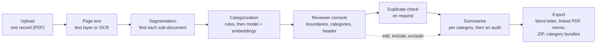
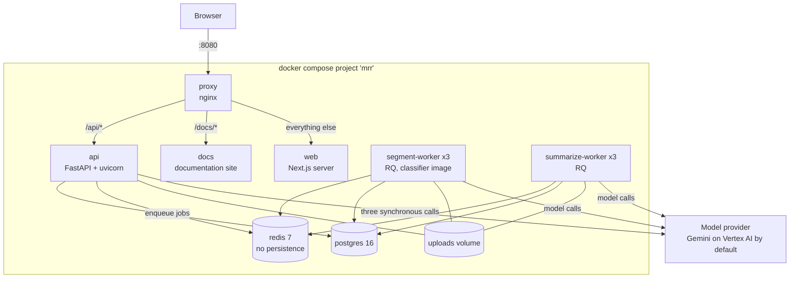
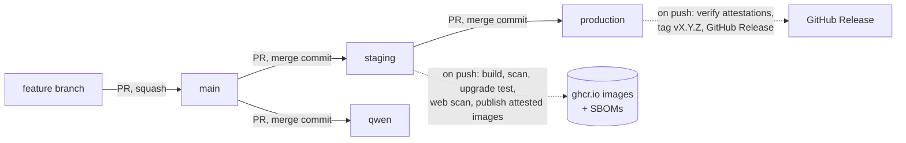

# MRR AI - AI Medical Record Review

Turns a scanned medical-record PDF into a reviewed, summarized Medical Record Review, with a reviewer in control.

[](https://github.com/gesco-healthcare-support/ai-medical-record-review/actions/workflows/ci.yml)
[](https://github.com/gesco-healthcare-support/ai-medical-record-review/actions/workflows/codeql.yml)
[](https://sonarcloud.io/summary/new_code?id=gesco-healthcare-support_ai-medical-record-review)
[](https://scorecard.dev/viewer/?uri=github.com/gesco-healthcare-support/ai-medical-record-review)



## What it is

A reviewer uploads one scanned medical-record PDF, often hundreds to a few thousand pages. MRR AI
finds the sub-documents inside it (each report, note, study or letter), categorizes them, and
lets the reviewer correct every boundary, category and header field. On request it checks the
included sub-documents for duplicates, drafts a summary of each with a category-specific prompt,
audits each summary against its source pages, and exports the finished Medical Record Review. The
reviewer can correct the machine at every step: the app is an assistant, not an autopilot.

> [!IMPORTANT]
> This app processes real medical records. Never commit PDFs, OCR text, exports or Word files -
> their filenames alone can carry patient surnames. Sample and labelled data live outside the
> repository, and every pull request carries a PHI review section.

## Highlights

- **Segmentation by a multimodal model** over overlapping page windows (an inline PDF on Gemini,
  page images on vLLM), followed by a boundary verify pass that is on by default (`VERIFY_MERGE`).
- **Three-signal categorization:** deterministic rules first, then a constrained model vote and a
  local embedding model (`all-MiniLM-L6-v2`); a disagreement is flagged for the reviewer.
- **A workbench, not a report generator:** the PDF beside editable rows, autosaved corrections,
  include and exclude per sub-document, and a single-summary re-draft.
- **Summaries that are checked:** each is drafted with its category's prompt, then audited against
  its source by a separate model call (on by default, `SUMMARY_VERIFY`) before the reviewer sees it.
- **Five deliverables:** the MRR Word letter, a linked PDF (letter plus the whole record), a
  covering memo, a ZIP of all of them, and category bundles (combined PDF or a bundle letter).
- **Background jobs with per-reviewer lanes:** RQ workers, one active job per record (enforced by
  a partial unique index), stop, force stop, pause, resume and recovery after a restart.
- **One provider seam:** Gemini on Vertex AI by default; OpenAI or a self-hosted vLLM server can be
  chosen per stage by configuration, with startup checks that refuse a mismatched model name.
- **A documentation site built from `docs/`**, kept in step with the code by tests that fail CI
  when a reference table or a cited path drifts.

## Contents

- [Architecture](#architecture)
- [Tech stack](#tech-stack)
- [Quick start](#quick-start)
- [Configuration](#configuration)
- [Project structure](#project-structure)
- [Testing and quality](#testing-and-quality)
- [Deployment and operations](#deployment-and-operations)
- [Documentation](#documentation)
- [Security and data handling](#security-and-data-handling)
- [Known gotchas](#known-gotchas)
- [Status](#status)
- [Contributing](#contributing)
- [License](#license)

## Architecture

Everything runs as one Docker Compose project (`docker-compose.yml`, project name `mrr`). The same
file runs on a developer machine and on a server; only `.env` differs.



| Service | What it does |
| --- | --- |
| `proxy` | The only published port (8080). Sends `/api/` to the API, `/docs/` to the docs site and everything else to Next.js, so the browser stays on one origin and the session cookie is first-party. |
| `web` | The Next.js workbench. It fetches everything from `/api/` in the browser; it has no server-side data access. |
| `api` | FastAPI: authentication, records, rows, jobs, exports, admin. It queues pipeline jobs and never runs a whole stage itself; it calls a model directly only for three actions a reviewer waits on (header auto-fill, re-drafting one summary, a bundle summary). |
| `segment-worker` (3) | `segment` and `classify` jobs: page text, boundaries, categories, the verify pass, injury dates. A larger image, because the categorizer loads a local embedding model. |
| `summarize-worker` (3) | `summarize` and `dedup` jobs. |
| `postgres` | All durable state: users, records, rows, summaries, jobs, the category catalog, the audit log, stored page text. |
| `redis` | RQ queues, the shared model-call pacer, cancel signals and short-lived download metadata. |
| `docs` | Serves the documentation site. |

How a record moves through these services, job by job, is in
[Architecture](docs/explanation/architecture.md) and [Pipeline and jobs](docs/explanation/pipeline-and-jobs.md).

## Tech stack

Versions are the ones locked in `backend/uv.lock` and `frontend/pnpm-lock.yaml` on 2026-09-30.

| Layer | Technology |
| --- | --- |
| Backend | Python 3.12, FastAPI 0.139.0, uvicorn 0.51.0, SQLAlchemy 2.0.51, Alembic 1.18.5, Pydantic 2.13.4, pydantic-settings 2.14.2, FastAPI Users 15.0.5, psycopg 3.3.4 |
| Jobs | RQ 2.10.0 on Redis 7 (redis-py 8.0.1) |
| Database | PostgreSQL 16 |
| Models | google-genai 2.11.0 (Gemini on Vertex AI), openai 2.53.0, a self-hosted vLLM server through the OpenAI-compatible API |
| Categorization | sentence-transformers 5.6.0 with torch 2.13.0 (segment-worker image only) |
| Documents | PyMuPDF 1.28.0, Tesseract through pytesseract 0.3.13 and Poppler, python-docx 1.2.0 |
| Frontend | Next.js 15.5.26 (App Router, standalone output), React 19.2.7, TypeScript 5.9.3, TanStack Query 5.101.2, Tailwind CSS 4.3.3, a vendored pdf.js viewer |
| Tooling | uv 0.11.2, ruff 0.15.21, pyright 1.1.414, pytest 9.1.1, pnpm 9.15.0, ESLint 9.39.5, Vitest 4.1.11, Playwright 1.61.1 |
| Delivery | Docker Compose, nginx, GitHub Actions, SonarCloud, CodeQL, OpenSSF Scorecard |

## Quick start

Needs Docker with Compose v2, a Bash shell (Git Bash on Windows) and free host ports 8080 and 5433.
The AI steps also need a Google Cloud project with Vertex AI and a service-account key; without it
the app runs and only the AI jobs fail.

```bash
cp deploy/env.docker.example .env               # then set SECRET_KEY and SECURITY_PASSWORD_SALT
GIT_SHA=$(git rev-parse --short HEAD) docker compose build
docker compose up -d --wait postgres redis
docker compose run --rm api alembic upgrade head   # create or update the schema
docker compose up -d
```

Open <http://localhost:8080>, create an account at `/login?view=register`, then run
`docker compose restart segment-worker summarize-worker` so the workers pick up the new account.
The documentation site is at <http://localhost:8080/docs/>. Every step, the Windows notes and a
failure table are in [Run the app locally](docs/how-to/run-the-app-locally.md); the
[first-day tutorial](docs/tutorials/first-day.md) takes a synthetic record from upload to export.

## Configuration

Settings are environment variables read by `backend/app/config.py` (pydantic-settings). A setting
reaches a container only if `docker-compose.yml` passes it. The full list, with types, defaults and
validation, is the [configuration reference](docs/reference/configuration.md).
The ones a new install touches:

| Variable | Required | Purpose |
| --- | --- | --- |
| `SECRET_KEY` | yes | Signs password-reset and verification tokens; at least 32 bytes. |
| `SECURITY_PASSWORD_SALT` | yes | Password pre-hash salt; accounts carried over from the previous app verify only with the original value. |
| `POSTGRES_PASSWORD` | no | The app database password (a local-only default is provided). |
| `ENVIRONMENT` | no | `dev` (default) or `prod`; `prod` marks the session cookie `Secure` and requires Vertex AI. |
| `GOOGLE_GENAI_USE_VERTEXAI`, `GOOGLE_CLOUD_PROJECT`, `GOOGLE_CLOUD_LOCATION`, `GOOGLE_APPLICATION_CREDENTIALS` | for AI steps | The Vertex AI connection; the key file goes in `secrets/` (git-ignored). |
| `LLM_BACKEND`, `LLM_BACKEND_OVERRIDES` | no | Which backend (`gemini`, `openai`, `vllm`) serves every stage, or one stage. |
| `CLASSIFY_MODEL`, `SUMMARY_MODEL`, `GENAI_MODEL`, `VERIFY_MODEL` | no | Model per stage; the defaults are Gemini models. |
| `VERIFY_MERGE` | no | Runs the boundary verify pass after segmentation (on by default). |

`deploy/env.docker.example` is the minimal template for the Compose stack; `.env.example` lists
every tunable setting with its reasoning. Never commit a real `.env`.

## Project structure

```text
.
|-- backend/            FastAPI API, RQ workers, SQLAlchemy models, Alembic migrations, tests
|   |-- app/            api/ routes, auth/, schemas/, services/ (the pipeline), worker/ (RQ jobs)
|   |-- alembic/        the migration chain (one head)
|   |-- scripts/        maintenance and evaluation scripts
|   `-- tests/          the pytest suite, against a throwaway Postgres
|-- frontend/           Next.js workbench
|   |-- app/            routes: records and the record workbench, depositions, diagnostics, admin, login
|   |-- components/     UI by area: documents, review, bundle, admin, auth, app shell, ui primitives
|   |-- hooks/ lib/     TanStack Query hooks and the typed API client
|   `-- e2e/            Playwright tests against the full stack
|-- deploy/             nginx config, the Compose .env template, a server bootstrap script
|-- docs/               documentation pages: tutorials, how-to, reference, explanation
|-- docs-site/          builds docs/ into the site served at /docs/
|-- experiments/        segmentation research and its measurements
|-- legacy/             documents kept from the retired Flask app (its code was removed)
|-- .github/            CI workflows and their scripts
|-- docker-compose.yml       the app stack, local and server
`-- docker-compose.dev.yml   throwaway Postgres + Redis for the backend tests
```

Each folder has its own `README.md` (what is in it) and `CLAUDE.md` (the rules for changing it).

## Testing and quality

```bash
# backend (from backend/): start the throwaway test database first
docker compose -p mrrtest -f ../docker-compose.dev.yml up -d --wait postgres redis
uv run pytest -q
uv run ruff check . && uv run ruff format --check .

# frontend (from frontend/)
pnpm install --frozen-lockfile
pnpm lint && pnpm typecheck && pnpm test

# end to end (from frontend/), against the full stack
pnpm exec playwright install chromium
pnpm e2e
```

- **Suites:** 70 backend test files, 53 frontend unit-test files and 3 Playwright specs on
  2026-09-30 (counted with `git ls-files`).
- **Coverage floors enforced by CI:** backend 90% (lines plus branches), frontend 80% (each of
  statements, branches, functions and lines).
- **SonarCloud on `main` at `8dc94e2` (2026-09-30):** quality gate passed; 96.0% coverage;
  0 bugs; 0 vulnerabilities; 0.2% duplicated lines; 18,764 lines of code.
- **Pull requests into `main`** must pass 13 required checks: backend (with pyright), frontend,
  end to end, secret scan, coverage floor, two SonarCloud checks, workflow lint, container lint,
  dependency review, OSV scan, the docs build and the PR title format. CodeQL must also report no
  new high or critical alert. The full list, per branch, is in
  [CI and merge gates](docs/reference/ci-and-merge-gates.md).

How to run a subset, the coverage run and the end-to-end setup: [Run the tests](docs/how-to/run-the-tests.md).

## Deployment and operations

Code moves by pull request through a branch cascade. Promotions are merge commits, and a guard
check allows each branch to be fed only from the branch above it.



- **Staging acceptance** builds the three images once, scans them, runs a database upgrade test
  and the stack in production mode, runs a baseline web scan, then publishes the accepted images
  with build-provenance and SBOM attestations.
- **Release** runs on a push to `production`: it verifies that the images were built by the
  staging workflow from `staging`, attaches their SBOMs and creates the next version tag and GitHub
  Release. Release tags cannot be moved or deleted.
- **Servers** run the same `docker-compose.yml` from a git checkout, built on the server. The
  procedure, rollback and traps are in [Deploy to the server](docs/how-to/deploy-to-the-server.md);
  backups in [Back up and restore](docs/how-to/back-up-and-restore.md); a stuck job in
  [Diagnose a stuck or failed job](docs/how-to/diagnose-a-stuck-or-failed-job.md).

## Documentation

The documentation is a searchable site built from [`docs/`](docs/index.md), served at `/docs/`
on a running stack and readable as Markdown on GitHub.

| If you want to | Read |
| --- | --- |
| understand the system | [Architecture](docs/explanation/architecture.md), then [Segmentation](docs/explanation/segmentation.md), [Categorization](docs/explanation/categorization.md), [Duplicate detection](docs/explanation/duplicate-detection.md), [Summarization](docs/explanation/summarization.md) |
| run it | [Run the app locally](docs/how-to/run-the-app-locally.md), [Your first day](docs/tutorials/first-day.md) |
| change it | [Add an API route or export](docs/how-to/add-an-api-route-or-export.md), [Add a job kind or stage](docs/how-to/add-a-job-kind-or-stage.md), [Add or change a category](docs/how-to/add-or-change-a-category.md), [Change a summary prompt or rule](docs/how-to/change-a-summary-prompt-or-rule.md), [Extend the frontend](docs/how-to/extend-the-frontend.md) |
| operate it | [Deploy to the server](docs/how-to/deploy-to-the-server.md), [Manage users and admins](docs/how-to/manage-users-and-admins.md), [Switch model backends](docs/how-to/switch-model-backends.md) |
| look something up | [HTTP API](docs/reference/http-api.md), [Configuration](docs/reference/configuration.md), [Data model](docs/reference/data-model.md), [Export formats](docs/reference/export-formats.md), [Glossary](docs/reference/glossary.md) |
| answer "why did it do that?" | [Troubleshoot a summary](docs/how-to/troubleshoot-a-summary.md), [Job and document states](docs/reference/job-and-document-states.md), [Errors and messages](docs/reference/errors-and-messages.md) |

## Security and data handling

- **Where patient data lives** is documented place by place, with its lifetime, in
  [Architecture](docs/explanation/architecture.md#where-patient-data-lives): uploaded PDFs are named
  by a UUID, prepared exports by a random token and deleted after five minutes, and deleting a
  record removes its rows, summaries, page text and PDF.
- **Code rules:** never log a filename, patient field, OCR text or model prompt; name stored files
  by id or token, never by patient; document the lifetime of any new place content persists.
  The audit log keeps ids and action names only.
- **Model calls** leave the stack only to the configured provider: Gemini on Vertex AI by
  default. See [Model providers](docs/explanation/model-providers.md).
- **Access:** every route except sign-in, registration and password reset requires a signed-in,
  active user; a record is visible only to its
  owner and to admins, and anyone else gets the same 404 as for a record that does not exist. See
  [Auth and access](docs/explanation/auth-and-access.md).
- **Secrets** come from `.env` and `secrets/`, both git-ignored; gitleaks runs on every pull
  request. Report a vulnerability as [SECURITY.md](SECURITY.md) says, never in a public issue.

## Known gotchas

- **Images are baked, not bind-mounted.** A code change reaches a container only after a rebuild
  and `--force-recreate`. There are two backend images: `docker compose build api` does not
  rebuild the segment worker (`mrr-backend-classifier`).
- **A setting reaches a container only if `docker-compose.yml` names it**; setting it in `.env`
  is not enough. See [Configuration model](docs/explanation/configuration-model.md).
- **Two databases.** The app's Postgres is on host port 5433; the test database is on 5432. The
  backend suite refuses to run against the app database.
- **New accounts need a worker restart** before their jobs are picked up: each worker listens on
  the per-reviewer lanes that existed when it started.
- **Redis keeps nothing on disk.** RQ's queues do not survive a Redis restart; the `jobs` table in
  Postgres does ([Diagnose a stuck or failed job](docs/how-to/diagnose-a-stuck-or-failed-job.md)).
- **The category catalog lives in the database.** Once it has rows, editing the Python taxonomy
  changes nothing; carry the change in a migration
  ([Add or change a category](docs/how-to/add-or-change-a-category.md)).
- **On Windows,** prefix commands that pass container paths with `MSYS_NO_PATHCONV=1`, and run
  the queue workers only in Compose (RQ needs `fork()`).

## Status

As of 2026-09-30:

- Deployed on an internal server; the procedure is in
  [Deploy to the server](docs/how-to/deploy-to-the-server.md).
- First release [`v0.1.0`](https://github.com/gesco-healthcare-support/ai-medical-record-review/releases/tag/v0.1.0)
  was cut on 2026-09-30 through the staging acceptance stage.
- Known issues and requested features are tracked in
  [GitHub Issues](https://github.com/gesco-healthcare-support/ai-medical-record-review/issues).
- The retired Flask application's code was removed on 2026-09-30; `legacy/` keeps only its
  documents, and git history has the rest.

## Contributing

Changes arrive by pull request into `main`; direct pushes are blocked and every required check must
pass. Pull requests into `main` are squash-merged, so the PR title becomes the commit: it follows
`<type>(<scope>): <subject>` (checked by `pr-title`), with the scopes listed in
[`.claude/rules/commit-scopes.md`](.claude/rules/commit-scopes.md). Update the docs in the same pull
request as the code they describe ([Work on these docs](docs/how-to/work-on-these-docs.md)). The
full guide is [CONTRIBUTING.md](CONTRIBUTING.md); the code of conduct is
[CODE_OF_CONDUCT.md](CODE_OF_CONDUCT.md). AI coding assistants read [CLAUDE.md](CLAUDE.md) first.

## License

Copyright (c) 2026 Healthcare Support, LLC. All rights reserved. This repository is publicly
visible but not open source; see [LICENSE](LICENSE).
