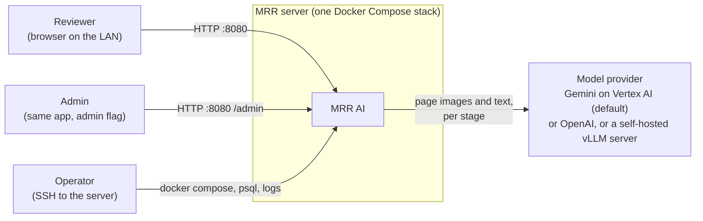
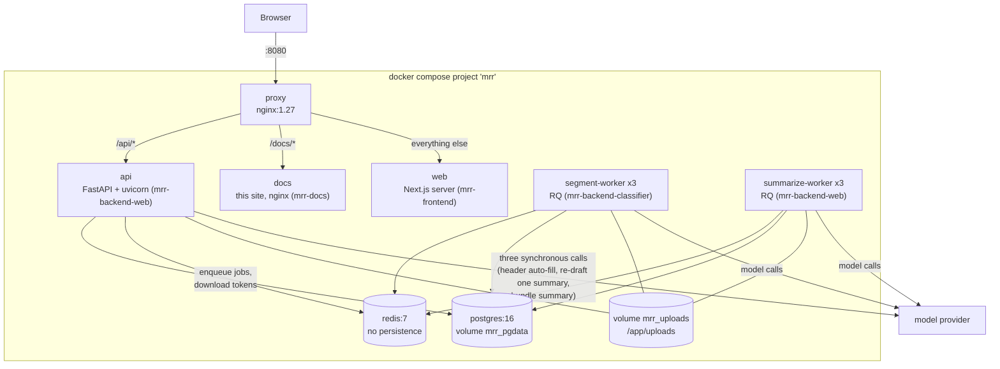

# Architecture

This page is the map of the whole system: what runs, how a record moves through it, and where
patient data goes. Every other explanation page zooms into one part of this picture.

## What the app does

A reviewer uploads one scanned medical-record PDF (often hundreds to a few thousand pages). The app:

1. **Identifies** the sub-documents inside it - where each report, note or study starts and ends -
   and assigns each a category (see [Segmentation](segmentation.md) and
   [Categorization](categorization.md)).
2. Lets the reviewer **correct** the boundaries, categories and header details, and choose which
   sub-documents to include.
3. On the reviewer's request, **checks for duplicates** among the included sub-documents
   ([Duplicate detection](duplicate-detection.md)).
4. **Summarizes** each included sub-document with a category-specific prompt, then audits each
   summary against its source ([Summarization](summarization.md)).
5. **Exports** the assembled review as a Word letter, a linked PDF, a memo, a ZIP or a category
   bundle ([Exports and downloads](exports-and-downloads.md)).

The reviewer can correct the machine at every step. Nothing is sent anywhere outside the app except
the model calls in steps 1, 3 and 4.

## System context



- Records arrive only by upload in the browser. There is no inbound integration with another
  system.
- Which provider each stage uses is configuration, not code: see
  [Model providers](model-providers.md).

## Containers

All of it is one Docker Compose project, `docker-compose.yml` (project name `mrr`). The same file
runs locally and on the server; only `.env` differs.



| container | what it does | details |
| --- | --- | --- |
| `proxy` | The only port published to the network (8080). Routes `/api/` to the API, `/docs/` to this site, everything else to the Next.js server. Keeps the browser on one origin, so the session cookie is first-party and there is no CORS. | `deploy/nginx.conf` |
| `web` | The Next.js app the reviewer uses. It fetches everything from `/api/` in the browser; it has no server-side data access. | [Frontend workbench](frontend-workbench.md) |
| `api` | FastAPI. Authentication, documents, rows, jobs, exports, admin. Starts pipeline jobs by putting them on Redis and never runs a whole stage itself; the only model calls it makes directly serve three reviewer actions that wait for their answer (header auto-fill, re-drafting one summary, a bundle summary). | [HTTP API reference](../reference/http-api.md) |
| `segment-worker` (3) | Runs `segment` and `classify` jobs: OCR, finding sub-document boundaries, categorizing, the boundary verify pass, injury dates. Built as a separate, larger image because the categorizer loads a local embedding model (torch). | [Pipeline and jobs](pipeline-and-jobs.md) |
| `summarize-worker` (3) | Runs `summarize` and `dedup` jobs. | [Pipeline and jobs](pipeline-and-jobs.md) |
| `postgres` | All durable state: users, documents, rows, summaries, jobs, the category catalog, audit log, stored page text. | [Data model](../reference/data-model.md) |
| `redis` | The RQ job queues, the shared model-call pacer, cancel signals and short-lived download metadata. Runs without persistence, so a Redis restart loses queued work. | [Pipeline and jobs](pipeline-and-jobs.md) |
| `docs` | Serves this documentation site. | [Working on these docs](../how-to/work-on-these-docs.md) |

The full service table - images, ports, volumes, replicas - is the
[compose services reference](../reference/compose-services.md).

## How a record moves through the system

```mermaid
sequenceDiagram
    participant B as Browser
    participant A as api
    participant R as Redis (RQ)
    participant S as segment-worker
    participant M as summarize-worker
    participant P as Postgres
    B->>A: POST /api/documents (upload PDF)
    A->>P: documents row; PDF saved to the uploads volume
    B->>A: POST /documents/{id}/segment/start
    A->>P: jobs row (one active job per document)
    A->>R: enqueue on the owner's segment lane
    R->>S: segment_document(job)
    S->>P: page text, rows with categories, progress
    B->>A: GET /documents/{id}/status (polled every second)
    B->>A: PUT /documents/{id}/rows (reviewer corrections, autosaved)
    B->>A: POST /documents/{id}/dedup/start
    A->>R: enqueue dedup on the owner's summarize lane
    R->>M: dedup_document(job)
    B->>A: POST /documents/{id}/summarize/start
    A->>R: enqueue summarize
    R->>M: summarize_document(job) - one summary row committed at a time
    B->>A: POST /documents/{id}/export
    A-->>B: token for a prepared file
    B->>A: GET /documents/{id}/downloads/{token}
```

The job model - lanes, stop and force stop, pause and resume, recovery after a restart - is in
[Pipeline and jobs](pipeline-and-jobs.md). Every job and document state is listed in the
[job and document states reference](../reference/job-and-document-states.md).

Inside the segment job the order is fixed: extract the page text once (OCR where needed), find
boundaries window by window, categorize every row, run the boundary verify pass (on by default,
`VERIFY_MERGE`), then read each row's injury date. See [Segmentation](segmentation.md).

## Where patient data lives

The records are real patient medical records. This is where their content goes.

| place | what is kept | how long |
| --- | --- | --- |
| `mrr_uploads` volume, `<UPLOAD_FOLDER>/<user id>/<uuid>.pdf` | The uploaded PDF, named by a UUID, never by the patient. | Until the reviewer deletes the document. |
| `documents` table | The original filename and the report header (patient name, date of birth, law firm, doctor and so on). | Until the document is deleted. |
| `page_texts` table | The extracted text of every page. | Until the document is deleted. |
| `review_rows.source_text`, `summaries.text` and `summaries.source_text` | Sub-document text and the generated summaries. | Until the document is deleted. |
| `<UPLOAD_FOLDER>/<user id>/downloads/<token>` | A prepared export, named by a random token. | Deleted after `DOWNLOAD_TTL_SECONDS` (300 s by default), and by sweeps at startup. |
| Redis | Download metadata including the export's filename. | The same TTL; Redis never writes to disk. |
| The model provider | Page images and text for each stage's call. | Governed by the provider agreement - see [Model providers](model-providers.md). |

Deleting a document removes its jobs, rows, summaries, stored page text and uploaded PDF. The
`audit_log` keeps only ids and action names, never content.

Code that handles this data follows three rules, repeated in the comments where it matters: never
log a filename, patient field, OCR text or model prompt; name stored files by id or token, never by
patient; and never add a place where content persists without documenting its lifetime here.

## Technology choices

| layer | choice | why, as recorded in the code and history |
| --- | --- | --- |
| Backend | Python 3.12, FastAPI, SQLAlchemy 2, Alembic, pydantic-settings | The rewrite replaced a Flask app (archived under `legacy/`) with a typed API and a separate frontend. |
| Jobs | RQ on Redis, per-user lanes, a round-robin worker | Long AI stages must not run inside a web request; per-user lanes stop one reviewer's backlog from queueing everyone else's. |
| Database | PostgreSQL 16 | Partial unique indexes enforce one active job per document; the whole pipeline passes state through rows, not files. |
| OCR | Tesseract through Poppler, in the backend image | Most records are scans without a usable text layer. See [OCR and page text](ocr-and-page-text.md). |
| Models | google-genai against Vertex AI by default, with OpenAI and self-hosted vLLM behind one provider interface | Vertex is the provider covered for this data in production; the interface lets a stage move between backends by configuration. |
| Frontend | Next.js (App Router), React, TanStack Query, Tailwind with a hand-written design system | A workbench with a PDF viewer beside editable rows. |
| Tooling | uv, ruff, pnpm, vitest, Playwright, GitHub Actions, SonarCloud | See the [CI and merge gates reference](../reference/ci-and-merge-gates.md). |

## Related pages

- [Configuration model](configuration-model.md) - how settings reach each container.
- [Auth and access](auth-and-access.md) - who can see what.
- [Glossary](../reference/glossary.md) - the words used across these pages.
