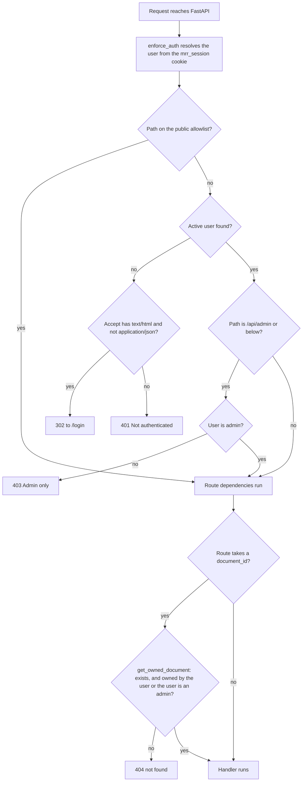
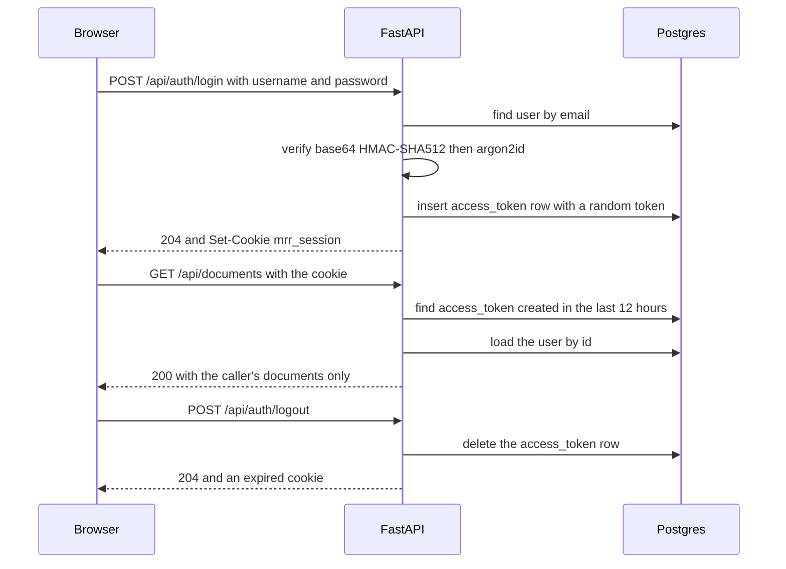

# Authentication and access

## Why it exists

Every uploaded record is a patient's medical file. The app therefore has to answer three questions
on every request: is this a signed-in, active user; may this user see this record; and, for the
catalog screens, is this user an admin. The answers live in `backend/app/auth/` (who you are) and
`backend/app/api/deps.py` (what you own), and they are wired so that a route written tomorrow is
protected without anyone remembering to protect it.

Accounts were migrated from an earlier Flask-Security app, so the password scheme had to verify
those stored hashes unchanged. That constraint explains most of the unusual code in
`backend/app/auth/password.py`.

## How it works

### The deny-by-default gate

`enforce_auth` (`backend/app/auth/deps.py`) is attached to the whole FastAPI app as a dependency
(`dependencies=[Depends(enforce_auth)]` in `backend/app/main.py`), so it runs before every route,
including routes added later. It resolves the current user from the `mrr_session` cookie, then:

The allowlist has two parts. `_PUBLIC_EXACT` holds exact paths: `/`, `/api/auth/login`,
`/api/auth/register`, `/api/auth/forgot-password` and `/api/auth/reset-password`.
`_PUBLIC_PREFIXES` holds `/health`, `/docs`, `/redoc` and `/openapi.json`, matched with
`str.startswith`, so each also covers any longer path that begins with it. Everything else needs a
session.

The 302 versus 401 choice is content negotiation (`_wants_html`): a browser navigation, whose
`Accept` header asks for HTML, is sent to the sign-in page; a `fetch` from the web app, which sends
`Accept: application/json` (`apiFetch` in `frontend/lib/api.ts`), gets a 401 it can handle. main.py
turns the `AuthRedirect` exception into the 302.

### Sessions

Authentication is FastAPI-Users 15.0.5 with one backend (`auth_backend` in
`backend/app/auth/backend.py`): a cookie transport paired with a database strategy.

- The cookie value is an opaque random token (`secrets.token_urlsafe`), not a signed payload. The
  token is the primary key of a row in the `access_token` table, which also holds `user_id` and
  `created_at`.
- The cookie is `HttpOnly` and `SameSite=Lax`, and `Secure` only when `ENVIRONMENT=prod`
  (`_cookie_transport`).
- `SESSION_LIFETIME_SECONDS` (12 hours) sets both the cookie's `Max-Age` and the strategy's
  lifetime. A token is accepted only while its `created_at` is less than 12 hours old, so the
  lifetime runs from sign-in and is not extended by activity.
- Each sign-in creates a new row, so a user can hold several sessions at once. Logout deletes the
  row for the cookie it was sent with.
- The user is loaded from the database on every request, so a change to `active` or `is_admin`
  takes effect on that user's next request. An inactive user is treated as signed out (401).

Domain routes run on the synchronous SQLAlchemy session (`get_db` in `backend/app/db.py`), while
the FastAPI-Users adapters are async-only (`get_async_db`). Only the user id crosses from one to the
other (`backend/app/api/deps.py` docstring).

### Passwords

`MrrPasswordHelper` (`backend/app/auth/password.py`) reproduces Flask-Security's scheme:

1. Pre-hash: `base64(HMAC-SHA512(key = SECURITY_PASSWORD_SALT, message = password))`.
2. Hash the pre-hash with argon2id. New hashes use time cost 3, memory 65536 KiB, parallelism 4, the
   parameters the migrated hashes were made with. Verification reads the parameters stored in each
   hash.

`verify_and_update` always returns `(verified, None)`: it never hands FastAPI-Users a replacement
hash. FastAPI-Users rewrites the stored hash on sign-in whenever the helper returns one; the code
comment records that such a rewrite would store the hash in pwdlib's default format and lock the
user out at their next sign-in. Returning `None` keeps every stored hash byte-for-byte as migrated.

The password rule lives in `UserManager.validate_password` (`backend/app/auth/users.py`): at least 8
characters, a digit, and a character outside `A-Z`, `a-z` and `0-9`. FastAPI-Users calls it on
register, reset and user update, so the API enforces what the sign-up form shows
(`passwordRules` in `frontend/components/auth/password-checklist.tsx`).

### Registration and password reset

- `POST /api/auth/register` is public. It requires `name` (`UserCreate` in
  `backend/app/auth/schemas.py`) and creates the account with FastAPI-Users `safe=True`, which drops
  `is_active`, `is_superuser` and `is_verified` from the body: every new account is an active
  non-admin. No verification router is mounted; `is_verified` stays false and nothing checks it.
- A new account's background jobs are routed onto a per-user queue lane that running workers only
  learn about when they start. See
  [How to manage users and admins](../how-to/manage-users-and-admins.md).
- `POST /api/auth/forgot-password` answers 202 for any address, so the response does not reveal
  whether an account exists. For an active user FastAPI-Users creates a reset token: a JWT signed
  with `SECRET_KEY`, valid for 3600 seconds, that carries a fingerprint of the current password
  hash, so it stops working once the password changes. It then calls
  `UserManager.on_after_forgot_password`, which logs `password reset requested user_id=<id>` and
  does nothing else. The token is not stored, logged or sent anywhere; the app has no mail
  transport.
- `POST /api/auth/reset-password` accepts a token and a new password. The web app's reset form is
  opened by a link of the form `/login?token=<token>` (`frontend/components/auth/login-view.tsx`).

### Per-user isolation

Records are private to the account that uploaded them, with one exception: an admin can open and
fix any account's record. The client's lead reviewer asked for it, to correct a mistake after the
reviewer who made it has left. There is no sharing between reviewers and no view of everyone's
records at once.

- `get_owned_document` (`backend/app/api/deps.py`) loads the document by id and admits the caller
  when `document.user_id` is the caller's id or the caller is an admin. A missing document and
  someone else's document get the same 404 `not found`, so a non-admin cannot learn whether an id
  exists. Every route with a `{document_id}` in its path depends on it, except the admin reprocess
  route.
- The listing route filters on `Document.user_id` (`list_documents` in
  `backend/app/api/documents.py`): the caller's own records, or, for an admin who passes `owner`,
  that one account's records. A non-admin's `owner` is ignored, not refused.
- What an admin does on another account's record is recorded under the admin: every audit row takes
  the acting user, and a job records who started it (`jobs.requested_by`), which the worker's own
  audit row for a re-segment uses. The header, duplicate resolution and job-start routes all
  audit, and an admin opening a record they do not own writes a `view_record` row. The record
  stays with its owner.
- Deleting stays owner-only, even for an admin (`delete_document`): deleting is not fixing, and it
  cannot be undone.
- A prepared export's token is bound to both the user and the document that made it
  (`lookup` and `delivery_status` in `backend/app/services/downloads.py`). A mismatch is the same
  404 as an unknown token.
- Files are stored under `<UPLOAD_FOLDER>/<user_id>/`, named by the document's UUID, never by the
  upload's file name.
- `POST /api/admin/reprocess/{document_id}` is the one route that takes a document id with no
  ownership check. It starts a summarize job and returns `{"ok": true}`; it returns no record
  content.

### The admin flag

An admin is a user whose `user.is_admin` column is true. FastAPI-Users expects the attribute
`is_superuser`, so `backend/app/models.py` maps it onto `is_admin` with a SQLAlchemy synonym (the
same way `hashed_password` maps onto `password` and `is_active` onto `active`), which lets the
migrated rows be used unchanged.

- `/api/admin/*` is refused by the gate for non-admins (403 `Admin only`), and the admin router
  also depends on `current_superuser` (`backend/app/api/admin.py`): two independent checks.
- FastAPI-Users' `/api/users/{id}` routes are admin-only through their own `current_superuser`
  dependency (403 `Forbidden`).
- The first admin is created with the CLI, `python -m app.cli admin grant <email>`
  (`backend/app/cli.py`); nothing else seeds an admin and registration never creates one.
- The web app shows the Admin link in the user menu only when `/api/users/me` reports
  `is_superuser` (`frontend/components/app/user-menu.tsx`). The API enforces the rule regardless.

### What SECRET_KEY and SECURITY_PASSWORD_SALT do

Both are required settings with no default (`Settings` in `backend/app/config.py`), so the API,
the workers and Alembic fail at startup without them. `docker-compose.yml` reads them as
`${SECRET_KEY:?...}` and `${SECURITY_PASSWORD_SALT:?...}`, so compose stops with an error while
either is unset in `.env`.

| Setting | What it does | What rotating it does |
| --- | --- | --- |
| `SECRET_KEY` | Signs the reset-password and verification JWTs (`UserManager.__init__` in `backend/app/auth/users.py`). It does not sign the session cookie, which is an opaque token looked up in `access_token`. | Outstanding reset tokens stop working. Sessions are unaffected. |
| `SECURITY_PASSWORD_SALT` | The HMAC key of the password pre-hash for every account (`MrrPasswordHelper`). For migrated accounts it must equal the salt of the Flask app that created their hashes. | Every stored password stops verifying; every user is locked out until the old value is restored. |

## Design decisions

| Decision | Reason recorded in the code | Rejected alternative |
| --- | --- | --- |
| One app-level gate instead of a dependency on each route | Every route, existing and added later, requires a session unless its path is explicitly public (`backend/app/auth/deps.py` docstring). | Per-route `Depends(current_active_user)`, which a new route can forget. |
| Opaque token stored in Postgres | Sessions are server-side and revocable on logout, and no token is exposed to JavaScript (`backend/app/auth/backend.py` docstring). | A self-contained signed token, which logout cannot revoke. |
| `SameSite=Lax` as the CSRF protection | It stops cross-site unsafe requests from carrying the cookie; the app is same-origin behind one proxy (`backend/app/auth/backend.py`, `frontend/lib/api.ts`). | A double-submit CSRF token. |
| 12-hour fixed lifetime | "One working day; a fresh login each morning is acceptable for staff use" (`SESSION_LIFETIME_SECONDS`). | |
| `Secure` cookie only in `prod` | `prod` is meant for a deployment with TLS at the proxy, which `deploy/nginx.conf` says to add on the server; development runs over http. | |
| 404, never 403, for someone else's document | A non-owner cannot confirm that a document exists (`backend/app/api/deps.py`). | 403, which confirms existence. |
| Flask-Security-compatible hashing that never rehashes | Migrated hashes only verify against the HMAC-then-argon2id construction, and a rehash on sign-in would lock the user out (`backend/app/auth/password.py`). | FastAPI-Users' default helper and its automatic upgrade. |
| Password rule enforced in the API as well as the form | A direct API registration cannot bypass what the UI enforces (`backend/app/auth/users.py`). | Client-side checking only. |
| The reset hook logs the user id only | The token is a credential and the email is PHI-adjacent, so neither goes to a log (`on_after_forgot_password`). | |
| Admin checked twice | Defense in depth (`backend/app/api/admin.py` docstring). | Relying on the gate alone. |

## Before you change it

- A new route is protected automatically. To make one public, add its exact path to
  `_PUBLIC_EXACT`; do not start a protected route's path with `/health`, `/docs`, `/redoc` or
  `/openapi.json`, because those are matched as prefixes.
- A route that takes a document id must depend on `get_owned_document`, and the path parameter
  must be named `document_id`, because that is the parameter the dependency reads. Keep the 404.
- Never make `MrrPasswordHelper.verify_and_update` return a hash, and never change
  `SECURITY_PASSWORD_SALT` on a box with existing accounts.
- `ENVIRONMENT=prod` makes the cookie `Secure`. Over plain http the browser drops it and sign-in
  appears to do nothing, so switch it together with TLS at the proxy (`deploy/nginx.conf`).
- `SESSION_LIFETIME_SECONDS` drives both the cookie and the database lifetime; change the one
  constant, not either side.
- Never log a session token, a reset token or an email address.
- Tests that pin this behaviour: `backend/tests/test_auth_gate.py`,
  `backend/tests/test_auth_integration.py`, `backend/tests/test_password.py`,
  `backend/tests/test_user_manager.py`, `backend/tests/test_cli.py`, and the ownership tests in
  `backend/tests/test_documents_api.py`, `backend/tests/test_downloads.py` and
  `backend/tests/test_admin_api.py`. Run them as described in
  [How to run the tests](../how-to/run-the-tests.md).

## Related pages

- [How to manage users and admins](../how-to/manage-users-and-admins.md)
- [HTTP API reference](../reference/http-api.md)
- [Errors and messages reference](../reference/errors-and-messages.md)
- [Configuration reference](../reference/configuration.md)
- [Architecture](architecture.md)
- [How to add an API route or export](../how-to/add-an-api-route-or-export.md)
