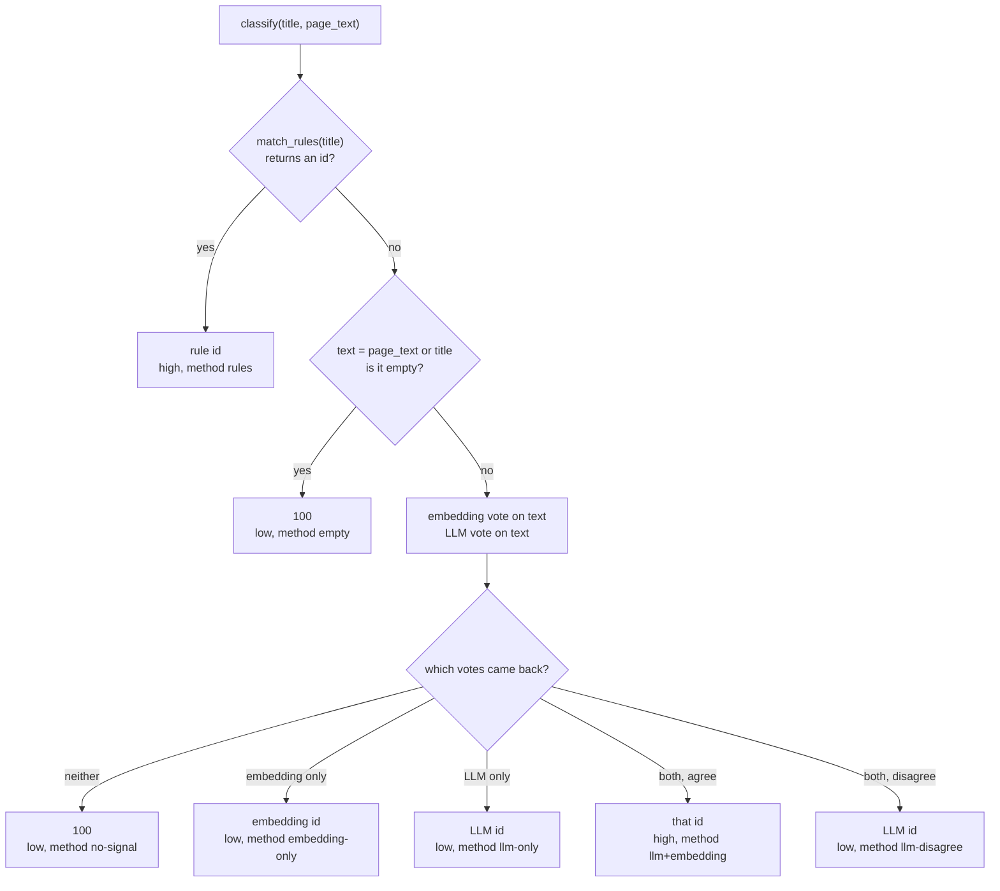
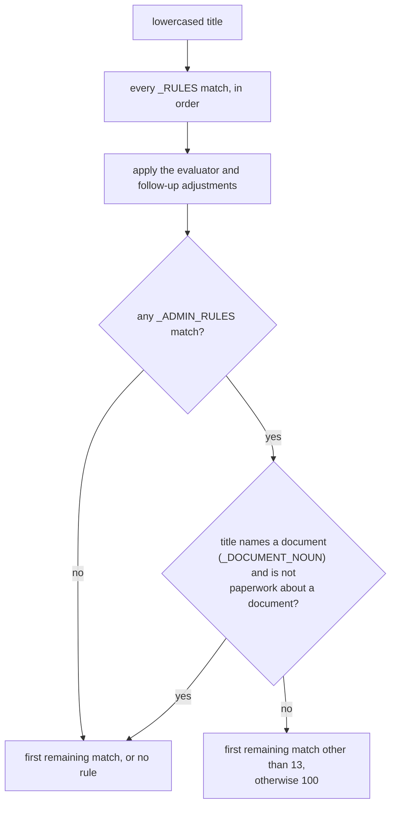
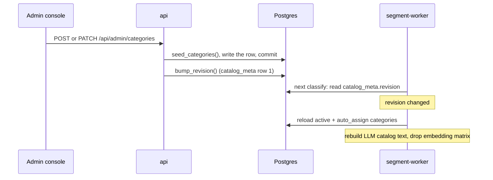

# Categorization

Categorization gives every sub-document row a category id. The id labels the document for the
reviewer, decides whether the row is ticked for summarization by default, and selects the summary
prompt and shared rule blocks the row is summarized with (see [Summarization](summarization.md)).

## Why it exists

A medical record holds many document types, and each type is summarized to a different point list:
an imaging report to its findings, a medico-legal evaluation to its diagnoses and conclusions, a
deposition in page groups. A wrong category produces a summary written to the wrong checklist,
which reads plausibly and is wrong. A document placed in General (`100`) is worse: General is
unticked for summarization by default, so the document silently reaches no deliverable.

The first categorizer was a single fuzzy string match of the title against a list of known
document-type names. It sent many rows to General and was confused by section-heading names in
that list. It was replaced by the cascade described here; the old code survives only in git history (the
Flask app was removed on 2026-09-30).

## Where it runs

Categorization runs only on the segment worker (`segment-worker`, classifier image), in two jobs:

| Job | Called from | What it classifies |
| --- | --- | --- |
| `segment` | `backend/app/services/segment_engine.py` `_categorize()`, on `classify_workers` threads | Every row the segmenter produced: the title first, the row's first pages only when needed |
| `classify` | `backend/app/worker/tasks.py` `classify_document()`, sequentially | Every row of an aggregate upload (several pre-split PDFs merged into one record); rows have no title, so it classifies the text of each row's first page |

The web tier never runs the classifier. `backend/app/services/classification.py` imports torch and
sentence-transformers lazily, only when the embedding stage first runs, so the `api` and
`summarize-worker` containers (the torch-free `mrr-backend-web` image) never load them. The web tier
does call the rule function `match_rules()`, which is pure (see
[What the reviewer sees](#what-the-reviewer-sees)).

## The cascade

`classify(title, page_text=None)` is the entry point. It runs three stages and escalates only as
far as it must:

1. **Rules** on the title. A match answers outright, at high confidence, with no model call. One
   exception, on our own model only: see
   [A bare Progress Note on our model](#a-bare-progress-note-on-our-model).
2. **Embedding** vote, run locally.
3. **LLM** vote, a constrained choice among the allowed category ids.

The two statistical votes must agree for a high-confidence answer. Anything weaker is still
answered, but flagged for a human.

Note that when `page_text` is given, the embedding and LLM stages see the page text only, not the
title plus the text. Rules always look at the title.

### Stage 1: rules

`match_rules(title)` lowercases the title and tests two separate lists of regular expressions.
Both are code in `classification.py`; nothing in the admin console can change them.

**Document-type rules (`_RULES`).** 23 ordered patterns, each mapping to a category. Order is
precedence: specific categories sit above the categories they are confused with, and each rule's
comment in the code records why it sits where it does. In order:

| # | Matches (paraphrased) | Category |
| --- | --- | --- |
| 1 | A request or letter asking for a supplemental report ("request for ... supplement") | 100 |
| 2 | Supplemental plus QME/AME/PQME, in either order | 12 |
| 3 | QME, AME, PQME, qualified or agreed medical evaluator | 13 |
| 4 | Utilization review, independent medical review, IMR | 15 |
| 5 | Return-to-work and voucher, both present | 1 |
| 6 | Physical therapy, chiropractic, acupuncture, PT initial/progress, shockwave therapy or treatment, functional improvement | 5 |
| 7 | PR-4, permanent and stationary, P&S, MMI, doctor's first report, initial consultation | 2 |
| 8 | PR-2, progress report or note, office visit, work status, activity status, follow-up | 1 |
| 9 | Prescriptions, and named orders (lab, imaging, radiology, x-ray, MRI, CT, EKG/ECG, EMG, NCS) | 10 |
| 10 | Imaging and other instrument studies (MRI, CT, x-ray, EMG, NCS, ultrasound, mammogram, sleep study, colonoscopy, DEXA, radiology, diagnostic study) | 3 |
| 11 | Operative report, pathology, operation performed | 8 |
| 12 | Deposition | 9 |
| 13 | RFA, request for authorization | 10 |
| 14 | Adjudication of claim, compensation claim, DWC-1, compromise and release (not a letter or proof of service about one) | 7 |
| 15 | Comprehensive interval history, medical decision making | 11 |
| 16 | GI outpatient, outpatient procedure H&P | 4 |
| 17 | Lab or test results, lab discharge summary | 14 |
| 18 | Emergency department record, report or visit; emergency patient record | 1 |
| 19 | Emergency nursing assessment form | 100 |
| 20 | History and physical, H&P | 1 |
| 21 | A title that starts with referral (optionally "patient" or "medical") | 100 |
| 22 | Discharge summary | 16 |
| 23 | Job description, duties, requirements or analysis; essential functions; position description | 17 |

Three placements show the pattern:

- The supplemental-request rule sits above the supplemental-report rule, and is directional (the
  request words must come before "supplement"), because "Supplemental Report in Response to Your
  Request" is the real report and must not be sent to General.
- Orders (rule 9) sit above imaging (rule 10), so "Radiology Order" is an order, not a study.
- Emergency department, discharge summary and job description sit last, so a title that also
  names a more specific document ("Discharge Summary - Operative Report") keeps that document's
  answer.

**Two precedence adjustments** run on the list of matching rules before the first match is taken:

- **A named document type outranks a bare evaluator mention** (`_EVALUATOR_YIELDS_TO`). If rule 3
  (category 13) matched and so did imaging (3), operative (8), deposition (9) or laboratory (14),
  13 is dropped. "AME Deposition Transcript" is a deposition, not the evaluator's report. This is an
  explicit set rather than moving rule 3 down the list, because any position that lets a deposition
  win would also let "progress report" and "permanent and stationary" win, and those phrases
  describe an evaluator's own report ("AME Permanent and Stationary Report" is 13).
- **A bare "follow-up" yields to a document type** (`_FOLLOWUP_TOKEN` and friends). "Follow-up" says
  when a visit happened, not what the pages are, so "Follow-Up MRI of the Lumbar Spine" is an MRI.
  Category 1 is withheld only when follow-up is the sole reason it matched: not when the title also
  carries a treating-visit phrase ("Office Visit Follow-Up MRI"), and not when another rule answered
  1 for its own reason (`_answered_for_another_reason()`).

**Administrative rules (`_ADMIN_RULES`).** Eight patterns for the paperwork that wraps a record:

1. Routing sheets and slips.
2. Cover and transmittal letters, AME/QME/PQME letters, correspondence, a title that opens with
   "email", and a title that is only the word "letter".
3. Declarations (a title that starts with one), declarations and proofs of service, certificates of
   service or mailing, declarations under penalty.
4. Schedules, indexes and requests for records; records or patient order summaries.
5. Requests, notices and scheduling of an evaluation or examination.
6. Hospital and registration paperwork: facesheets, flowsheets, after-visit and coding summaries,
   patient signature pages and information sheets, ER registration, conditions of admission,
   admission or inpatient records, medication administration, ED care timelines.
7. A bare excerpted-records wrapper ("Medical Records Excerpt", "Review of Medical Records"),
   anchored at both ends so "Medical Record Excerpt - MRI of Right Knee" is not claimed.
8. A list of administrative types the reviewers said they never summarize: demographics, face
   sheets, medication lists, W-9 and taxpayer forms, provider lists, delivery confirmations,
   subpoenas, cover and separator sheets, attestations, record chronologies, billing and invoices,
   attachment information.

**How the two lists combine: document beats wrapper.**

- If the title names a document at all (`_DOCUMENT_NOUN`: report, transcript, note, study, scan,
  imaging, x-ray, chart, questionnaire, result), the administrative rules stand down and the title is
  decided as if they had not matched. "Cover Letter - Psychological Evaluation Report" is a report;
  if no document-type rule fits, it falls through to the embedding and LLM stages rather than being
  buried in General. "Records" is deliberately not a document noun: "Schedule of Records" is
  paperwork about records.
- One shape is excepted (`_PAPERWORK_ABOUT_A_DOCUMENT`): "declaration, proof or certificate of
  service or mailing OF ...". There the noun names what the paperwork is about, so the
  administrative rule holds. It is anchored on the trailing "of", because a real evaluation does
  travel with a service page: "QME Report - Proof of Service" stays 13.
- Otherwise the administrative match holds, and the answer is the first document-type rule that
  also matched, except 13, else 100. Category 13 does not count here because it fires on a mere
  mention of the evaluator, which correspondence about an AME contains too. Any other rule counts:
  "Transmittal Letter - MRI Lumbar Spine" is an MRI.

So an administrative title can return 100 even though a document-type rule (13) matched. That is
the one path where a rule assigns General at high confidence without a flag, which is why the
administrative list is kept narrow and why `_DOCUMENT_NOUN` exists.

A rule hit is never flagged for review. The review flag protects the statistical stages; a rule
that fires wrongly is invisible until a reviewer notices the row.

### Stage 2: embedding vote

`embed_classify(text)` encodes the text with the local sentence-transformers model
`all-MiniLM-L6-v2` and picks the category whose corpus is nearest by cosine similarity. A
category's corpus is its name, description and example titles joined into one string
(`taxonomy.Category.corpus`, mirrored by `classification._corpus()` for catalog rows). The model
file is baked into the classifier image, so this stage makes no network call and no record text
leaves the host for it. The similarity score is returned but nothing thresholds it.

`SentenceTransformer.encode` is not documented as thread-safe, so encoding is serialized under a
lock. Raising `classify_workers` does not parallelize this stage; the LLM call dominates the time
anyway.

### Stage 3: LLM vote

`llm_classify(text)` makes one call on the `classify` stage: `generate_choice` with the allowed
category ids as the only permitted answers (on Gemini, the native enum output mode), at temperature
0 and with no output cap. The model is `classify_model` (default `gemini-2.5-flash-lite`, the
cheapest tier, because this is a short enum task), or `vllm_model` when the stage is routed to the
vLLM backend. See [Model calls by stage](../reference/model-calls-by-stage.md).

The prompt lists each allowed category as `id: name - description` (examples are not included),
says to choose 100 only when nothing specific fits, and states the administrative rule in words, so
the LLM agrees with `_ADMIN_RULES` rather than fighting it. A reply that is not an allowed id, or any
error, returns no vote. A cancelled job (`JobCancelled`) is re-raised rather than treated as a
failed vote.

The allowed ids are the catalog's categories that are both active and auto-assignable (see
[The catalog](#the-catalog)). The embedding stage uses the same set.

### How the votes combine

| Situation | Category | Confidence | Flag for review | `method` |
| --- | --- | --- | --- | --- |
| A rule matched the title | the rule's id | high | no | `rules` |
| No rule, and the text is empty | 100 | low | yes | `empty` |
| Embedding and LLM agree | that id | high | no | `llm+embedding` |
| Embedding and LLM disagree | the LLM's id | low | yes | `llm-disagree` |
| Only the embedding answered | the embedding's id | low | yes | `embedding-only` |
| Only the LLM answered | the LLM's id | low | yes | `llm-only` |
| Neither answered | 100 | low | yes | `no-signal` |

Any model failure degrades to a flagged best guess, never an error. The result is a
`Classification(category, confidence, method, needs_review)`; `confidence` itself is not stored.
Two further `method` values exist outside `classify()`: `timeout`, written by the segmentation
engine for a row the categorization pool never finished (category 100, flag `x`), and NULL, for a
row created before the column existed or added in the review editor.

## Title first, then the row's first pages

In the segment job, `_categorize()` calls `classify(title)` on the title alone first, because a
title is cheap and usually enough. Only when that answer needs review does it read evidence and
classify again with `page_text`:

- It reads up to three leading pages of the row (`_ESCALATION_PAGES`), never past the row's own
  end, skipping blank pages, capped at 12,000 characters (`_ESCALATION_CHARS`).
- In the worker the text comes from the page-text store through `page_text_fn`, so pages already
  read at the start of the job are not OCR'd again. Only a standalone run (the eval harnesses) OCRs
  the pages itself.
- The escalated answer replaces the title-only one, and its `method` is what is stored.
- A missing OCR installation (`OcrUnavailableError`) fails the job, because it would fail every row
  identically. Any other error keeps the title-only answer and logs a warning.

The row's flag becomes `x` when the final answer needs review or when the segmenter's own
manual-check field was `x`.

Why three pages: boundaries move by a page between runs. The comment on `_ESCALATION_PAGES` records
a 463-page record segmented twice on the same build that started one document on page 94 in one
run and on page 93 (the previous document's last page) in the other. Re-classified on page 93
alone, a 52-page medico-legal evaluation became category 100 with both votes agreeing, so it was
not even flagged. Pages 93 and 94 together still answered 100; pages 93 to 95 recovered 13. A
"read more when the first page looks thin" rule was rejected because the failing two-page text was
already long enough to satisfy any sensible threshold.

A title where both votes agree is answered at high confidence without reading any page.

### A bare Progress Note on our model

When the `classify` stage runs on vLLM (`backend_for("classify") == "vllm"`), a title whose only
category-1 reason is the token "progress note" (`bare_progress_note()`) does not let rule 1 decide:

- Asked on the title alone, `classify()` answers rule 1's category flagged for review and calls no
  model, so `_categorize()` escalates to the row's first pages as above.
- Asked with page text, the rule stands aside and the embedding and LLM vote on the pages. If
  neither vote comes back, rule 1's category stands, still flagged.
- "Progress report", "PR-2", "office visit", "work status" and "activity status" keep the rule. So
  does any title another rule answers on its own word: rule 5's therapy words, the return-to-work
  voucher, the emergency-department visit, History & Physical.

Why: on the 27-record exam of 2026-10-06, rule 1 answered 84 bare "Progress Note" rows on our
trained model and 28 of them were chiropractic, physical-therapy or acupuncture notes the reviewer
filed under 5. Our model leaves the discipline out of the title, so rule 5 never fires, and the
author's credential is on the pages. The other treating tokens were 63 right against 4 wrong.

The same deferral covers a treating physician's report that also names a request for authorization
(`treating_report_with_authorization()`): a title naming a treating physician (or "PTP") and an
RFA, with no rule-1 token, that the authorization rule would answer 10. Across the 211 reviewed
records on the live box reviewers filed that shape 1 on 8 rows, 2 on 4 and 10 on 4. A bare "Request
for Authorization" keeps its 10 (288 of 292 rows), and a title carrying a rule-1 token already
answers 1.

Gemini is untouched: on a Gemini backend the rule answers exactly as before and the pages are not
read.

### Deciding from the pages first, on our model (`VLLM_CLASSIFY_FROM_PAGES`)

Off by default, and then everything above holds. On, and only when `classify` runs on vLLM,
`_categorize()` reads the row's first pages first and calls `classify(title, page_text)` once, so
every row no title rule answers is decided on its pages. With no readable page text it falls back
to the title alone. Rules still answer first, a reviewer's Stop and a missing OCR installation still
propagate, and any other read failure falls back to the title.

It exists because the fine-tuned adapter was trained on the pages form of the request (the
mrr-training categorization builder sends the escalation text wherever page text exists), while
the default path asks it about the title and keeps a confident title answer. It is a switch so the
two can be compared by a categorization replay on a pod without a rebuild. Whether it helps is a
measurement, not yet made.

The aggregate-upload `classify` job does not escalate: its rows have no title (`-`), so no rule can
match, and it classifies the text of each row's first page directly. It re-derives each row's
`include` from the new category and sets the flag to `x` when the answer needs review.

## What the reviewer sees

- **`category`** on the row, which the reviewer can change in the editor.
- **`flag`** `x` on low-confidence rows (and on rows the segmenter flagged).
- **`method`**, stored on both `segment_rows` and `review_rows`. It is frozen at segment time and
  server-owned: the editor round-trips it, but `_store_rows()` in `backend/app/api/documents.py`
  ignores the client's value and carries the stored one across by exact page range. A row whose
  range the reviewer changed starts again at NULL, because the verdict described other pages.
- **`ruled_paperwork`**, computed on every editor load by `_editor_row()`: true when
  `match_rules(title)` returns 100 today. It is a live replay, so it reflects rules shipped since
  the row was segmented.

The workbench combines them (`frontend/lib/review-rows.ts`):

- **"Could not identify"** (`couldNotIdentify()`): a row in category 100 that no rule calls
  paperwork today and whose `method` is not `llm+embedding`. General holds both "this is paperwork"
  and "nothing identified this"; only two agreeing votes or a rule settle the first. NULL counts as
  unknown, so old rows stay listed.
- **Guessed category** (`categoryWasGuessed()`): a row outside General whose `method` is anything
  but `rules` or `llm+embedding`. It is shown as a marker, not added to the filter, because the
  filter reads the live category and clears when the reviewer re-categorizes, while `method` does
  not change on save.

See [The frontend workbench](frontend-workbench.md).

## The catalog

### Two sources, one rule for choosing between them

Categories live in the `categories` table (name, description, examples, and the `active`,
`auto_assign` and `summarize_default` flags; see the [data model](../reference/data-model.md)). The
code constants are the fallback:

- `backend/app/services/taxonomy.py` `CATEGORIES`: ids 1-5, 7-17 and 100, each with a name, a
  description and example titles.
- `backend/app/services/seed_catalog.py` `constants_categories()`: those, plus id 6 ("Daily / SOAP
  notes", active, `auto_assign=False`) and id 18 ("Illegible document",
  active, `auto_assign=False`: a reviewer marks a document nobody can read), with
  `summarize_default` off for 100 only.

`backend/app/services/catalog.py` `get_categories()` reads the table and uses the constants **only
when the table has no rows at all**. The fallback is all-or-nothing: one inserted row ends it for
every reader, and the catalog becomes exactly the rows in the table. That is the normal state of a
fresh box, a local database and CI, because nothing in `app/` seeds the table at startup.

Three views are derived from it:

| View | Filter | Used by |
| --- | --- | --- |
| Every category | none | the admin console |
| Editor set | `active` | the editor's category list and `validate_rows()`, which rejects a saved row whose category is not active |
| Classifier set | `active` and `auto_assign` | the embedding and LLM stages |

Category 6 is active but not auto-assignable: a reviewer may pick it, the classifier never does.
Its document types (daily and SOAP notes) are assigned to category 5, whose description and prompt
cover them.

### Writes seed first

Any admin write that needs a row calls `seed_categories()` first, which writes the constants as rows
if the table is empty and does nothing otherwise. Without it, creating one new category on a fresh
box would end the fallback and collapse the catalog to that single row. `seed_categories()` writes
categories only. The older `seed_catalog()` also writes one summary-prompt row per category, and
those rows would shadow `backend/app/services/prompts.py` forever, so nothing in `app/` calls it
(migration `f1a83b5c60d2` removed such rows where they existed). `GET /api/admin/categories` never
writes: it lists the catalog, which on a table with no rows is the built-in constants, so the admin
page is never empty on a fresh box.

A category added in code reaches a box whose table already has rows only through a migration (see
[How to add or change a category](../how-to/add-or-change-a-category.md)).

### How an edit reaches the classifier

1. Every successful admin write (category create or update, prompt set or revert) increments the
   revision in `catalog_meta` (`catalog.bump_revision()`) and writes an audit row.
2. Each segment-worker process caches the classifier set, the LLM catalog text and the embedding
   matrix. Every catalog read inside `classify()` first reads the current revision on a short
   session (`_refresh_locked()`); when it differs, the process reloads the set and rebuilds the text,
   and the embedding matrix is rebuilt on its next use.
3. Segment-worker processes also clear the cache at startup (`reset_catalog_cache()` in
   `backend/app/worker/__main__.py`).
4. If the database cannot be read, the revision reads as -1 and the classifier falls back to the
   `taxonomy.py` constants, which keeps the cascade usable in unit tests.

No restart or rebuild is needed for a catalog edit. Each job is also stamped with the revision it
started under (`jobs.catalog_revision`).

### What an edit can and cannot change

| Edit | Effect on classification |
| --- | --- |
| Name, description | Changes the LLM's catalog text and the embedding corpus |
| Example titles | Changes the embedding corpus only (the LLM prompt does not list examples) |
| `active` or `auto_assign` off | Removes the category from both votes |
| `summarize_default` | No effect on classification; sets `include` on rows classified into it later |
| Anything | **No effect on the rules.** `_RULES` and `_ADMIN_RULES` are code |

Rules can return any id regardless of the catalog's flags; only the two votes honour
`active`/`auto_assign`. A new category created in the console is therefore reachable only through
the votes, and only when the embedding and LLM agree on it will it be assigned without a flag.

Deactivating a category is refused with 409 while any review row uses it, because `validate_rows()`
accepts only active categories: every document holding such a row would fail to save. Category 11
has no summary prompt of its own and resolves to the general one, and is kept active for the same
reason.

## Design decisions and their reasons

- **Rules first.** A rule costs nothing, needs no model, and gives the same answer on every record.
  Many rules exist for that determinism alone: an unruled title is re-decided by the votes every time
  and was measured coming back with different answers across records (for example a work-status
  form answered four ways over 89 rows before its rule existed).
- **But a rule skips the review flag**, so rules are added only on evidence (a reviewer's direct
  answer, or a measurement over stored titles) and kept narrow. Document types the votes already
  answer consistently, such as "Interdisciplinary Notes" and "Transmittal Note", deliberately have
  no rule and stay pinned as expected failures in the test suite.
- **Two independent votes must agree.** Either vote alone is a guess. Agreement is high confidence;
  anything else is answered and flagged, so weak results reach a human rather than silently landing
  in General.
- **The embedding stage is local**, so that stage sends no record text anywhere.
- **The LLM answer is constrained to the allowed ids**, so it cannot emit an invalid category, and
  runs on the cheapest tier.
- **Category descriptions say what does not belong.** The descriptions of 3 and 14, 10 and 15, 16,
  17 and 100 each end with a sentence pointing the confusable case at the other category. The votes
  read only this text, so those sentences are load-bearing (comments in `taxonomy.py`).
- **Section headings were removed from category 5's examples**, because headings such as "Physical
  Examination" appear in nearly every report and attracted anything with an exam heading.
- **Choices recorded as measured and rejected in the code comments:**
  - Moving rule 3 (category 13) down the list instead of the explicit yield set: impossible to
    express by position (above).
  - Qualifying the follow-up token to "follow-up visit": moved 4 real titles from category 1 to no
    rule at all.
  - Treating every declaration as standalone paperwork: broke two pinned evaluation titles, which is
    what narrowed `_PAPERWORK_ABOUT_A_DOCUMENT` to its trailing "of".
  - Adding emails to `_PAPERWORK_ABOUT_A_DOCUMENT`: fixed one observed row but broke the pinned
    document-beats-wrapper case ("Email Correspondence - QME Report" is a cover page on a report as
    often as it is an email about one).
  - A substring rule for "excerpt": would bury "Medical Record Excerpt - MRI ..." in General.
  - An unanchored referral rule: claimed titles that merely mention a referral.
  - A bare "order" token for category 10: would move ward paperwork into a clinical category.
  - Escalating on one or two pages: measured wrong (above).
- **Rule 8 (category 1) and the follow-up mirror are built from the same constants**, because two
  hand-maintained copies had drifted twice.
- **Several placements were decided in-house** rather than answered by the reviewers (the evaluator
  yield set and the paperwork-about-a-document exception); each is one line to reverse.
- **An editable catalog** (historical record: `legacy/docs/decisions/0006-editable-catalog-admin.md`).
  Categories and summary prompts moved from frozen constants into tables so the business can change
  them without a deploy, with the constants kept as fallback. Still true of that decision: ids are
  immutable numeric strings because they key stored rows; deletion is the soft `active` flag; the
  `auto_assign` flag keeps "the classifier's set" separate from "the editor's set"; a revision bump
  on every edit invalidates the classifier caches and is stamped on jobs; re-processing a document
  replaces its previous summaries. A single admin flag was chosen over role-based access, and a
  config allowlist and file-based overrides were rejected. What changed since: the admin flag is now
  the FastAPI-Users superuser flag, schema changes go through Alembic, and nothing seeds at startup.

## Before you change it

- **Measure a rule change over stored titles first**: how many distinct titles and rows change their
  answer, and which way. The code comments on almost every rule record that number. A rule that
  moves rows out of a summarized category into General loses content invisibly, which is the
  expensive direction.
- **Pin the change** in `backend/tests/test_classification.py` (it stubs the models at the provider
  seam, so it runs without torch). Catalog behaviour is covered by `test_catalog.py` and the admin
  endpoints by `test_admin_api.py`. See [Run the tests](../how-to/run-the-tests.md).
- **Rebuild both backend images.** The cascade runs on `segment-worker` (`mrr-backend-classifier`);
  the `ruled_paperwork` replay runs on `api` (`mrr-backend-web`). Rebuilding only one leaves the two
  answering differently. See [Deploy to the server](../how-to/deploy-to-the-server.md).
- **Existing rows keep their category.** A rule or catalog change affects rows classified afterwards.
  Re-running segmentation re-classifies, but also replaces the document's rows and every reviewer
  correction on them.
- **A `taxonomy.py` edit does not reach a database whose `categories` table has rows** without a
  migration; see [How to add or change a category](../how-to/add-or-change-a-category.md).
- **Check `summarize_default` in the table, not the constants,** before relying on a category's
  default: the live value is whatever the row says.

## Related pages

- [How to add or change a category](../how-to/add-or-change-a-category.md)
- [Segmentation](segmentation.md) - where categorization runs for most rows.
- [Summarization](summarization.md) and
  [How to change a summary prompt or rule](../how-to/change-a-summary-prompt-or-rule.md) - what the
  category selects.
- [Duplicate detection](duplicate-detection.md) - uses the category as one of its signals.
- [HTTP API reference](../reference/http-api.md) - the `/api/admin` routes.
- [Auth and access](auth-and-access.md) - who counts as an admin.
- [Glossary](../reference/glossary.md)
