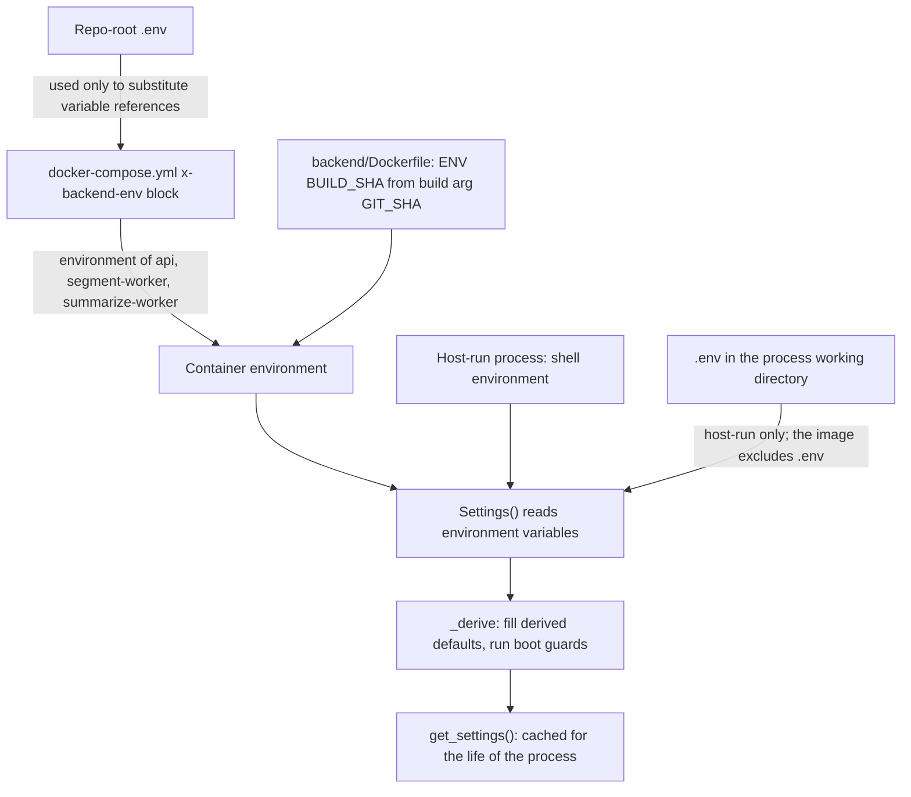

# Configuration model

All backend configuration is one class, `backend/app/config.py` `Settings`, read from environment
variables. That part is simple. What is not simple is the path a value takes to reach it inside a
container, and that path has caused the same failure repeatedly: a key set correctly in `.env` that
never reached the app. This page explains how a setting reaches running code, why 19 settings are
not passed to containers, why `.env.example` is not a defaults file, and which tests hold the rules
in place.

Every setting, with its defaults and effect, is listed in the
[Configuration reference](../reference/configuration.md).

## How a setting reaches code

### Settings

- `Settings(BaseSettings)` sets `env_file=".env"` and `extra="ignore"`, and no `env_prefix`
  (`model_config`). Each field is read from the environment variable of the same name, uppercased.
  The one exception is `use_vertex`, which reads `GOOGLE_GENAI_USE_VERTEXAI` through a
  `validation_alias`.
- `env_file=".env"` is relative to the process working directory. A backend run on the host from
  `backend/` reads `backend/.env`. pydantic-settings gives real environment variables priority over
  the dotenv file.
- `database_url`, `secret_key` and `security_password_salt` have no default, so building `Settings`
  fails at once if any is missing (module docstring). This is why alembic and any script that
  imports the settings need those three set.
- `Settings._derive()` fills the derived defaults (`GENAI_MODEL`, `SUMMARY_MODEL`, `VERIFY_MODEL`,
  the summarize model triple, the body fallback model) and runs every boot guard. See
  [Model providers](model-providers.md) for the guards.
- `get_settings()` is wrapped in `functools.lru_cache`, so settings are read once per process. A
  changed value needs a restart of every process that reads it; with Compose that means recreating
  `api`, `segment-worker` and `summarize-worker` together.

### Inside a container

- **Compose names a variable or it never arrives.** Compose reads the repo-root `.env` only to
  substitute `${VAR}` references inside `docker-compose.yml`. It does not load `.env` into the
  containers. A key that `docker-compose.yml` does not name in its `x-backend-env` block never
  reaches a container, however `.env` is written (comment at the head of the pacing block in
  `docker-compose.yml`).
- **The image carries no `.env`.** `backend/.dockerignore` excludes `.env` and `.env.*`, so inside a
  container `Settings` sees only the environment compose passes and the one variable the image sets
  itself (`BUILD_SHA`, from the `GIT_SHA` build argument in `backend/Dockerfile`).
- **Compose defaults win over `config.py`.** A line such as `PIPELINE_WORKERS: ${PIPELINE_WORKERS:-5}`
  passes a value explicitly, so the container reads the compose default when `.env` is silent and
  never falls back to the default in `config.py`. Editing only the `config.py` default changes
  nothing on a deployed box (comment above `PAGE_TEXT_WORKERS` in `docker-compose.yml`).
- **`${VAR:-default}` also replaces an empty value.** Setting a key to nothing in `.env` gives the
  container the compose default, not an empty string. For example `VLLM_MODEL` can never be empty
  inside a container, and `GOOGLE_GENAI_USE_VERTEXAI` is true unless `.env` says `false`.
- **Required secrets fail at interpolation.** `SECRET_KEY` and `SECURITY_PASSWORD_SALT` use
  `${VAR:?message}`, so Compose refuses to start the stack when either is unset or empty.
- **Empty on purpose.** `GENAI_MODEL` and `VERIFY_MODEL` default to empty in compose so the
  derivation in `config.py` still runs (`GENAI_MODEL` from `GOOGLE_GENAI_USE_VERTEXAI`,
  `VERIFY_MODEL` from `GENAI_MODEL`). Hardcoding a name there would break that chain (comment above
  `GENAI_MODEL` in `docker-compose.yml`).

### Compose defaults that differ from the code

Most compose defaults repeat the `config.py` default, and a test enforces equality for every
setting whose comment promises an environment toggle (see below). These differ:

| Variable | `config.py` | `docker-compose.yml` | Effect inside a container |
| --- | --- | --- | --- |
| `GOOGLE_GENAI_USE_VERTEXAI` | `False` | `true` | Vertex is on unless `.env` says `false` |
| `VLLM_MODEL` | `""` | `Qwen/Qwen3.6-35B-A3B-FP8` | Never empty, so the "VLLM_MODEL missing" guard cannot fire in a container |
| `REDIS_URL` | `redis://localhost:6379/0` | `redis://redis:6379/0` (fixed) | Always the compose `redis` service |
| `UPLOAD_FOLDER` | `./uploads` | `/app/uploads` (fixed) | Always the `mrr_uploads` volume |
| `DATABASE_URL` | required | built from `POSTGRES_PASSWORD` (default `mrr_local_only`) | Always the compose `postgres` service |
| `SECRET_KEY`, `SECURITY_PASSWORD_SALT` | required | `${VAR:?...}` | Compose refuses to start without them |

## The 19 settings that are not passed

`Settings` has 90 fields; `docker-compose.yml` names 71 of them. The module docstring of
`backend/tests/test_compose_passthrough.py` records the policy: most of `Settings` is deliberately
not exposed, because "an operator has no business retuning a thinking budget from an env file", and
listing every field in the test would make it a second copy of the class. What must be exposed is
narrower and is a property rather than a preference:

- a setting a boot guard compares against another setting (a guard over a value nobody can change is
  a wall, not a control);
- a setting that must match how a rented vLLM pod is served;
- a setting whose own comment promises it can be changed from the environment;
- any key `.env.example` advertises.

None of the 19 below meets those conditions. Inside a container each takes its `config.py` default.

| Variable | Why it is not passed |
| --- | --- |
| `TESSERACT_CMD` | Excluded on purpose: it holds a Windows host path, and injecting it would point the containers' pytesseract at a binary that does not exist and break OCR. The Linux images have tesseract on `PATH` (comment at the end of `x-backend-env`; asserted by `backend/tests/test_pool_wiring.py`) |
| `BUILD_SHA` | Set inside the image: `backend/Dockerfile` declares `ARG GIT_SHA=unknown` and `ENV BUILD_SHA=$GIT_SHA`, and compose passes `GIT_SHA` as a build argument |
| `GEMINI_API_KEY` | Not named. Inside a container it is always empty, so the containerised app reaches Vertex only through `GOOGLE_CLOUD_PROJECT` with Application Default Credentials (`GOOGLE_APPLICATION_CREDENTIALS`, which compose passes) |
| `OPENAI_MAX_RPM`, `OPENAI_MAX_TPM` | Not named. `.env.example` records that they are absent and says to name them in compose in the change that first needs them; the pacer replaces them with OpenAI's own header values after the first call |
| `GENAI_TIMEOUT_PER_1K_TOKENS_MS`, `GENAI_DEADLINE_RETRY_MULTIPLIER` | Not named; both are calibrated values whose comments carry the measurement |
| `AUDIT_MAX_OUTPUT_TOKENS` | Not named; its comment says it is deliberately given no value until a measurement decides which way it should move |
| `SUMMARY_IMAGE_LONG_EDGE_PX` | Not named; its comment says changing it "is not a local decision" and points to the capacity report it came from |
| `OCR_TIMEOUT_SECONDS`, `OCR_BASE_DPI`, `OCR_MAX_LONG_EDGE_PX` | Not named; the long-edge cap's comment says nobody enables it without running `scripts/eval/ocr_cap_word_recall.py` first |
| `DOI_WORKERS` | Not named |
| `SUMMARIZE_PAUSE_AFTER`, `SUMMARIZE_RESUME_DELAY` | Not named |
| `FUTURE_TIMEOUT_MARGIN_SECONDS` | Not named |
| `DOWNLOAD_TTL_SECONDS`, `DOWNLOAD_WATCH_SECONDS` | Not named |
| `BUNDLE_SUMMARIZE_CAP` | Not named |

To make one of these settable on a deployed box, add it to `x-backend-env` with the same default as
`config.py`, and to `.env.example`.

## `.env.example` is a template, not a defaults file

Three templates exist and they serve different runs:

| Template | Copied to | Used by |
| --- | --- | --- |
| `.env.example` | repo-root `.env` | The compose stack; also the operator-facing catalogue of tunable keys |
| `deploy/env.docker.example` | repo-root `.env` | The compose stack; carries `POSTGRES_PASSWORD` and `ENVIRONMENT`, which `.env.example` does not |
| `backend/.env.example` | `backend/.env` | A backend run on the host from `backend/` (`DATABASE_URL`, `REDIS_URL`, the two secrets, the Vertex keys, `GEMINI_API_KEY`, `UPLOAD_FOLDER`) |

The values in `.env.example` are not all the code defaults. Copying it unchanged makes these values
live, because every uncommented key it holds except `TESSERACT_CMD` is named in compose and therefore
overrides the compose default:

| Key | `.env.example` | Compose and code default |
| --- | --- | --- |
| `VERTEX_MAX_RPM` | `20` | `60` |
| `SEGMENT_WINDOW_WORKERS` | `1` | `3` |
| `GOOGLE_APPLICATION_CREDENTIALS` | `/secrets/vertex-sa.json` | empty (not a `Settings` field) |
| `TESSERACT_CMD` | a Windows path | empty; never passed to containers |

Its comments are also the only place some operational history is recorded, so read them as
commentary rather than as the current defaults. The [Configuration reference](../reference/configuration.md)
lists the `config.py` and `docker-compose.yml` defaults side by side.

## The passthrough tests

These tests exist because the same trap recurred. The comments record `VERTEX_MAX_RPM` and
`SEGMENT_WINDOW_WORKERS` set in the server `.env` on 2026-07-31 while the containers kept the code
defaults; the `DUPE_*` thresholds advertised as env-tunable the same day and inert;
`SUMMARY_MODEL` inert on 2026-08-12 when the configured body model was refused and the only way out
was a code change; and `SUMMARY_VERIFY=false`, set on the box as the containment for an incident on
2026-09-18, doing nothing. `DUPE_SIMILARITY_OVERRIDE` is the worked example of the other direction:
`config.py` said 0.99 while compose said 0.90, and every container served 0.90.

| Test | Asserts |
| --- | --- |
| `backend/tests/test_pool_wiring.py` `test_compose_passes_through_the_settings_it_claims_to_control` | Every uncommented `KEY=` line in `.env.example` is named in `docker-compose.yml` as `KEY: ${KEY`, except `TESSERACT_CMD`, which must not be. Derived from `.env.example` so it grows by itself, with a floor of 20 parsed keys so a broken parse fails rather than passing empty |
| `backend/tests/test_compose_passthrough.py` `test_the_setting_is_named_in_compose` | Eleven pod-agreement settings (`VLLM_SEGMENT_MAX_PAGES`, `VLLM_MAX_IMAGES_PER_PROMPT`, `SUMMARY_IMAGE_MAX_PAGES`, `SUMMARY_IMAGE_DPI`, `DOI_IMAGE_LONG_EDGE_PX`, `DEPOSITION_IMAGE_LONG_EDGE_PX`, `DOI_MAX_OUTPUT_TOKENS`, `DEPOSITION_MAX_OUTPUT_TOKENS`, `VLLM_THINKING_STAGES`, `VLLM_CLASSIFY_FROM_PAGES`, `VLLM_AUDIT_ISSUES_FIRST`) are passed as `${NAME:-default}`, not merely mentioned in a comment |
| `test_the_setting_is_documented_in_env_example` | The same eleven appear as `NAME=` lines in `.env.example` |
| `test_every_named_setting_actually_exists_on_settings` | The eleven are real `Settings` fields, so a rename cannot leave the list asserting nothing |
| `test_the_mirrored_page_caps_match_their_modules` | `config._DOI_IMAGE_CAP` and `_DEPOSITION_IMAGE_CAP` equal `summary_doi._MAX_PAGES` and `deposition_pages._MAX_PAGES` (config cannot import those modules, so it mirrors them) |
| `test_every_stage_that_rasterises_is_covered_by_the_image_guard` | The services that call `page_image_parts(` are exactly the stages in `config._IMAGE_CAPPED_STAGES` |
| `test_a_setting_that_promises_an_env_toggle_can_reach_a_container` | Every field whose comment block contains a phrase such as "env-overridable", "via env" or "without a redeploy" is passed through compose |
| `test_the_compose_default_matches_the_config_default` | For those same fields, the compose default parses to the `config.py` default |
| `test_the_comment_reader_still_finds_comments`, `test_no_comment_block_is_orphaned_from_its_field` | Controls: the comment reader still finds comments, and no comment block is separated from its field by a blank line (a gap would silently drop that field out of the checks above) |

The comment-derived tests read the contiguous block of `#` lines directly above each field, using
`ast` to find fields. The phrase list is deliberately loose: a promise worded some other way is a
false negative, so the tests are a floor, not proof that every promise is honoured.

## Before you change it

- **Adding a setting:** give it a comment block directly above the field with no blank line between.
  If a boot guard compares it, if it must match how a pod is served, or if its comment says it can be
  changed from the environment, name it in `x-backend-env` with the same default as `config.py` and
  add it to `.env.example`. If `.env.example` advertises it, compose must name it.
- **Changing a default:** when the setting is named in compose, change both places; the compose value
  is the one containers run.
- **Changing a value on a box:** edit `.env`, then recreate `api`, `segment-worker` and
  `summarize-worker` together. See [How to deploy to the server](../how-to/deploy-to-the-server.md).
- **Only the exact value `prod` of `ENVIRONMENT`** enables the production guards (Vertex required,
  OpenAI Zero Data Retention acknowledgement, vLLM origin allowlist) and the secure session cookie.
- **Building `Settings` in a test** reads whatever environment the run carries. The comments on
  `config._IMAGE_CAPPED_STAGES` and in `backend/tests/test_backend_provenance.py` record a fake
  `DATABASE_URL` leaking into an unrelated test this way; patch the cached instance instead.

## Related pages

- [Configuration reference](../reference/configuration.md)
- [Model providers](model-providers.md)
- [Compose services reference](../reference/compose-services.md)
- [How to switch model backends](../how-to/switch-model-backends.md)
- [How to deploy to the server](../how-to/deploy-to-the-server.md)
- [How to run the app locally](../how-to/run-the-app-locally.md)
