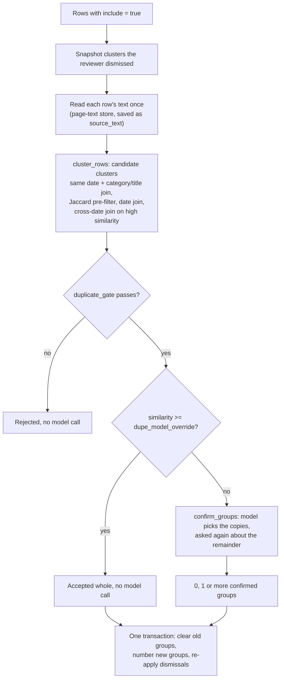
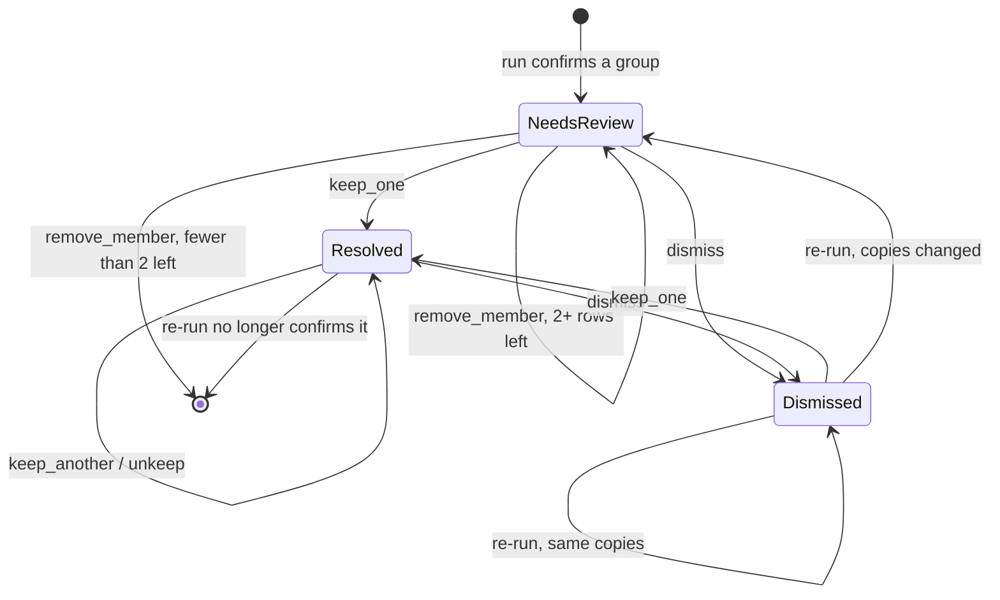

# Duplicate detection

Duplicate detection finds sub-documents that are copies of the same document (a re-scan, a re-sent
fax, the same report filed twice) among the rows the reviewer chose to summarize, and lets the
reviewer decide which copy to keep. It never removes anything on its own.

## Why it exists

Medical records routinely contain the same document more than once. If both copies stay ticked for
summarization, the client receives two near-identical paragraphs, with nothing on screen to hint at
it. The reviewers' rule, recorded in the comments on the thresholds in `backend/app/config.py`, is
that nothing is deleted automatically: the reviewer picks which copy to keep, sometimes by scan
quality. So the check is built for recall and ends in a human decision, and the thresholds are
tuned toward surfacing a doubtful cluster rather than missing a real one.

The hard part is that text similarity does not answer the real question. Two scans of one page are
OCR'd separately and never come out identical, and a badly scanned copy can score low. A recurring
form filled in on different visits (six physiotherapy notes on one template) can score very high and
is not a duplicate. What separates them is whether the documents record the same event, so the check
leads with the date and the title or category, and uses text similarity as supporting evidence.

## When it runs

Only when the reviewer starts it. Nothing enqueues it after segmentation.

- `POST /api/documents/{id}/dedup/start` enqueues a job of kind `dedup` (409 if a job is already
  active for the document). The "Re-check duplicates" button shown in the workbench header on the
  Duplicates tab calls it.
- The job runs on the `summarize` queue, on the `summarize-worker` containers (the torch-free web
  image): it needs OCR text and one small model call, not the classifier.
- Unlike the other kinds, a `dedup` job does not change the document's status on enqueue, finish or
  cancel. See [Job and document states](../reference/job-and-document-states.md).

It runs at this point, rather than straight after segmentation, because its scope is the rows ticked
for summarization (`include = true`). Straight after segmentation those are still the category
defaults nobody has reviewed; by the time the reviewer is ready to summarize, the selection is real.
Rows the reviewer excluded are never checked. That narrowing was accepted deliberately: an excluded
row is not summarized, so a duplicate among excluded rows cannot reach a client.

## How a run works

The worker entry point is `backend/app/worker/tasks.py` `dedup_document()`. The algorithm is in
`backend/app/services/dedup.py`.

### 1. Remember what the reviewer dismissed

Before anything is rewritten, the job records each dismissed cluster as the exact set of page ranges
of its members (`_dismissed_cluster_sets()`), so the answer can be re-applied later.

### 2. Read each row's text

Each in-scope row needs its full text in `review_rows.source_text`. A row that already has it is
reused; otherwise `_ensure_row_source_text()` reads the row's pages from the page-text store (see
[OCR and page text](ocr-and-page-text.md)), extracting any page the store lacks and retrying pages
stored as errored, and saves the result. Each row is committed as it is read.

A row whose text comes back empty can never match anything. The job counts such rows, logs which
pages errored and which were blank, and the Duplicates payload reports the count as `unreadable`,
so a run that could not read part of the record does not present as a clean result.

### 3. Find candidate clusters (`cluster_rows()`)

For every pair of rows:

0. **Same known date and same category or title: join, whatever the wording.** If both rows carry
   the same known date and the same known category or title, the pair joins without the word-set
   test. This is exactly the pair the gate's primary rule admits (section 4). The lead client reviewer
   reported duplicates missed when one report arrives in two formats, for example the state PR-2
   form and a clinic's own letter of the same visit: the same facts in different wording share few
   words, so the pre-filter used to drop the pair before the gate saw it. Measured over the corpus,
   only 18% of same-date same-category pairs got past it (issue #234). The confirm step still
   decides: dissimilar text never clears `dupe_model_override`, so these always get a model call.
   On the live box (2026-09-29) this is at most about five extra candidates per record, the largest
   ten documents. An unknown date is never a match here.
1. **Word-set pre-filter.** Each text becomes a set of lowercase alphanumeric tokens of two or more
   characters, after date masking (below). A pair whose Jaccard overlap is below
   `dupe_jaccard_threshold` (0.70) is skipped. This is a cheap set intersection that keeps the
   expensive comparison off pairs that share nothing. It applies to every pair step 0 did not join.
2. **Same date: join.** If both rows carry the same normalized date, the pair joins a cluster.
   Unknown dates (`""`, `-`, `n/a`, `none`, `unknown`) count as one shared "unknown" bucket here,
   which is what records built by aggregate upload (where every row's date is `-`) need.
3. **Different dates: join only on near-identical content.** The pair joins when its text
   similarity is at least `dupe_similarity_override` (0.90). This pass exists because a genuine
   re-scan can carry two different transcribed dates (one copy has a fax or received stamp the
   other lacks); a reviewer-confirmed duplicate scored 0.998 with exactly that shape. Without it the
   date would be an absolute veto.

Joins are transitive (union-find), so a cluster can be a chain. Each cluster of two or more rows
gets:

- `similarity`: the lowest pairwise similarity across all its members.
- `content_joined`: true when the cross-date content joins alone connect every member. A second
  union-find structure tracks those joins, because which edge of a cycle counts as redundant would
  otherwise depend on row order.

**The similarity measure** (`_min_difflib()`) is Python's `difflib.SequenceMatcher(...).ratio()`
over the first 1,500 characters of each text, with dates masked. Each detail was measured:

- **Numeric dates are masked** (`mask_dates()` replaces every match of
  `\b\d{1,2}[/.\-]\d{1,2}[/.\-]\d{2,4}\b` with a fixed word), so a stamped or handwritten date does
  not make two scans of one document score lower. The same masked text feeds both the pre-filter and
  the score, so the two always compare the same thing.
  Extending the mask to ISO and spelled-out dates was measured over 1,500 cross-date pairs: 7.8% of
  scores moved, the mean movement was slightly negative, and 2 verdicts flipped at 0.90. It was not
  adopted.
- **`autojunk=False` is required.** difflib's autojunk heuristic is built for line sequences; on
  character sequences it discards the spaces and common letters that make up most prose, and
  suppressed scores far below what the texts share. Turning it off moved 13 of 84 candidate clusters
  from reject to pass, none the other way.
- **Excerpts are sorted before comparing.** `ratio()` is not symmetric (its longest-match
  tie-break prefers positions in the first argument), and on boilerplate-heavy form series the
  verdict depended on which row came first. Sorting pins the argument order, so the score is a
  property of the texts. Scoring both directions was rejected as costing more for no measurable
  gain.
- **The 1,500-character window stays.** It is the same window the model reads. Windows of 3,000,
  6,000 characters and full text were measured: the overlap between real duplicates and false
  positives survived every window, and full text cost about 27 times as much.

### 4. Gate a candidate before spending a model call (`duplicate_gate()`)

A candidate passes when any of these holds, checked in order:

1. All members share one known date, **and** they share one known title **or** one known category.
2. `content_joined` is true: every member is connected by content joins that already cleared
   `dupe_similarity_override`. The closure minimum is not re-tested here, because in a chain A-B-C
   the pair A-C was never required to be similar.
3. `similarity >= dupe_similarity_override`.

An absent date, title or category is unknown, never a match. So on an aggregate-upload record,
where every row's date and title are `-`, the gate falls back to content similarity. The category
is an alternative to a matching title, never a requirement: the category comes from a cascade that
can be wrong, and as an alternative a wrong category can only admit a pair, never hide one.

A rejected candidate costs nothing further; the job logs `dedup rejected a N-member candidate ...`
with its pages and similarity. The gate runs before the model call because it both raises precision
and saves a model request per rejected cluster.

### 5. Skip the model when the text has already answered

A candidate whose `similarity` (the closure minimum) is at least `dupe_model_override` (0.95) is
accepted whole without a model call. This also removes the one way the confirm step can lose a
real duplicate (the model answering "all distinct"). It deliberately reads the minimum, not
`content_joined`: a chain admitted by the gate must still be adjudicated.

### 6. Ask a small model which members are copies (`confirm_groups()`)

`confirm_cluster()` makes one call on the `dedup` stage: `generate_structured` with the members as
numbered text blocks (`[i] title: ... | date: ...` followed by the first 1,500 characters of the
text), a system prompt asking which are copies of the same underlying document as opposed to
documents sharing a template, the schema `{"duplicate_indices": [int, ...]}`, temperature 0 and at
most 256 output tokens. It is text only; no page images are sent. The model is `classify_model` on
Gemini, or `vllm_model` when the stage is routed to vLLM (see
[Model calls by stage](../reference/model-calls-by-stage.md)).

- Indices outside the range are ignored; fewer than two confirmed members means "no duplicates".
- **Any error returns every member**, so a broken call surfaces the cluster for review instead of
  hiding it. A cancelled job (`JobCancelled`) is re-raised instead.
- `confirm_groups()` asks again about the members left over, so a candidate holding two unrelated
  duplicate pairs yields both groups instead of one. The loop ends when fewer than two members
  remain or the model confirms nothing, and cannot run more than `len(members) // 2` times.
- A group carved out of a larger candidate gets its own similarity recomputed
  (`group_similarity()`), so the stored score describes only its members.

The job logs when one candidate splits into several groups, and warns when the model discards a
whole candidate.

### 7. Write the result in one transaction

At the end, in a single transaction, the job:

1. Clears `dupe_group`, `dupe_dismissed` and `dupe_similarity` on every row of the document.
2. Numbers the confirmed groups 1..n and writes each member's `dupe_group` and `dupe_similarity`.
3. Sets `dupe_dismissed` on a group whose exact set of page ranges matches a cluster the reviewer
   dismissed before. A cluster that gained or lost a copy is a new question and shows again.

`dupe_primary` (the reviewer's "keep this one" mark) is not cleared. Because nothing is rewritten
until the end, a run that fails or is cancelled part-way leaves the previous clusters in place.

## The thresholds are a recall dial

| Setting | Default | What it decides |
| --- | --- | --- |
| `dupe_jaccard_threshold` | 0.70 | Which pairs are compared at all, except a pair sharing a known date and a known category or title (step 0) |
| `dupe_similarity_override` | 0.90 | Whether rows with different dates may join, and the gate's content escape hatch |
| `dupe_model_override` | 0.95 | Whether a candidate is accepted without the confirm call |

`dupe_similarity_override` cannot be derived from data. The comment on it in `config.py` records a
re-derivation over 39 reviewer-labelled clusters (19 dismissed, 20 kept), on the corrected
similarity scale: the worst false positive scored 1.000 and the lowest real duplicate 0.529, a total
overlap. Counting only the similarity path into the gate:

| Threshold | False positives admitted | Real duplicates lost |
| --- | --- | --- |
| 0.90 | 14 | 7 |
| 0.95 | 12 | 9 |
| 0.97 | 7 | 13 |
| 0.99 | 4 | 14 |
| 0.995 | 1 | 14 |

Raising it trades lost duplicates for fewer false clusters. Because the reviewers want nothing
removed automatically, a missed duplicate is the more expensive error, which is why the default is
0.90. The threshold choice is recorded in the code as an open decision. The environment variables
are in the [configuration reference](../reference/configuration.md).

## What the reviewer does with a cluster

The Duplicates tab reads `GET /api/documents/{id}/duplicates`, which returns each group of two or
more rows (members listed oldest date first), the latest dedup job's progress, and three flags:
`checked` (a dedup run has ever completed), `stale` (see below) and `unreadable`.

Each cluster is resolved with `POST /api/documents/{id}/duplicates/{group}/resolve`, refused with
409 while any job is running for the document:

| Action (button) | What it writes | Result |
| --- | --- | --- |
| `keep_one` with `primary_idx` ("Keep this one") | The chosen row gets `dupe_primary = true`; every member gets `dupe_dismissed = false`; `include` becomes true only for the chosen row, and only if any member was included before | One copy is summarized. An all-excluded cluster stays excluded, so keeping a copy never adds paperwork to the report. |
| `keep_another` with `idx` ("Also keep", shown once a copy is kept) | That row also gets `dupe_primary = true` and `dupe_dismissed = false`; its `include` copies the kept copies' inclusion | For a group holding two different documents, such as a left and a right study on the same date, where each needs one copy in the report. Refused with 400 when no copy is kept yet. |
| `unkeep` with `idx` ("Undo" on an extra kept copy) | That row's `dupe_primary` and `include` become false | Reverses `keep_another`. Refused with 400 on the last kept copy; choosing a different single copy is `keep_one`. |
| `dismiss` ("Not duplicates") | Every member gets `dupe_dismissed = true`, `dupe_primary = false`; `include` is untouched | The cluster is marked as not duplicates, and stays dismissed on a later run while its set of copies is unchanged. |
| `remove_member` with `idx` ("Not a duplicate" on one row) | That row leaves the group: `dupe_group`, `dupe_primary` and `dupe_dismissed` cleared, `include` reset to its category's `summarize_default` | For a mixed cluster. If fewer than two rows remain, the group dissolves and the remaining row is reset the same way. |

The tab shows "Needs review", "Resolved" (fewer than two members still included, or every
included member is one the reviewer kept) or "Dismissed". `GET /api/documents/{id}/status` carries an
advisory count, `unreviewed_duplicate_groups`: groups that are not dismissed and still have two or
more included members, at least one of them not kept. The backend (`_cluster_needs_review`) and the
frontend (`clusterNeedsReview`) apply the same rule.

## Boundary edits and stale checks

Saving the rows in the editor recreates them (`_store_rows()` in `backend/app/api/documents.py`),
so the dedup fields are carried across by exact page range:

- A row whose `(start, end)` is unchanged keeps its `source_text`, group, primary mark, dismissal
  and similarity.
- A row whose range changed (merge, split, boundary move) starts fresh: no text, no group.
- If a changed row belonged to a group, the surviving members of that group lose their dismissal,
  because the reviewer never judged the new set.
- A group left with a single member is hidden (`_dupe_groups()`).

`duplicate_check_state()` defines the two flags that both the Duplicates tab and the summarize gate
use:

- `checked`: at least one `dedup` job has finished with state `done`. A later failed or cancelled
  run does not undo it, because its clusters are still stored.
- `stale`: `checked`, and some included row has no `source_text`. A completed run saves text on
  every row in scope and a metadata-only edit keeps it, so a missing one means the set of rows
  changed since (a boundary moved, a row was added, or a row was newly included).

## Continue or start over

| Mode | Request | What is re-read |
| --- | --- | --- |
| Continue (default) | `fresh` false or absent; "Re-check duplicates", or "Continue" after a cancelled run | Only rows with no stored text; everything else reuses `source_text`, so a re-check is cheap |
| Start over | `fresh: true`; "Start over" after a cancelled run | `source_text` is cleared on every row of the document first, so every in-scope row is read again from the page-text store (pages stored as errored are retried) |

Clustering, the gate and the confirm calls run in full either way.

## The summarize gate

`POST /api/documents/{id}/summarize/start` refuses with 409 unless a completed duplicate check still
covers the current rows (`checked` and not `stale`). The message says either that the record has not
been checked for duplicates or that the documents changed since the last check. See
[Errors and messages](../reference/errors-and-messages.md).

The gate is soft. The request may set `skip_duplicate_check: true`, and the server then writes an
audit row `summarize.skip_duplicate_check` with the detail `never checked` or `stale check`, so a
skip is a recorded decision rather than an omission. The workbench offers "Summarize without
checking", on the Duplicates tab, only when the duplicate check is the only thing in the way (rows
valid and saved, at least one row included, no check running).

The gate sits at summarize time because an audit showed records reaching a deliverable with no
duplicate check ever run while the pipeline reported success; placing it after segmentation would
check the uncurated default selection and spend requests on records nobody summarizes.

## Before you change it

- **Threshold changes go in the environment, not only in `config.py`.** The three `DUPE_*` keys are
  passed through `docker-compose.yml` with their own defaults, and a container reads the compose
  value. An earlier raise of the `config.py` default to 0.99 never reached any container for that
  reason. See [The configuration model](configuration-model.md).
- **Re-measure before moving a threshold or the similarity measure.** The comments in `dedup.py`
  and `config.py` record which measurements exist and which figures no longer hold (the 0.994 /
  0.823 separation quoted in older notes was measured with autojunk on and does not survive).
- **Keep the fail-safes pointing toward surfacing:** a confirm error returns all members, the gate's
  category test only admits, and a run writes nothing until it has finished.
- **The job runs on the summarize worker**, so a change to `dedup.py` or `dedup_document()` needs
  the web image rebuilt (`api` and `summarize-worker`); see
  [Deploy to the server](../how-to/deploy-to-the-server.md).
- **Tests:** `backend/tests/test_dedup.py` (clustering, masking, gate, confirm), plus the job and
  endpoint tests in `test_jobs.py` and `test_documents_api.py`. See
  [Run the tests](../how-to/run-the-tests.md).

## Related pages

- [Categorization](categorization.md) - the category the gate can use in place of a title.
- [OCR and page text](ocr-and-page-text.md) - where `source_text` comes from.
- [Summarization](summarization.md) - what runs after the gate, and how it reuses `source_text`.
- [Pipeline and jobs](pipeline-and-jobs.md) - queues, cancellation and job states.
- [HTTP API reference](../reference/http-api.md) - the duplicates and dedup routes.
- [The frontend workbench](frontend-workbench.md) - the Duplicates tab.
