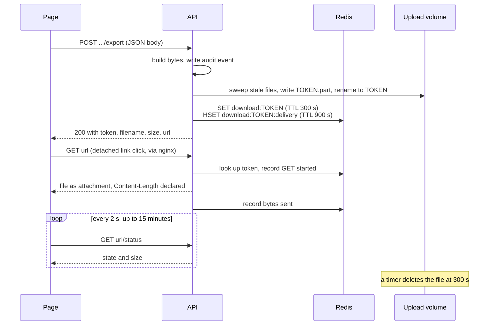

# Exports and downloads

Every deliverable the app hands a reviewer is built on demand from the stored summaries and review
rows, handed to the browser once, and deleted a few minutes later. Nothing is kept on the server
after the download window closes: the record's uploaded PDF and its database rows are the only
durable state, and a deliverable can always be built again from them.

This page explains what each deliverable is built from and how a finished file reaches the
browser. Route payloads, filenames and error codes are listed in
[Export formats](../reference/export-formats.md); the visual layout of each document is in
[Deliverable layout](deliverable-layout.md).

## The deliverables

| Deliverable | Where a reviewer asks for it | Route | Built by |
| --- | --- | --- | --- |
| MRR Word letter | Export dialog, "Export to Word" | `POST /api/documents/{id}/export` | `backend/app/api/documents.py` `_mrr_docx_bytes()` -> `backend/app/services/reporting.py` `build_mrr_document()` |
| Linked PDF | Export dialog, "Export to linked PDF" | `POST .../export/pdf` | `_linked_pdf_bytes()` -> `backend/app/services/linked_pdf.py` `build_linked_pdf()` |
| Covering memo | Export dialog, "Download memo" | `POST .../export/memo` | `_memo_docx_bytes()` -> `reporting.py` `build_memo_document()` |
| Archive of all of them | Export dialog, "Download all (.zip)" | `POST .../export/zip` | The three builders above plus `_bundle_members()` |
| Bundle PDF | `/diagnostics`, "Download combined PDF"; `/depositions`, "Download separate PDFs" | `POST .../bundle/pdf` | `backend/app/services/bundles.py` `build_bundle_pdf()` and `build_cover_pdf()` |
| Bundle report | `/diagnostics` or `/depositions`, "Summarize to Word" | `POST .../bundle/summarize` | `bundles.py` `bundle_summary_entries()` -> `build_mrr_document()` |

The export dialog is `frontend/components/review/export-dialog.tsx`; the two bundle pages share
`frontend/components/bundle/bundle-page-client.tsx`, and the two bundle definitions (categories 3
and 8 with a cover heading; category 9 without one) live once in `frontend/lib/bundle-api.ts`. The
backend keeps no copy of the bundle category lists; the zip route is handed them in its request.

There is no CSV export. `reporting.py`'s module docstring records that the old CSV and on-disk
export routes were dropped.

## How the letter entries are prepared

The Word letter and the linked PDF are the same letter in two formats, so both are built from one
entry list (`documents.py`):

1. **Which summaries.** `_included_summaries()` takes the record's summaries whose `excluded` flag is
   false, and answers 409 when there are none.
2. **Title and body.** `_export_title_and_text()` takes the effective title (reviewer edit, else
   audited correction, else raw) through `presentable_title()`, which strips the internal markers
   `[ManualCheck]`, `[Diagnostic Study]` and `(Pages X-Y)` and any address pieces. If the dialog asked
   for page numbers, `(Pages X-Y)` is re-applied from the summary's stored page range. The body is
   the effective text; unedited machine text of a non-deposition row is run through `one_paragraph()`
   again, and a missing DOI prefix is restored from the raw body.
3. **Record passes.** `_record_pass()` makes provider spellings consistent across the record
   (reviewer-edited titles are locked and win) and then folds same-visit category-1 entries into one.
   See [Summarization](summarization.md#record-level-passes-at-export).
4. **Record facts.** `ReportDetails` carries the doctor (Word typeface only), the attorney, law firm,
   covering-letter type and date, the reviewer's display name from the signed-in account (which
   switches on the Labor Code sentences), and the page accounting computed from the review rows
   (`_record_accounting()`).

The page count the letter states is the cover-sheet figure typed on the review page when there is
one, else the PDF's own page count (`_letter_pages()`).

## How each deliverable is built

- **MRR Word letter.** python-docx builds the document in memory: page header, evaluation line and
  heading, opening paragraph, a two-column table of entries sorted by date with undated entries
  last, the page accounting, and the conclusion.
- **Linked PDF.** `linked_pdf.py` renders the same letter as HTML through PyMuPDF's `Story`, which
  reports where it laid out each title (every title carries an element id `t{i}`). The rectangles are
  unioned per title and page into one hotspot, the whole uploaded source PDF is appended after the
  letter, and each title gets an internal link to page `letter pages + start page - 1` of the
  combined file. Placement needs no text matching, so a title that wraps across a page break gets a
  hotspot on each page. Native PyMuPDF was chosen over converting the Word file because it reproduced
  the reference layout most faithfully and needs no extra dependency.
- **Covering memo.** A short Word document addressed to the doctor's office. It reuses the letter's
  sender and covering-letter clauses (`_sender_clause()`, `_letter_clause()`) and the same
  `RecordAccounting` the letter closes with, rather than recomputing either. Unlike the letter it
  needs no summaries: a record still being worked has a memo.
- **Archive.** The zip route calls the same three builder functions its sibling routes call, so each
  member is the file that route would hand over, then adds one combined PDF per requested bundle that
  matches at least one row, or one PDF per matched sub-document for a bundle sent with `separateAs`
  (the Depositions preset). It is written `ZIP_STORED` because every member is already compressed.
  The bundle report is deliberately left out: it makes model calls per row and would outlive the
  request.
- **Bundle PDF.** `bundles.py` `matched_rows()` selects the rows in the requested categories minus
  any copy a reviewer resolved away as a duplicate (a non-primary, non-dismissed member of a cluster
  that has a primary). It deliberately does not filter on the row's `include` flag, because an older
  data migration unticked every deposition row in bulk and an `include` filter would empty the
  Depositions bundle for older records. The matched rows' pages are concatenated in record order with
  pypdf; out-of-range pages are skipped. When the request carries a cover heading, a list page built
  by `build_cover_pdf()` goes in front, unless every cell of it would be empty. A request carrying
  `separateAs` (Depositions) instead gets one PDF per matched row, named
  `Deposition of <who> <MM-DD-YY>.pdf`, handed over as that PDF for one match or as a zip for several;
  the reviewers asked for each deposition on its own, dated. See `export-formats.md`, "Separate
  documents".
- **Bundle report.** Synchronous, and refused with 409 above `BUNDLE_SUMMARIZE_CAP` (40) matched
  rows. Each matched row is summarized fresh with its category prompt and the audit turned off; a
  row with no readable text, or whose transcript page numbers could not be read, is skipped and
  logged, and if every row is skipped the route answers 422. The letter is the Word letter with only
  the law firm filled in: no doctor typeface, no covering-letter clause, no Labor Code sentences and
  no page accounting.

Each POST builds its bytes, writes one audit event (`export`, `export_pdf`, `export_memo`,
`export_zip`, `bundle_pdf`, `bundle_summarize`), then parks the file.

## The two-step download

An export does not answer its POST with the file. It parks the file behind a random token and
answers with where to fetch it; the browser's own download manager then fetches it with an ordinary
link.



1. **Prepare.** `backend/app/services/downloads.py` `prepare()` sweeps stale files first (a failed
   sweep is logged and never blocks the export), writes the bytes to
   `<upload folder>/<user id>/downloads/<token>.part` and renames it, so a half-written file is never
   served. It stores the metadata `{user_id, document_id, media_type, filename, size}` under
   `download:<token>` and opens a delivery record under `download:<token>:delivery`. If Redis cannot
   be reached the file is deleted and the route answers 503. The token is
   `secrets.token_urlsafe(32)`, always 43 characters.
2. **Hand over.** `frontend/lib/download.ts` `downloadFile()` reads the JSON and clicks a detached
   anchor with the `download` attribute set to the filename. Same-origin, so the session cookie goes
   with it.
3. **Serve.** `backend/app/api/downloads.py` `download_file()` first checks the record belongs to the
   signed-in user, then that the token is well formed, unexpired, and was made by this user for this
   record, and that the file still exists. Every refusal is the same 404 `not found` a missing record
   gets, so a request cannot confirm that a token or a record exists. One `download` audit event is
   written per GET.
4. **Measure.** `_MeasuredFileResponse` is a `FileResponse` that also watches for the browser leaving,
   stops sending when it does, writes one log line per GET (record id, first 8 characters of the
   token, status, bytes sent against the declared size, seconds taken), and updates the delivery
   record. A Redis failure while updating that record is logged and never interrupts the file.

The owner can fetch the same file again until it expires, so a second click and Chrome's Resume (a
`Range` request, answered 206) both work.

Response headers on the GET are `Content-Disposition: attachment`, `Cache-Control: no-store`
(patient data must not be cached by a browser or proxy) and `X-Accel-Buffering: no`.

## Why no Blob

The export used to answer its POST with the file, which the page read into a `Blob` and saved
through an object URL. Chrome keeps a large Blob in memory only up to an allowance and then pages it
to disk; on a machine short of disk space it cancels the body part-way instead. On the shared
reviewer machine this cut three of four exports short on 2026-09-24 (15.8 of 19.5 MB, 16.8 of 22.2,
16.2 of 37.0). Before that, the POST responses were streamed in many small fragments: a 50.2 MB
linked PDF went out in 260,433 fragments over 25.6 s, and large exports were cut off near 10.78 MB
on one tester's side. A plain link to a `FileResponse` lets the browser's download manager stream
straight to disk and, because `Content-Length` is declared, tell a cut-off transfer from a complete
one (module docstrings of `backend/app/services/downloads.py`, `backend/app/api/downloads.py` and
`frontend/lib/download.ts`).

## Lifetime and sweeps

A prepared file is patient data at rest, so it is short-lived and named only by its token.

| What | Lifetime | Removed by |
| --- | --- | --- |
| The file `<upload folder>/<user id>/downloads/<token>` | `download_ttl_seconds` (300) | A daemon `threading.Timer` started by `prepare()`; a sweep before every new export; a sweep at API startup |
| `download:<token>` in Redis (metadata including the filename) | `download_ttl_seconds` (300) | Redis expiry |
| `download:<token>:delivery` in Redis (ids and byte offsets only) | `download_watch_seconds` (900) | Redis expiry |

`sweep()` deletes every file under `*/downloads/*` older than the TTL by modification time,
including half-written `.part` files. A file it cannot delete is skipped, counted in one warning by
error type (never by name, because the name is the token), and tried again by the next sweep. The
startup sweep in `backend/app/main.py` exists because a restart cancels the in-process timers.

Redis runs without persistence (`docker-compose.yml`), so the filename, which carries the patient's
name, never reaches Redis's disk.

## Delivery status

Once the link is clicked the page cannot see the transfer, so it asks the server what its measured
GET saw. `downloads.py` `delivery_status()` reads the delivery record:

| State | Condition |
| --- | --- |
| `complete` | The longest prefix known to be sent reaches the file size |
| `downloading` | Not complete and a GET is running |
| `interrupted` | Not complete, no GET running, at least one GET happened |
| `waiting` | No GET yet and the link has not expired |
| `expired` | No GET yet and the link has expired |

`delivered_to` is extended only by a GET that started at or before it, which is what lets a Chrome
Resume (a Range request for the rest of the file) complete a download while a request for a later
piece does not. `complete` means the API handed the last byte to its connection, not that the
browser holds it; this was examined and accepted (`delivery_status()` docstring). nginx's own
download line is the closer record of what arrived.

`frontend/hooks/use-download-watch.ts` `useDownloadWatch()` polls `GET .../downloads/{token}/status`
every 2 s and shows one sentence:

| Server answer | Page shows | Keeps watching? |
| --- | --- | --- |
| `downloading`, or `waiting` for under 30 s | "Downloading..." | yes |
| `waiting` for 30 s or more | A prompt to allow downloads in the browser and try again | yes |
| `interrupted` | "The download was interrupted before it finished. Please try again." | yes, in case a Resume completes it |
| `complete` | "Download complete.", or "The download finished." if an interruption was seen first | no |
| `expired` | "The download did not start before its link expired. Please try again." | no |
| 404 | Nothing new | no |
| Any other error | The previous sentence | yes |

Watching also stops after 15 minutes, when the caller clears the download (the export dialog does
this when it closes), or when the page unmounts. In the export dialog the export buttons stay
disabled while a download is being watched.

## The nginx download log

`deploy/nginx.conf` gives prepared downloads their own location, anchored at the token so status
polls do not match it:

- `proxy_buffering off`, so bytes reach the browser at its own pace, the API sees the browser leave,
  and no patient file is copied into nginx's temporary files. The API's `X-Accel-Buffering: no`
  header does the same; either alone is enough.
- A dedicated log format, `mrr_download`, replaces the standard access line for these URLs. It
  records the record id and only the first 8 characters of the token, never the whole link.
  `completed` is empty when the browser left before the end.
- The status-poll location is proxied with its access log turned off, so a poll every 2 s writes
  nothing.

One download line has this shape (values in angle brackets vary):

```text
download status=<status> document=<record id> token=<first 8 characters> sent=<bytes written> of=<declared size> completed=<OK or empty> time=<seconds>
```

Together with the API's own line per GET, this is the only record of how a download ended, because a
failed native download otherwise shows only in the reviewer's browser.

## Before you change it

- A new export should end in `_offer_download()` like the others, so it gets the token, the TTL and
  the delivery record. [How to add an API route or export](../how-to/add-an-api-route-or-export.md)
  has the steps.
- The Word letter and the linked PDF must take their sentences, entry list and emphasis from the
  shared builders; see [Deliverable layout](deliverable-layout.md).
- The zip must call the same builder each single-file route calls, never a second rendering.
- Keep `download_watch_seconds` and the front end's `WATCH_LIMIT_MS` (15 minutes) in step.
- Never log a filename or a whole token; log ids, counts and the first 8 characters of a token.
- Deletion relies on an in-process timer, with the two sweeps as the backstop.

## Related pages

- [Export formats](../reference/export-formats.md)
- [Deliverable layout](deliverable-layout.md)
- [Summarization](summarization.md)
- [Duplicate detection](duplicate-detection.md)
- [Configuration](../reference/configuration.md)
- [HTTP API](../reference/http-api.md)
- [Frontend workbench](frontend-workbench.md)

<!-- reviewed: 2026-09-30 -->
