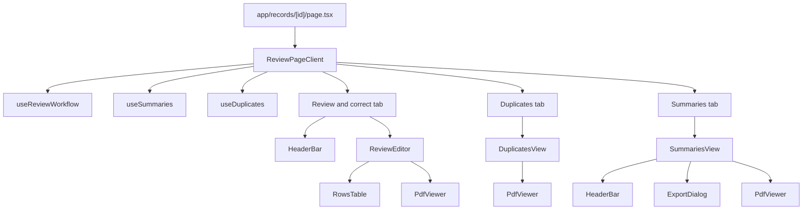
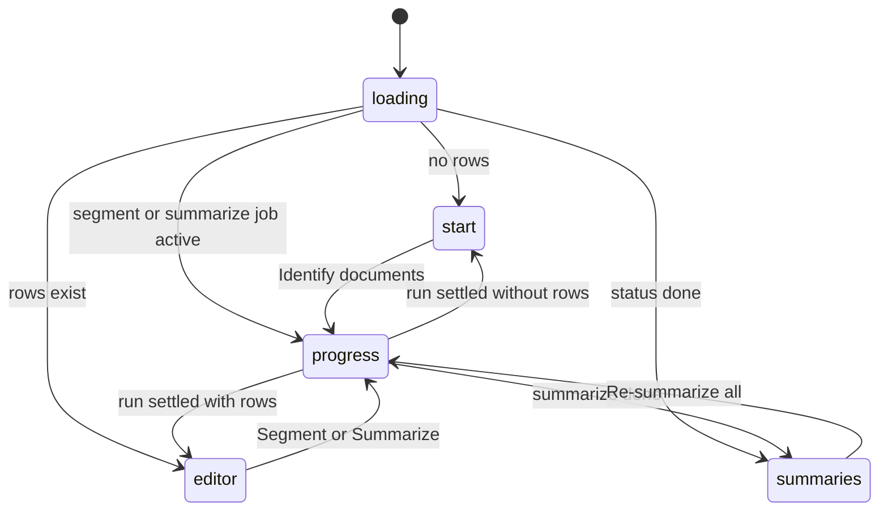
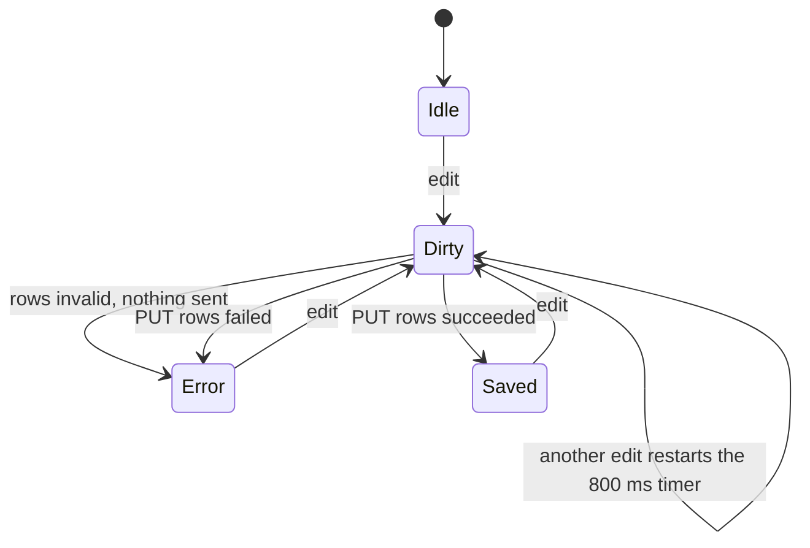
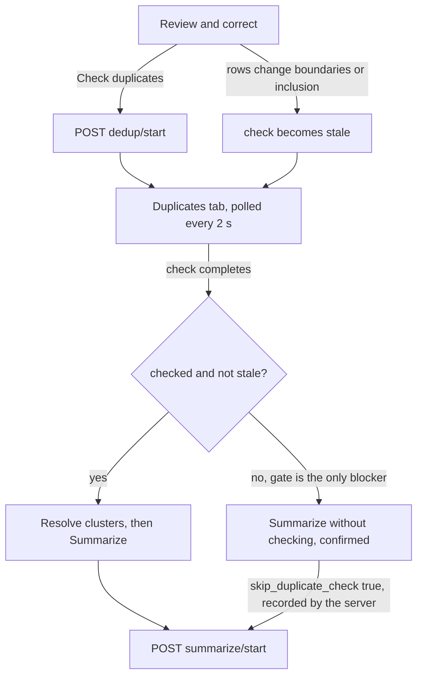
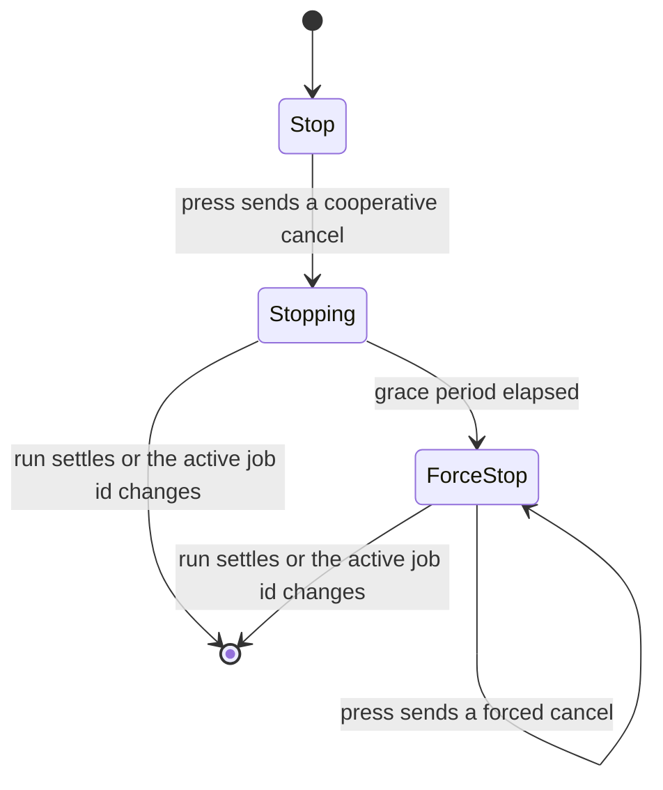
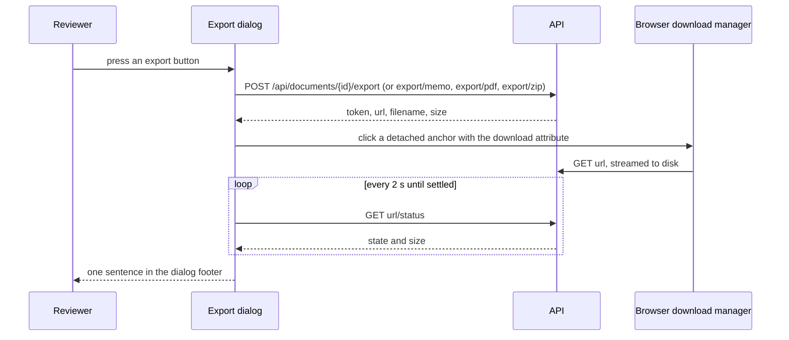

# The record workbench

The record workbench is the page at `/records/[id]`. On it a reviewer corrects the rows that
segmentation produced, resolves duplicate copies, starts summarization, reads and edits the summaries,
and exports the deliverables. This page explains how that page works in the browser and why it is
built the way it is. Every endpoint it calls is listed in the
[frontend routes and data reference](../reference/frontend-routes-and-data.md); what the backend does
with those calls is in [the pipeline and jobs](pipeline-and-jobs.md).

## Why it exists

The app is an assistant, not an autopilot: segmentation, categories and summaries are all checked by a
reviewer before anything is delivered. The workbench keeps the record's PDF beside every list, so each
correction is made against the source pages. It also has to keep the reviewer's unsaved work safe
while background jobs run on the same record and rewrite parts of it, which is where most of its
complexity comes from.

## The pieces

| Piece | Code | Role |
| --- | --- | --- |
| Route | `frontend/app/records/[id]/page.tsx` `RecordPage()` | Awaits the route params (a Promise in Next 15) and renders `AppBar` and `ReviewPageClient` |
| Page | `frontend/components/review/review-page-client.tsx` `ReviewPageClient()` | Header bar (back link, record name, document and page count, tabs, step actions, progress and Stop), banners, tab body |
| Lifecycle hook | `frontend/hooks/use-review-workflow.ts` `useReviewWorkflow()` | Boot, job polling, the row buffer, autosave, stop and restart, reloads after other tabs write |
| Server-state hooks | `frontend/hooks/use-summaries.ts` `useSummaries()`, `frontend/hooks/use-duplicates.ts` `useDuplicates()`, `useStartDedup()` | Summaries list, duplicate clusters and the duplicate-check start |
| Review & correct tab | `frontend/components/review/header-bar.tsx` `HeaderBar()`, `frontend/components/review/review-editor.tsx` `ReviewEditor()`, `frontend/components/review/rows-table.tsx` `RowsTable()` | Report header, row toolbar, the editable rows table beside the PDF |
| Duplicates tab | `frontend/components/review/duplicates-view.tsx` `DuplicatesView()` | Duplicate clusters beside the PDF |
| Summaries tab | `frontend/components/review/summaries-view.tsx` `SummariesView()`, `frontend/components/review/export-dialog.tsx` `ExportDialog()` | Summary cards beside the PDF, the export dialog |
| PDF pane | `frontend/components/review/pdf-viewer.tsx` `PdfViewer`, `frontend/components/review/split-pane.tsx` `SplitPane()` | The vendored pdf.js viewer in an iframe, and the resizable two-pane layout |
| Row rules | `frontend/lib/review-rows.ts` | Keys, sorting, merge, validation, flag and boundary rules, the "could not identify" and "category guessed" tests |
| Downloads | `frontend/lib/download.ts` `downloadFile()`, `frontend/hooks/use-download-watch.ts` `useDownloadWatch()` | Hand a prepared export to the browser, then watch it |

## Boot

When the page mounts, `useReviewWorkflow()` runs its boot effect once per document id:

1. It requests `GET /api/documents/{id}`. If that fails, the banner reads "Could not load this
   document: ..." and the start panel shows.
2. It stores the page count, the category options, the doctor list, the rows (through `replaceRows()`,
   below), the filename and the nine report-header fields.
3. It decides where the reviewer lands, first match wins:

| Record state at boot | Landing |
| --- | --- |
| Active job of kind `segment` | Watches it (`watchSegment()`) |
| Active job of kind `summarize` (queued, running or paused) | Watches it (`watchSummarize()`) |
| Status `done` | Summaries |
| Status `needs_attention` | Reads `GET /status` to recover the attention message and the failed rows (`loadAttention()`), then the editor if there are rows, otherwise the start panel |
| Status `error` | Banner "The last run failed - you can start again.", then continues down this table |
| Status `interrupted` | Banner "The last run was interrupted - start again.", then continues down this table |
| Rows exist | The editor |
| Otherwise | The start panel ("Ready to identify documents") |

Only `segment` and `summarize` jobs are watched by the hook. A duplicate check (`dedup`) reports its
progress through the Duplicates tab's own polling, described below. A `classify` job, which an
aggregated upload starts, has no watcher on this page.

The boot effect's cleanup runs when the page unmounts or the id changes. It marks the boot cancelled,
stops polling, and flushes any pending autosave to the document those rows came from (see
[Autosave](#autosave)).

### Sections, tabs and what the page shows

The hook keeps a `Section` (`loading`, `start`, `progress`, `editor`, `summaries`). The page does not
render from it directly. It chooses the tab body from its own `tab` state (`review`, `duplicates`,
`summaries`), the number of rows, and whether a job is being watched. `section` drives one thing: when
it becomes `summaries`, the page switches to the Summaries tab. When a summarize run ends needing
attention, the page switches to Review & correct so the failed rows are in view. Manual tab switches
are left alone after that.

The Review & correct tab body depends on the rows and on `watching`:

| Condition | Review & correct shows |
| --- | --- |
| No rows, a job is watched | `ProgressPanel` (the first identification run) |
| No rows, nothing watched | `StartPanel` ("Ready to identify documents") |
| Rows exist | `HeaderBar` and `ReviewEditor`; the editor is dimmed and ignores the pointer while a job is watched |

The Duplicates and Summaries bodies render whether or not a job is watched.

Each tab carries its own header actions. While a job is watched they are replaced by the progress bar
and the Stop button.

| Tab | Header actions |
| --- | --- |
| Review & correct | "Segment" or "Re-run segment", "Check duplicates", the autosave chip |
| Duplicates | "Re-check duplicates", "Summarize N documents", and "Summarize without checking" when the duplicate gate is the only blocker |
| Summaries | "Re-summarize all from scratch", only when summaries exist |

The tab labels carry counts: rows that could not be identified, unresolved duplicate groups, and
summaries. The record line under the name reads "N documents", a middle dot, then "M pages".

The hook also still returns `activeStep` and `gotoStep()` for a three-step `Stepper` component
(`frontend/components/review/stepper.tsx`). No production component renders the stepper.

## Job polling

`pollJob()` watches one run. It first clears any poll already running, so only one loop exists at a
time; that is also what keeps the boot effect safe when React StrictMode runs it twice. It sets the
section to `progress`, then runs a `setTimeout` chain that calls `GET /api/documents/{id}/status` every
1000 ms. That endpoint returns the newest job of any kind, plus the attention payload of the newest
summarize job (`backend/app/api/documents.py` `get_status()`).

| `job` in the status answer | Poll outcome |
| --- | --- |
| `null` | Resolves `done` |
| `state: done` | Resolves `done` |
| `state: needs_attention` | Resolves `needs_attention` with `job.error` (or "Some documents need attention.") and `job.attention.rows` |
| `state: error` | Rejects |
| `state: interrupted` | Rejects |
| `state: cancelled` | Resolves `cancelled` |
| `queued`, `running`, `paused` | Keeps polling |

A state the code does not name falls through to "keep polling". That is why `cancelled` is a settled
outcome rather than a tolerated state: without it, a stopped job would spin the bar forever. A status
request that fails rejects the poll; the loop itself does not retry.

The progress bar shows `round(100 * current / total)` percent, or 5 when `total` is 0, and never less
than 4. While the job is `queued` the label is "Waiting for a free worker - other records are being
processed first" (`QUEUED_LABEL`), whatever its stage: a queued job's stage is still `starting`, and
"Starting..." for minutes behind another reviewer's batch read as frozen. Otherwise the label comes
from `STAGE_LABELS`:

| Job stage | Label |
| --- | --- |
| `starting` | Starting... |
| `reading` | Reading the pages |
| `segmenting` | Finding document boundaries |
| `categorizing` | Categorizing each document |
| `verifying` | Double-checking uncertain boundaries |
| `summarizing` | Writing summaries |
| `paused` | Paused - waiting for capacity, will retry automatically |
| anything else | the raw stage string |

When `total` is non-zero the label gains "(current/total)". A label that starts with "paused" turns the
bar amber (`.rce-progress.paused`), because a paused summarize retries by itself and is not an error.

What happens when a watched run settles:

| Run | Cancelled | Done | Needs attention | Rejected |
| --- | --- | --- | --- | --- |
| Segment (`watchSegment()`) | Continue / Start over banner; editor or start panel | Re-reads the record, replaces the rows wholesale (a segment run rewrites every row), resets the header, opens the editor | - | Banner, start panel |
| Summarize (`watchSummarize()`) | Continue / Start over banner; editor or start panel | Summaries tab | Amber notice; editor or start panel | Banner, editor or start panel |

`watchSummarize()` invalidates the `["summaries", id]` query as soon as the poll resolves, before it
looks at the outcome, so `done`, `needs_attention` and `cancelled` all refresh it; a rejected poll
(`error`, `interrupted`, a failed status request) goes straight to the banner. Nothing else refreshes
that query: it has the app-wide 30 s stale time, no refetch on focus and no polling. `Summary.idx` is
positional over the included rows, so editing a card from a stale list wrote the old body over the
freshly generated one.

The refs beside the state (`rowsRef`, `saveStateRef`, `totalPagesRef`, `activeJobRef`) exist because
the async flows and the cleanup run from closures created before boot finished. Reading state there
would see the empty initial values; for example, validating against a page count of 0 would refuse to
save valid rows.

## Autosave

1. Every edit calls `onRowsChange()`. It sorts the rows by start then end, records touched fields
   (below), sets the save state to `dirty` ("Unsaved changes..."), keeps the sorted set as the pending
   save, and restarts an 800 ms timer.
2. When the timer fires, `flushPendingSave()` validates with `rowErrors()`. Invalid rows are not sent;
   the chip reads "Not saved - fix the highlighted page ranges first."
3. Valid rows go to `PUT /api/documents/{id}/rows` as the whole set, with the client-only `_key`
   stripped. Success sets `saved` and clears the touched set. Failure sets `error` with "Not saved: "
   and the reason.
4. Nothing retries a failed save. The next edit schedules a new one.

Three rules keep the promise the "Unsaved changes..." chip makes:

- The boot effect's cleanup flushes the pending save instead of dropping it, so an edit made in the
  last 800 ms before leaving the page is still written, to the document it belongs to.
- `takePendingSave()` is the single way to stand the debounce down. It clears the timer and the pending
  row set together; a pending set left without a timer would be written by the next flush.
- `onSummarize()` stands the pending save down rather than flushing it, because
  `POST /summarize/start` carries the same rows itself.

The server refuses `PUT /rows` with 409 while any job is active for the record
(`backend/app/api/documents.py` `put_rows()`). It checks page ranges with the same rules as
`rowErrors()` (`backend/app/services/rows.py` `validate_rows()`): whole numbers,
`1 <= start <= end <= page count`, no overlap with the previous row, gaps allowed. It also refuses an
empty row set and any category that is not an active catalogue id, which the client does not check.
The client never sends an empty set: `flushPendingSave()` returns without a request when the pending
set is empty.

### Row keys and the touched set

- Every row in the buffer carries a client `_key` such as `r42`, minted by `withKeys()` or `newKey()`
  from `keySeq`, a module-level counter in `frontend/lib/review-rows.ts` that is never reset. The key is
  the React key and the identity used by the touched set.
- `touchedRef` holds `<_key>:<field>` for every edit to `include` or `category` since the last
  successful save. Those are the only two fields another tab can write
  (`SERVER_WRITABLE_FIELDS`, `touchedFields()`).
- `replaceRows()` is the one place the buffer is replaced wholesale. It clears the touched set and
  re-mints every key. Because `keySeq` is never reset, a stale touched entry can never name a row in
  another document; resetting it per document would let a leftover entry pin a field on the next
  record to a value nobody typed there.

### Reloads after another tab writes

Two actions on the other workbench tabs change rows on the server: resolving a duplicate cluster
changes `include`, and the category select on a summary card changes `category`. The editor keeps its
own buffer and autosaves the whole set, so without a reload its next save would send the old values
back. Both components therefore receive `reloadRows()` (`onResolved` on `DuplicatesView`,
`onRowsChanged` on `SummariesView`).

`reloadRows()` reads the record again, then:

- If the buffer holds unsaved work (save state `dirty` or `error`) it keeps the local rows and applies
  only the server's `include` and `category`, through `applyServerRowChanges()`. Rows are matched by
  their `start-end` span; a local row whose span has no server twin keeps its own values, and a field in
  the touched set keeps the local value.
- Otherwise it replaces the buffer with the server rows through `replaceRows()`.
- If the read fails it keeps the current rows.

Replacing the buffer wholesale used to discard unsaved edits with nothing on screen to show it.
Flushing the local rows first was the other obvious option, and the code comment rejects it: the
stale local copy would overwrite the very write that triggered the reload.

"Tab" here means a workbench tab on the same page.

## Editing rows

Every edit in `RowsTable` goes through one function, `field()` in `ReviewEditor`, which applies two
rules before calling `onRowsChange()`:

- `moveSharedBoundary()`: editing a row's start also moves the previous row's end, but only when the
  two rows were contiguous before the keystroke. A gap is left alone. Editing an end never moves
  anything. Segmentation already derives each end from the next start, so this keeps one boundary one
  edit.
- `clearFlagOnEdit()`: a real change to title, category, start, end, date or injury date clears the
  review flag (`x` to `-`). Editing the flag itself or `include` does not, and re-sending an unchanged
  value does not.

| Operation | Result |
| --- | --- |
| Merge up | `mergeRows()`: the upper row keeps its identity (title, date, category); `end` is the larger end; the flag is `x` if either row had it; `include` is true if either row was included |
| Apply N suggested merges | Merges every row with `suggest_merge` into the row above, top to bottom |
| Split | Asks for the first page of the second half, in `(start, end]`; the second half gets a new key, title `-`, the same category and dates, flag `x`, and the first half's `include` |
| Insert document | Page range defaults to the page after the last row; the new row is category `100`, title "(added manually)", flag `x`, included |
| Delete | Removes the row; a gap strip appears where it was |
| Could not identify (N) | Filters the table to rows `couldNotIdentify()` returns true for; the button stays visible at 0 while the filter is on |

Selecting a row jumps the PDF viewer to the row's start page. The filter hides rows inside the render
loop rather than narrowing the array, so row numbers and the gap strips ("pages X-Y not included
(skipped at summarization)") stay true; gap strips are suppressed while the filter is on.

Each row can carry these chips:

| Chip | Condition |
| --- | --- |
| Could not summarize | The row's `start-end` is in the attention list of a summarize run that needed attention |
| Could not identify | `couldNotIdentify()`: category `100` (General), not ruled paperwork, and `method` is not `llm+embedding`; a missing `method` counts as unknown |
| Category guessed | `categoryWasGuessed()`: a category other than `100` whose `method` is present and is neither `rules` nor `llm+embedding` |

The last two are disjoint by construction. "Category guessed" is deliberately not part of the filter:
the filter is a to-do list that clears when the reviewer re-categorizes a row, while `method` is frozen
at segment time and would never clear.

Values are strings with sentinels: `flag` is `x` or `-`, an empty title or date is `-`, and category
ids are strings (`100` is General). The [glossary](../reference/glossary.md) defines the terms.

## The duplicate-check gate

Summarize is refused unless a completed duplicate check still covers the current rows. The server
enforces it (`backend/app/api/documents.py` `_enforce_or_audit_duplicate_check()`); the page mirrors it
so the reviewer sees why before meeting a 409. How the check itself works is in
[duplicate detection](duplicate-detection.md).

- `useDuplicates()` polls `GET /api/documents/{id}/duplicates` every 2 s while the latest dedup job is
  queued or running, and not otherwise. The answer carries the clusters, the job, `stale`,
  `unreadable` and `checked`.
- "Check duplicates" (Review & correct) starts a check with `POST /dedup/start` and switches to the
  Duplicates tab. It is disabled while the autosave is `dirty`, because the check reads the included
  rows on the server. "Re-check duplicates" (Duplicates) asks for confirmation first when clusters
  already exist, because removals of single copies do not survive a re-check.
- A duplicate check is not a watched run: the header progress bar and Stop do not appear for it. Its
  progress shows in the Duplicates tab as "Checking for duplicates (current/total)".
- `needsDuplicateCheck` is `!checked || stale`, and false while the duplicates answer is still loading.

Summarize is disabled when any of these holds. The tooltip gives the first matching reason:

| Condition | Reason shown |
| --- | --- |
| A row is invalid | Fix the highlighted page ranges before summarizing. |
| No row is included | Select at least one document to summarize. |
| A duplicate check is queued or running | Wait for the duplicate check to finish. |
| A check completed but the rows changed since | The documents changed since the last duplicate check. |
| No check has ever completed | This record has not been checked for duplicates yet. |
| The autosave is `dirty` or `error` | Your latest changes aren't saved yet. |

On the Review & correct and Duplicates tabs, invalid page ranges ("Fix these before summarizing:",
one line per row) and a failed save also appear as banners, because the Summarize button lives on the
Duplicates tab and a tooltip alone is easy to miss. The Duplicates tab's own banners cover a missing or
stale check.

The gate is soft. "Summarize without checking" appears on the Duplicates tab only when the missing or
stale check is the only thing in the way. It asks for confirmation, then sends
`skip_duplicate_check: true`, which the server accepts and records in the audit log.

Resolving clusters does not block Summarize. The actions are "Keep this one" (`keep_one`), "Also
keep" on the other copies once one is kept (`keep_another`, for a group holding two different
documents such as a left and a right study), "Undo" on an extra kept copy (`unkeep`), "Not a
duplicate" for one copy (`remove_member`, after a confirmation) and "Not duplicates" for the whole
cluster (`dismiss`). Each resolve invalidates the duplicates query and calls `reloadRows()`. A cluster
reads "Resolved" once fewer than two of its copies are included or every included copy was kept,
"Dismissed" when dismissed, and "Needs review" otherwise. The count of unresolved clusters
(`clusterNeedsReview`: not dismissed, two or more copies included, at least one not kept) labels the
tab and puts a blue banner on the other tabs.

The Duplicates tab shows separate banners for a stale check (red), a record never checked (blue), a
check that failed or was interrupted (red, with the job's error text), and sub-documents the last check
could not read (red, with the count). Similarity shows as a plain percentage with no colour scale,
because the app enforces no cut-off.

## Stopping a run

The Stop button lives in the header progress bar, so it exists only for watched runs (segment and
summarize).

1. The first press sends `POST /api/documents/{id}/jobs/{jobId}/cancel` with `{"force": false}`. The
   job id is the one the last poll saw (`activeJobRef`), so the request names that job rather than
   whatever happens to be active. The button reads "Stopping...".
2. The answer carries `graceSeconds`, the server's `job_cancel_grace_seconds` setting (default 10; see
   the [configuration reference](../reference/configuration.md)). Taking it from the server keeps the
   button in step with the setting. After that many seconds the button becomes "Force stop".
3. "Force stop" sends `{"force": true}`, which kills the RQ work-horse. It is never the first press,
   because a hard kill can land mid-transaction.
4. The escalation resets whenever `watching` or `activeJobId` changes, and its timer is cleared, so a
   new job never starts out on "Force stop". A failed cancel request shows "could not stop the run" and
   the poll carries on.

A run that settles as `cancelled` resolves the poll rather than rejecting it. The page then shows a
blue banner, "Stopped. Anything already finished has been kept.", with Continue and Start over.
`restartCancelled(fresh)` restarts by kind: summarize sends the current rows to
`POST /summarize/start` and is watched by `watchSummarize()`; `dedup` uses `POST /dedup/start` and any
other kind `POST /segment/start`, and both of those are watched by `watchSegment()`. `fresh` is true
for Start over. Before continuing a summarize, the page counts edited summaries whose row category has
changed since they were written; those will be regenerated, so it asks for confirmation first.

## Summarize runs

- "Summarize N documents" calls `onSummarize()`: it clears the banner and any attention notice, stands
  the pending autosave down, and sends `POST /summarize/start` with the sorted rows, `fresh` and
  `skip_duplicate_check`, then watches the run.
- `fresh` is true only for "Re-summarize all from scratch", which asks for confirmation. A plain
  Summarize keeps finished summaries whose page range and category are unchanged, so it is the one to
  use after a correction, and "Re-summarize all" is the one to use after a prompt change.
- A run that ends `needs_attention` shows an amber notice with the message and one line per failed
  sub-document: "Pages X-Y - title: reason". The failed rows turn amber in the table with the "Could not
  summarize" chip. They are matched by page range, because the attention list's `idx` is the position
  among included rows, not the row index.

## The Summaries tab

- A reading column of cards, 20 per page (paged in the browser), beside the PDF, with the report header
  on top and an Export button that is disabled when no summary is included.
- A search box and an Order choice sit above the cards (`frontend/lib/summary-order.ts`). The search
  keeps the summaries whose title, text or date contain every word typed, ignoring case; the count
  line then adds "N matching". Order is page order (as the server sends them, the default) or date
  order, oldest first, undated last as in the export, ties in page order. Paging applies to what is
  showing, so a match is on the first page of the results. The lead client reviewer asked for an
  easier way to find a summary to fix.
- Clicking a card's title or its meta line jumps the viewer to the summary's first page.
- The card strips display markers from the stored strings: a leading `[ManualCheck]` and trailing
  `(Pages X-Y)` and `[Diagnostic Study]` from the title, and a leading `**DOI**:` prefix from the body,
  which moves into the meta line. Two DOI grammars are read, current and legacy, mirroring
  `backend/app/services/summary_doi.py`. The trailing-marker patterns are written to run in linear
  time; the comment records the quadratic form taking 424 ms on a 20,000-character title.
- Edit saves title, date and text through `PUT /summaries/{idx}`. The edit box holds the display form,
  so a saved body has no DOI prefix; the export restores it from the model's original text
  (`backend/app/api/documents.py` `_export_title_and_text()`).
- "In export" toggles `excluded`. "Re-draft" regenerates one summary (after a confirmation when it was
  edited). Both, and Edit, patch the cached list in place with the item the server returns.
- The Category select writes the category to the owning review row, not to the summary. The server
  refuses it with 409 while any job runs. On success the card calls `reloadRows()` and says "Category
  saved - re-draft to apply it to the summary".
- Chips appear in a fixed order: Edited, Manual check, AI-fixed, Flagged not applied, Not checked,
  Category guessed, Pages changed - re-summarize, Category changed - re-draft to apply, Excluded. What
  the reviewer did comes first, then what the system flagged, then what is stale, then the export
  state.
- The faithfulness check's issues are listed in a collapsed "N things the AI check flagged" section
  with no chip. The code comment records that 61% of audited summaries carry issues, which would make a
  chip noise; the rare "Flagged, not applied" case does get a chip.
- Optional fields (`verifyKeptRaw`, `verifyFailed`, `rowMissing`, `rowMethodLive`) read "absent means
  nothing to say", so an older backend during a rolling deploy flags nothing.

## The report header

`HeaderBar` appears on Review & correct and on Summaries and edits nine fields: first name, last name,
DOB, attorney, law firm, doctor, letter type, letter date and pages received. The header state lives in
the hook, so both bars and the export dialog read one copy.

- Save sends the bar's `fields` object with `PUT /api/documents/{id}/header`. The server treats a field
  missing from the body as empty, stores an unrecognised letter type as empty, and stores an
  unparseable "pages received" as unset.
- Auto-fill (labelled "Re-detect" once any of first name, last name, DOB or law firm is stored) calls
  `POST /api/documents/{id}/extract-header`. The server reads the record's first 15 pages, stores the
  fields it found, and answers with first name, last name, DOB and law firm, merged with what was
  already stored. There is no separate Save step for it.
- The doctor select always includes the stored value, even before the list arrives or when the list no
  longer has it, so a blur cannot write a different doctor. The doctor list comes from the backend with
  the record (`doctors`). The letter options are a constant in the component (`LETTER_OPTIONS`); the
  record's `letter_types` list is typed but not read.

## Exports handed to the browser

The export dialog offers four outputs from the same fields:

| Button | Endpoint | Fallback file name |
| --- | --- | --- |
| Export to Word | `POST /api/documents/{id}/export` | `MRR.docx` |
| Download memo | `POST /api/documents/{id}/export/memo` | `memo.docx` |
| Export to linked PDF | `POST /api/documents/{id}/export/pdf` | `record_linked.pdf` |
| Download all (.zip) | `POST /api/documents/{id}/export/zip`, with every entry of `BUNDLES` | `record.zip` |

The body carries `patientName`, `patientdob`, `QMEorAME`, `lawfirm` and `includePageNumbers`. Patient
name, DOB and law firm are prefilled from the report header each time the dialog opens; the evaluation
type defaults to `PANEL QUALIFIED MEDICAL EVALUATION (ML-10*-)`; page numbers after titles are off by
default and reset on every open. What each file contains is in the
[export formats reference](../reference/export-formats.md), and the server side of downloads is in
[exports and downloads](exports-and-downloads.md).

`downloadFile()` is the only way the frontend fetches an export. The POST builds the file and answers with
where to fetch it. The page then clicks a detached anchor with `download` set, and the browser's own
download manager streams the file straight to disk. The code records why it stopped reading the file
into a Blob: on a reviewer machine short of disk space, Chrome cut three of four exports short on
2026-09-24.

`downloadFile()` fails the same way `apiFetch()` does, with an `ApiError` that `humanizeError()` can
turn into the server's sentence:

| Failure | Error |
| --- | --- |
| No response (offline, reset) | `ApiError("network", 0)` |
| 401 | Redirects to `/login`, then throws |
| 502 or 504 with no server sentence | "The server did not finish preparing the file. Please try again." |
| Headers arrived but the body could not be read | "The download was interrupted before it finished. Please try again." |
| Any other non-OK answer | The server's `detail` or `error` string |

Each failure also writes `console.error("download failed", {phase, status, expectedBytes})` in the
reviewer's browser, never the body or the file name, because the file name carries the patient's name.

After the hand-over, `useDownloadWatch()` asks `GET <url>/status` every 2 s, starting 2 s after the
hand-over:

| Server state | Sentence | Keeps watching |
| --- | --- | --- |
| (before the first answer) | Downloading... | yes |
| `waiting`, under 30 s | Downloading... | yes |
| `waiting`, 30 s or more | The download has not started. If the browser asked whether to allow downloads, allow it, then try again. | yes |
| `downloading` | Downloading... | yes |
| `interrupted` | The download was interrupted before it finished. Please try again. | yes, because the browser's Resume may still finish it |
| `complete` | Download complete. (or "The download finished." after an interruption) | no |
| `expired` | The download did not start before its link expired. Please try again. | no |

Watching also stops on a 404 from the status route, after 15 minutes, when the dialog closes, and when
the component unmounts. A status request that fails for any other reason keeps the last sentence and
asks again. The export buttons stay disabled while a file is being prepared or watched. The footer is
an `<output>` element that is always present, so screen readers announce each new sentence.
"Complete" means the server sent the last byte, which the code comment notes can run a few megabytes
ahead of what the browser has received.

The bundle pages (`/diagnostics`, `/depositions`) use the same two functions.

## The PDF viewer

- The pane is an iframe on `/pdfjs/web/viewer.html?file=<encoded /api/documents/{id}/pdf>#page=N`.
  pdf.js is vendored as static files under `frontend/public/pdfjs/` (version 6.1.200, per the header
  of `frontend/public/pdfjs/build/pdf.mjs`); it is not an npm dependency.
- The viewer is same-origin, so the component can read `PDFViewerApplication` inside the frame: the
  page count and current page for the "Page N of M" header, and the `pagechanging` and `pagesloaded`
  events. `jumpTo(page)` sets `PDFViewerApplication.page` when the viewer is live. Before that, it
  reloads the iframe at `#page=N`, unless that page was already the last one requested.
- Only the pdf.js markup editors are hidden (`#editorModeButtons`, `#editorModeSeparator`), by setting
  `display: none !important` inline on each element; pdf.js's own higher-specificity rule beats an
  injected stylesheet. Zoom, find, print, download, page navigation and the sidebar stay.
- A 1 s interval re-applies the trim and re-reads the page info for the life of the component, because
  some pdf.js builds fire their events before the listener attaches.
- Each tab renders its own `PdfViewer`, and tab bodies are conditional, so switching tabs unmounts one
  viewer and mounts another, which loads the PDF again.
- `SplitPane` sizes the left pane as a percentage: default 58, clamped to 24-70, moved by dragging or
  by the Left and Right arrow keys in steps of 2. The value is kept in `localStorage` under
  `mrr.review.split`, `mrr.duplicates.split` or `mrr.summaries.split`. While dragging, the iframe stops
  receiving pointer events so the drag does not die over the PDF. Below 900 px the panes stack and the
  handle is hidden.

## Design decisions recorded in the code

- **No Blob downloads.** Reading exports into a Blob was replaced by a native download after Chrome cut
  three of four exports short on a low-disk host (`frontend/lib/download.ts`).
- **One download function.** Three hand-written download paths had drifted: one dropped the server's
  reason, one never read the body, and two reported success after redirecting on a 401.
- **Flush on leave, not clear.** Clearing the debounce timer on unmount lost edits made in the last
  800 ms while the chip still said "Unsaved changes...".
- **Merge server fields into unsaved work.** Wholesale replacement lost edits silently; flushing local
  rows first would overwrite the server write that triggered the reload.
- **Module-level `keySeq`.** A per-document reset looks tidy and makes stale touched entries hit real
  rows in the next record.
- **Merged rows keep `include` if either half had it.** Taking the upper row's value once dropped a
  52-page evaluation into an unchecked row.
- **"Category guessed" is a chip, not a filter.** `method` is frozen at segment time, so a filter on it
  could never be cleared by the reviewer.
- **Two-stage Stop with the server's grace period.** A hard kill can land mid-transaction; a
  client-side grace value would drift from `job_cancel_grace_seconds`.
- **Summaries are refetched after every settled summarize run.** `Summary.idx` is positional, so a stale
  list let an edit overwrite a fresh summary.
- **Attention rows are matched by page range.** The attention `idx` counts included rows only.
- **The attention message comes from the stored payload first.** `job.error` belongs to the newest job
  of any kind, which after a duplicate check is not the summarize that failed.
- **The duplicate gate is soft and audited.** A reviewer may skip it on purpose; the skip is a separate,
  confirmed control and the server records it.
- **Blue and red banners mean different things.** Red is a result not to trust or an action that cannot
  be taken; blue is a fact or a next step. "No check has run yet" is blue because it is every record's
  default state (`frontend/app/evaluators-ds.css`, `.banner-info`).
- **An interrupted download is still watched.** The browser's Resume can finish it, and the page then
  says so rather than leaving a stale failure on screen.

## Keep in mind before changing it

- Replace the row buffer wholesale only through `replaceRows()`, and never reset `keySeq`.
- A new row field that another tab writes must be added to `SERVER_WRITABLE_FIELDS` and also copied in
  `applyServerRowChanges()`, which names `include` and `category` explicitly.
- Any component that writes rows on the server must be given `reloadRows()`.
- Anything that regenerates summaries must invalidate `["summaries", id]`.
- A new job state must be named in `pollJob()`, or the page polls forever.
- `rowErrors()` must stay in step with `backend/app/services/rows.py` `validate_rows()`. Three other
  client copies track backend code: the DOI grammar (`backend/app/services/summary_doi.py`), the inline
  emphasis pattern (`backend/app/services/reporting.py` `INLINE_EMPHASIS_RE`, no `s` flag), and bundle
  matching (`backend/app/services/bundles.py` `matched_rows()`).
- Keep the PDF viewer on the same origin; page sync and `jumpTo` read into the frame.
- Upgrading pdf.js means replacing `frontend/public/pdfjs/`, then checking that the two editor
  selectors and the `PDFViewerApplication` members used by `PdfViewer` still exist.
- Fetch files only through `downloadFile()`, never a bespoke `fetch`.
- The workbench confirms with `window.confirm`; the My documents page uses the Radix `ConfirmDialog`.

## Related pages

- [Frontend routes and data reference](../reference/frontend-routes-and-data.md)
- [Design system reference](../reference/design-system.md)
- [How to extend the frontend](../how-to/extend-the-frontend.md)
- [The pipeline and jobs](pipeline-and-jobs.md)
- [Job and document states reference](../reference/job-and-document-states.md)
- [Duplicate detection](duplicate-detection.md)
- [Summarization](summarization.md)
- [Exports and downloads](exports-and-downloads.md)
- [HTTP API reference](../reference/http-api.md)
