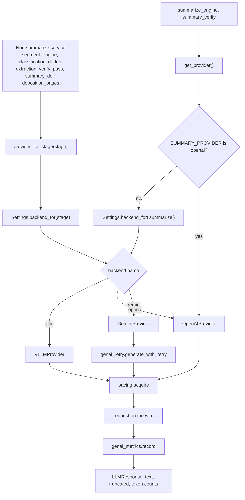
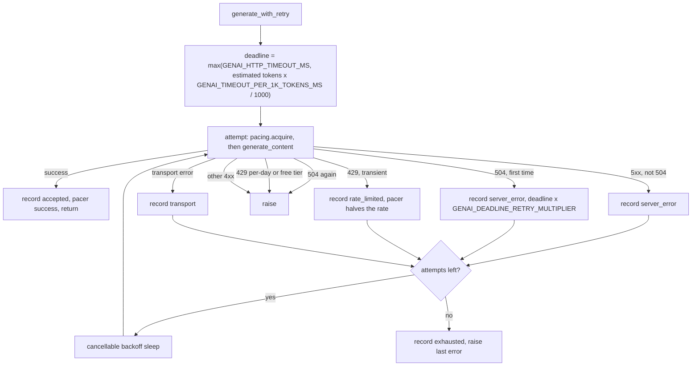
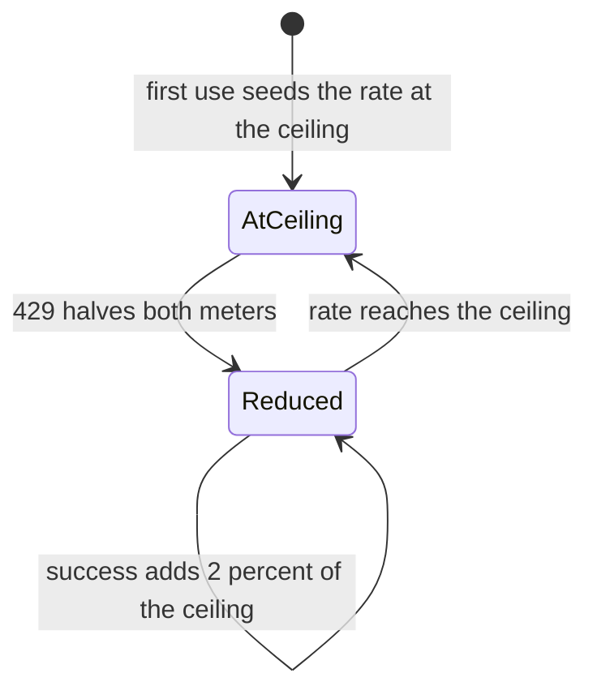
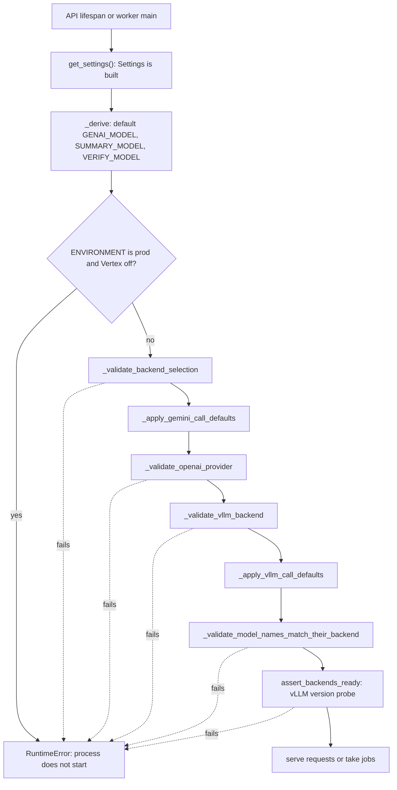

# Model providers

Every model call the backend makes goes through one package, `backend/app/services/llm/`. That
covers segmentation windows, categorization, the boundary verify pass, header extraction, the
duplicate confirm, the injury-date read, the transcript page-number read, and the three summarize
calls (body, title, audit). This page explains why that seam exists, how one call finds its backend,
model and thinking setting, what wraps every call (retries, deadlines, pacing, metrics), and which
checks run at boot before any record can leave the host.

Per-stage specifics (entry point, model default, output cap, parsing, failure behaviour) live in
[Model calls by stage](../reference/model-calls-by-stage.md). Every setting named here is listed in
the [Configuration reference](../reference/configuration.md). The procedure for moving a stage
between backends is [How to switch model backends](../how-to/switch-model-backends.md).

## Why it exists

The reasons are recorded in code comments:

- **One switch used to cover one stage.** `SUMMARY_PROVIDER` selected a vendor for the summarize
  stage only, and the other services called google-genai directly, so "point the app at another
  model" could not be expressed (comment above `llm_backend` in `backend/app/config.py`).
- **A split outcome is the expected one.** On the 2026-09-11 gate a self-hosted Qwen model scored
  level with Gemini on segmentation but inverted the direction of its errors (under-segmenting
  where Gemini over-segments) and trailed on categorization. A single global flag would have turned
  a per-stage judgement into one bet, so stages move independently (comment above
  `llm_backend_overrides`).
- **One wrapper for every vendor.** Retry and pacing wrap the provider rather than living inside
  the interface, so one adaptive pacer bounds all traffic (`backend/app/services/llm/base.py`
  module docstring).
- **Where records go becomes configuration.** Because the destination is now a setting, the
  controls on it (Vertex in production, the OpenAI Zero Data Retention acknowledgement, the vLLM
  origin allowlist and version floor) run at boot in one place.

The only code that puts a model request on the wire is `backend/app/services/genai_retry.py`
`generate_with_retry()` (reached only from the Gemini provider), `backend/app/services/llm/openai.py`
`OpenAIProvider._call()` and `backend/app/services/llm/vllm.py` `VLLMProvider._call()`. Some
evaluation scripts under `backend/scripts/eval/` call google-genai directly; they are not part of
the running app.

## How a call is routed

### Stages and backends

There are eight stages and three backends, both named once in `backend/app/config.py`
(`_LLM_STAGES`, `_LLM_BACKENDS`):

- Stages: `summarize`, `segment`, `extract`, `dedup`, `classify`, `verify`, `doi`, `deposition`.
  `summarize` covers the body, title and audit calls together, because all three cross the same
  seam and take the same thinking budget (comment above `_LLM_STAGES`).
- Backends: `gemini` (google-genai, Vertex AI or the Developer API), `openai` (OpenAI chat
  completions), `vllm` (a self-hosted vLLM server speaking the OpenAI wire dialect).

`Settings.backend_for(stage)` answers "which backend serves this stage": the first matching entry in
`LLM_BACKEND_OVERRIDES` (comma-separated `stage=backend` pairs), else `LLM_BACKEND`. An unknown stage
or backend in either setting refuses startup rather than being ignored, because an ignored override
leaves a stage where it was while looking like it moved (`_parsed_overrides()`,
`_validate_backend_selection()`). `Settings.resolved_backends()` is the set of every backend some
stage can reach; the boot guards key on that set rather than on `LLM_BACKEND` alone, because one
override is enough to send records to a vendor the global setting never mentions.

### Two entry points, and why summarize is different

`backend/app/services/llm/__init__.py` exposes two functions, and choosing the wrong one fails
silently:

| Caller | Transport | Model | Why |
| --- | --- | --- | --- |
| Summarize (`summarize_engine._generate()`, `summary_verify.verify_summary()`) | `get_provider()` with no name | `Settings.model_for(kind)` for `body`, `title`, `audit`, resolved once at job creation and stored on the job | `get_provider()` also honours `SUMMARY_PROVIDER=openai`, the older selector deployments still set; it wins for summarize so an upgrade cannot silently move live traffic |
| Every other stage | `provider_for_stage(stage)` | `Settings.model_for_stage(stage)` | Both halves resolve through the same stage |

A stage that took its model from `model_for_stage(stage)` but its transport from a bare
`get_provider()` would resolve the two through different stages: its own for the model, summarize
for the transport. They agree only while nothing is routed independently. The module docstring
records that this shipped once (#318) and was caught in review, not by a test.
`provider_for_stage("summarize")` raises `KeyError` because it cannot see `SUMMARY_PROVIDER`, and
`model_for_stage("summarize")` raises because summarize has three models, not one.

The `stage=` argument on the `generate_*` methods never picks a transport. It selects thinking only:
Gemini passes it to `thinking_for()`, vLLM to `vllm_thinking_for()`, and OpenAI discards it.

`get_provider(name)` with an explicit name returns that vendor whatever the configuration says; the
benchmark harness depends on this so a judge does not follow `LLM_BACKEND` and score its own arm.
Providers are cached per name (`functools.lru_cache`), and the SDK imports sit inside the branches
so selecting Gemini never imports the OpenAI package.

### Model resolution

- **Summarize** has three models. `Settings.model_for("body" | "title" | "audit")` returns
  `SUMMARY_BODY_MODEL`, `SUMMARY_TITLE_MODEL`, `AUDIT_MODEL`. `_derive` fills them per backend:
  on Gemini body from `SUMMARY_MODEL` (default `gemini-3.5-flash`), title and audit
  `gemini-2.5-flash` (`_apply_gemini_call_defaults()`); on vLLM all three from `VLLM_MODEL`
  (`_apply_vllm_call_defaults()`); on OpenAI there is no default and all three must be set. The
  title is extraction and the audit is a check, so neither needs the body model. They are read once
  at job creation (`backend/app/services/jobs.py` `create_job()`) and persisted, so a job resumed
  after a config change keeps the models it started with.
- **Every other stage** resolves through `Settings.model_for_stage(stage)`. On vLLM it returns
  `VLLM_MODEL` for every stage, because one vLLM process serves one model. On Gemini it keeps the
  per-stage settings: `GENAI_MODEL` for segment, extract, doi and deposition; `CLASSIFY_MODEL` for
  classify and dedup; `VERIFY_MODEL` (default `GENAI_MODEL`) for verify. It is a method rather than
  a rewritten field because `GENAI_MODEL` feeds four stages: rewriting it when one stage moves
  would drag the other three along (docstring of `model_for_stage()`).
- **OpenAI is a summarize-stage backend.** `_validate_openai_provider()` requires only the
  summarize triple, and for any other stage routed to `openai`, `model_for_stage()` falls through to
  the Gemini setting, which the name check then refuses (see boot guards below). The stages that
  send a PDF on non-vLLM backends (segment, doi, deposition) would also be refused per call, because
  chat completions has no inline-PDF part.

The full per-stage table is in [Model calls by stage](../reference/model-calls-by-stage.md).

### Thinking resolution

Thinking is a property of the stage, not of the vendor, and no two vendors express it alike, so the
interface carries a `stage` and each provider resolves thinking itself (`base.py` module docstring).

| Backend | How thinking is set | Values |
| --- | --- | --- |
| Gemini | `thinking_config.thinking_budget = Settings.thinking_for(stage)`, always sent | `segment` -> `SEGMENT_THINKING_BUDGET` (-1, dynamic); `summarize`, `doi`, `deposition` -> `SUMMARY_THINKING_BUDGET` (-1); every other stage -> `GEMINI_THINKING_BUDGET` (0, off) |
| vLLM | `extra_body.chat_template_kwargs.enable_thinking`, always sent; never a budget | `True` only for stages named in `VLLM_THINKING_STAGES` (empty by default) |
| OpenAI | Nothing sent | `stage` is discarded; `reasoning_effort` has never been set |

The reasons recorded in code:

- Segmentation keeps dynamic thinking on Gemini because an A/B showed thinking off regresses strict
  document F1 by over-segmenting (`Settings.thinking_for()`).
- The summarize family stays at -1 because the 2026-08-14 scoring arm that selected
  `gemini-3.5-flash` ran at -1, so the quality measurement only holds at that value. The comment on
  `summary_thinking_budget` warns against stepping it to 0 without re-scoring.
- Everything else takes 0 because thinking is pure overhead on a structured extraction call and, on
  2.5-flash, silently consumes the output budget (comment on `gemini_thinking_budget`).
- The Gemini provider sends the budget explicitly rather than omitting it: 2.5-pro rejected the
  seam's default of 0 with a 400, and omitting it once made every injury-date read return "-"
  (comment in `GeminiProvider._call()`).
- vLLM sends thinking explicitly off because, measured 2026-09-11 on a 1,314-page record, 25 of 476
  summarize rows (5.3%) came back empty with `finish_reason=length`, the reasoning having consumed
  the 8,192-token cap. A bounded `thinking_token_budget` was rejected: it relocates the failure by
  writing the reasoning into the reply (`backend/app/services/llm/vllm.py` module docstring,
  `_THINKING_OFF`). The pod is served with thinking off by default, so "on" must also be sent
  explicitly (`_THINKING_ON`).

## The interface

`backend/app/services/llm/base.py` defines `LLMProvider` with three keyword-only methods, each
returning `LLMResponse(text, truncated, input_tokens, output_tokens)`:

| Method | Returns in `text` | Gemini | OpenAI | vLLM |
| --- | --- | --- | --- | --- |
| `generate_text` | Free text | Plain generation | Plain chat completion | Plain chat completion |
| `generate_structured(schema=...)` | The raw JSON string; the caller parses | `response_mime_type="application/json"` plus the schema translated by `to_gemini_schema()` | `response_format` `json_schema` with `strict: true` and the schema passed through `_strict_schema()` | `response_format` `json_schema` without `strict`, schema passed through `_strict_schema()` |
| `generate_choice(choices=...)` | The bare chosen string | `response_mime_type="text/x.enum"` with an enum schema | A one-property object `{"choice": enum}`, unwrapped by `_unwrap_choice()`, which raises `ValueError` on an unparseable reply | `extra_body.structured_outputs={"choice": [...]}` |

Points that shape every caller:

- **Schemas are written in ordinary lowercase JSON Schema.** Each provider translates to its own
  dialect so no vendor becomes the default. `to_gemini_schema()` uppercases type names, collapses a
  `["string", "null"]` union to its first non-null type, drops `additionalProperties` (google-genai
  rejects it) and tells a `type` keyword from a property named `type`. `_strict_schema()` puts every
  property in `required` and adds `additionalProperties: false`, as OpenAI strict mode requires.
- **Part order is load-bearing.** `parts` are `TextPart`, `ImagePart` or `DocumentPart`
  (`backend/app/services/llm/parts.py`) and are sent in the order given. The multimodal summary
  call sends images, then OCR text, then the instruction last. OpenAI and vLLM put all parts in one
  user message so the order survives. A `DocumentPart` (inline PDF) raises `TypeError` on OpenAI and
  vLLM, which is why segment, doi and deposition rasterise pages to images when their stage is on
  vLLM.
- **`truncated` is always derived for the caller.** Gemini sets it from a `MAX_TOKENS` finish
  reason, OpenAI and vLLM from `finish_reason == "length"`. It exists so a reply cut off at the cap
  is never stored as finished. Token counts are for accounting only.
- **`max_output_tokens`, `top_p` and `top_k` are optional and sent only when set,** so a caller that
  omits them produces the same request it did before they existed. Four stages set no cap
  (`base.py` docstring of `generate_text`). OpenAI refuses `top_k` with `TypeError` rather than
  dropping it; vLLM sends it inside `extra_body`, because an unknown top-level key is accepted and
  silently ignored there.
- **`DelegatingProvider`** writes the three public methods once and forwards to each provider's
  `_call()`. It exists because the three near-identical copies measured 43.8% and 35.4% duplicated
  lines on SonarCloud and blocked the gate. `OpenAIProvider` still overrides `generate_choice()`
  because chat completions has no bare-enum mode; its `_call()` raises if handed `choices` so that
  deleting the override fails loudly.
- **The default `stage` is `"summarize"`** (`_DEFAULT_STAGE`). It is a default, not a fallback: a
  new caller that omits `stage` gets the summarize thinking budget.

## The three backends

| | Gemini | OpenAI | vLLM |
| --- | --- | --- | --- |
| Provider | `backend/app/services/llm/gemini.py` `GeminiProvider` | `backend/app/services/llm/openai.py` `OpenAIProvider` | `backend/app/services/llm/vllm.py` `VLLMProvider` |
| Client | `backend/app/services/genai_client.py` `get_genai_client()`, cached: Vertex with project and location (Application Default Credentials) when `GOOGLE_CLOUD_PROJECT` is set, Vertex with `GEMINI_API_KEY` otherwise, Developer API when Vertex is off | `openai.OpenAI`, cached per (key, timeout); SDK retries off | `openai.OpenAI` with `base_url=VLLM_BASE_URL`, cached per (key, URL, read, connect); SDK retries off |
| Endpoint | `models.generate_content` | `/v1/chat/completions` | `{VLLM_BASE_URL}/chat/completions` |
| Client timeout | `GENAI_HTTP_TIMEOUT_MS`, scaled per request (see below) and forwarded to Vertex as the server deadline | `GENAI_HTTP_TIMEOUT_MS / 1000` seconds | Read `VLLM_READ_TIMEOUT_S` (600 s), connect 10 s |
| PDF parts | Sent inline | `TypeError` | `TypeError` |
| Retention | Not applicable | `store: false` on every request | `store` deliberately not sent |
| Rate headers | None | `x-ratelimit-*` fed to the pacer | None |

Differences recorded as deliberate in the vLLM module docstring:

1. **No `store`.** vLLM accepts unknown request fields and ignores them, so sending it would look
   like a control and be nothing. The control that applies is the approved-destination check.
2. **No `strict`.** vLLM drops it from `response_format`, so strictness travels inside the schema
   via `_strict_schema()`.
3. **Thinking is sent explicitly and no budget is ever sent** (see above).
4. **A client-side timeout is not retried** (see below).

The OpenAI module docstring records its PHI constraints: chat completions only (it is Zero Data
Retention eligible; the Batch API, Assistants, threads and fine-tuning are not), `store=False` on
every request, and Zero Data Retention approved on the organization in addition to a signed BAA.

## Retries and deadlines

Each backend has its own retry loop. OpenAI deliberately did not share the Gemini loop: generalising
`genai_retry` would have put the only working pipeline at risk to save duplication in a provider
nobody had run yet (`openai.py` module docstring). All three loops share these properties:

- `GENAI_MAX_RETRIES` is the number of **attempts**, not retries (`range(genai_max_retries)`).
- Backoff is full jitter: a uniform delay in `[0, min(GENAI_RETRY_MAX_DELAY, GENAI_RETRY_BASE_DELAY * 2^attempt)]`
  seconds.
- Backoff sleeps poll the job's cancel flag in 1-second slices and raise `JobCancelled`, so the Stop
  button works while a call is backing off (`_cancellable_sleep()` in each module). Callers re-raise
  `JobCancelled` rather than treating it as a model failure.
- One pacer budget of `pacing.MAX_ACQUIRE_WAIT_S` (300 s) covers the whole logical call, not each
  attempt. A per-attempt budget would let eight attempts wait 40 minutes (comment in
  `generate_with_retry()`).
- Exhausted attempts record `exhausted` and re-raise the last error.

**Gemini** (`backend/app/services/genai_retry.py` `generate_with_retry()`):

- The per-request deadline scales with the request. `Settings.effective_genai_timeout_ms()` returns
  `max(GENAI_HTTP_TIMEOUT_MS, est_tokens * GENAI_TIMEOUT_PER_1K_TOKENS_MS / 1000)`, and
  `_set_deadline()` puts it on the request's `HttpOptions`, which google-genai forwards to Vertex as
  the server-side deadline. A call that needs longer comes back as a server 504, not a client
  timeout (proven 2026-08-12, comment on `genai_http_timeout_ms`). The scaling exists because a
  segmentation window is bounded by `WINDOW_MAX_PAGES` but a summarize row is as long as the
  segmenter drew it; 3800 ms per 1,000 tokens reproduces the 120 s deadline at the largest row
  measured (comment on `genai_timeout_per_1k_tokens_ms`).
- A 504 gets exactly one retry at the deadline multiplied by `GENAI_DEADLINE_RETRY_MULTIPLIER`
  (2.5), then fails for good (`_note_deadline()`). The retry passes through the normal backoff
  sleep. The old rule treated a 504 as deterministic; a row lost to one was later re-run three times
  in 51.7 s, 50.1 s and 77.5 s against a 120 s limit, so one retry at a longer limit recovers a slow
  moment without repeating the eight-attempt loop that once burned 17.5 minutes. A multiplier that
  does not raise the deadline (0 or anything up to 1) disables the retry.
- A 429 is recorded and fed to the pacer before anything else (`_note_client_error()`). A per-day
  or free-tier 429 (`backend/app/errors.py` `is_daily_quota()`) is re-raised at once because waiting
  inside one request cannot refill a spent budget. Otherwise a `RetryInfo` delay is honoured when
  present; Vertex was measured to send none, so backoff normally applies.
- Any other 4xx is re-raised on the first attempt. `httpx.TransportError` is retried.
- `_apply_thinking_default()` sets `GEMINI_THINKING_BUDGET` only when the request carries no
  thinking config. The Gemini provider always sets one, so it does not apply to seam traffic.

**OpenAI** (`OpenAIProvider._call()`, `_retryable()`):

- Retried: timeouts, connection errors, 5xx, and 429 unless the body mentions `insufficient_quota`
  or billing (the same carve-out as Gemini's per-day quota). Everything else is raised.
- `Retry-After` is honoured when present, plus up to 1 s of jitter, capped at
  `GENAI_RETRY_MAX_DELAY`.
- On success the `x-ratelimit-remaining-*` and `x-ratelimit-reset-*` headers go to
  `pacing.observe_limits()`.

**vLLM** (`VLLMProvider._call()`, `_retryable()`):

- Retried: connection errors, 429 and 5xx. A client read timeout (`APITimeoutError`) is **not**
  retried: vLLM keeps generating after the client gives up, so a retry starts a second generation on
  the rented GPU while the first still runs. At 8 attempts that is eight concurrent generations and
  about sixteen minutes of GPU for no answer. A timeout means the deadline was wrong, and retrying
  does not fix a deadline.
- No `Retry-After` branch, because vLLM queues instead of rate limiting.

## Pacing

`backend/app/services/llm/pacing.py` is a cross-process rate limiter: two Redis token buckets per
(provider, model), one metering requests and one metering estimated tokens, driven by an AIMD
controller (additive increase, multiplicative decrease).

Why it is shaped this way (module docstring and constant comments):

- **Adaptive, because a fixed rate was measured to be wrong.** Vertex dynamic shared quota publishes
  no remaining-capacity header and no `RetryInfo`, and the serviceable rate moved more than 4x
  between 2026-08-03 and 2026-08-05.
- **Two meters, because nobody could establish which one Vertex meters.** A paired experiment was
  confounded by pool depletion, so metering both is correct under either answer.
- **AIMD, because it is how TCP finds a capacity it cannot see.** Occasional 429s are the feedback
  signal, not a fault.
- **Additive increase is a fraction of the ceiling, not of the current rate.** An earlier version
  added 2% of the current rate, which is multiplicative and self-trapping: a model that fell to the
  floor needed about 198 successes (eight hours) to recover. Adding 2% of the ceiling climbs from
  floor to ceiling in about 49 successes.
- **Fail-open.** If Redis is unreachable the call proceeds; halting all inference because the pacer
  is down would be worse than a burst of 429s.

How it works:

- **Ceilings** come from `pacing.ceilings(provider)`: `OPENAI_MAX_RPM`/`OPENAI_MAX_TPM` for
  `openai`, `VLLM_MAX_RPM`/`VLLM_MAX_TPM` for `vllm`, `VERTEX_MAX_RPM`/`VERTEX_MAX_TPM` for anything
  else. They are safety bounds; the controller only ever sits at or below them.
- **Rate** is stored per second in Redis, seeded at `ceiling / 60` on first use, and clamped to
  `[2% of that, that]`. Rate keys expire after one day.
- **`record_rejection()`** (on a 429) halves both meters. A 2-second cooldown key absorbs the other
  rejections of the same burst, so N in-flight failures do not halve the rate N times.
- **`record_success()`** adds 2% of the ceiling to each meter that is below its ceiling.
- **`observe_limits()`** (OpenAI only) sets each meter to `remaining / reset_seconds`, clamped. This
  errs slow, which is the right direction because a 429 also consumes quota.
- **`acquire(provider, model, est_tokens, max_wait_s)`** asks both meters on every pass (request
  cost 1, token cost the estimate) and sleeps between 0.05 s and 1 s until both admit. A meter with a
  ceiling of 0 or less is skipped; with both at 0 the call is admitted at once. Bucket capacity is
  `max(cost, rate * burst)`, so one request larger than the burst can still be admitted. Burst
  seconds are 1.0 for Gemini (Google's guidance is to avoid second-level spikes), 4.0 for OpenAI and
  4.0 for vLLM. After `max_wait_s` it logs a warning and returns `False`; the callers proceed anyway
  and let retry absorb the outcome.
- **The token estimate** comes from `backend/app/services/llm/tokens.py` `estimate_tokens()`:
  characters / 4 for text (biased high against a measured 5.16), a per-provider constant per image
  (OpenAI 2200, Gemini 1300, vLLM 827), and 259 x 100 assumed pages per PDF part. It is never
  corrected after the call. The module docstring records why that has not mattered: at the default
  60 rpm and 4,000,000 tpm the request meter binds long before the token meter, so lowering
  `VERTEX_MAX_TPM` would make these constants start deciding admission.
- **vLLM pacing ships off** (`VLLM_MAX_RPM` and `VLLM_MAX_TPM` both 0). vLLM queues rather than
  returning 429 and sends no rate headers, so the controller has no signal and a wrong ceiling
  would be permanent (docstring of `ceilings()`).

Redis keys: `llm:pace:{provider}:{model}:{req|tok}:{rate|tokens|ts}` and
`llm:pace:{provider}:{model}:any:cooldown`. `pacing.snapshot()` reads the current rates for
`backend/scripts/eval/pacer_watch.py`.

## Metrics

`backend/app/services/genai_metrics.py` counts every attempt in a Redis hash
`vertex:metrics:<model>` with no expiry. It exists because a 429 that a retry later recovered from
used to leave no trace, which made "did rejections rise when concurrency rose?" unanswerable. Every
function swallows its own errors, so accounting cannot break a job. All three providers write to the
same hash, keyed by model name only.

| Field | Meaning | Written by |
| --- | --- | --- |
| `accepted` | Attempt succeeded | All three |
| `rate_limited` | Attempt got a 429 | Gemini, OpenAI |
| `server_error` | Attempt failed otherwise | Gemini (5xx, including 504); OpenAI (any non-429 failure); vLLM (every failure) |
| `transport` | Connection dropped without an HTTP status | Gemini |
| `exhausted` | A logical call ran out of attempts (not an attempt itself) | All three |
| `limiter_wait_ms` | Time blocked in `pacing.acquire()`, flushed once per logical call by `WaitTimer` | Gemini |

On Gemini a non-429 client error is re-raised before any counter is written. Read the counters with
`backend/scripts/eval/vertex_stats.py` (see [Scripts reference](../reference/scripts.md)).

## Boot-time guards

Settings are built once per process (`get_settings()` is cached) and `Settings._derive()` runs every
guard during construction. The API lifespan (`backend/app/main.py` `_lifespan()`) and each worker
(`backend/app/worker/__main__.py` `main()`) then call
`backend/app/services/llm/preflight.py` `assert_backends_ready()` before serving a request or taking
a job. Any failure raises `RuntimeError` and the process does not start.

The order inside `_derive` is load-bearing, and its comments say why: the override string must be
parsed before anything branches on it; `_apply_vllm_call_defaults()` runs after
`_validate_vllm_backend()` because it copies `VLLM_MODEL`, which that guard guarantees is non-empty;
and the name check runs last because it judges the names the defaulting passes leave behind.

| Guard | Refuses when | Why (from code) |
| --- | --- | --- |
| Vertex in production | `ENVIRONMENT` is `prod` and `GOOGLE_GENAI_USE_VERTEXAI` is false | Records may only go to the BAA-covered Vertex endpoint, never the Developer API. The check is unconditional, whatever the backends |
| Backend selection | `LLM_BACKEND` is not `gemini`, `openai` or `vllm`; an override entry lacks `=`, names an unknown stage or an unknown backend | A typo that leaves a stage where it was looks exactly like success |
| OpenAI provider | `SUMMARY_PROVIDER=openai` or any stage resolves to `openai`, and `OPENAI_API_KEY`, `SUMMARY_BODY_MODEL`, `SUMMARY_TITLE_MODEL` or `AUDIT_MODEL` is empty | No default model on purpose: a silent default is how an unvalidated model reaches production |
| OpenAI Zero Data Retention | Same condition, `ENVIRONMENT=prod`, and `OPENAI_ZDR_ACKNOWLEDGED` is not true | A BAA alone does not permit sending records; ZDR must also be approved on the organization, and this flag records that a person checked |
| vLLM configuration | Any stage resolves to `vllm` and `VLLM_BASE_URL` or `VLLM_MODEL` is empty | One server serves one model; an unset name would inherit a Gemini name and 404 |
| vLLM image counts | A stage on vLLM sends more page images per request than `VLLM_MAX_IMAGES_PER_PROMPT` (summarize `SUMMARY_IMAGE_MAX_PAGES`, segment `VLLM_SEGMENT_MAX_PAGES`, doi 10, deposition 6) | The pod refuses such a request at run time; checked in dev too because rented GPU time costs the same |
| vLLM render targets | `doi` or `deposition` is on vLLM and `SUMMARY_IMAGE_DPI` caps its render below `DOI_IMAGE_LONG_EDGE_PX` or `DEPOSITION_IMAGE_LONG_EDGE_PX` (tolerance one dpi step, on the tightest page geometry in the corpus) | The dpi ceiling is a summarize setting; lowering it would silently shrink these reads |
| vLLM origin | `ENVIRONMENT=prod` and the origin (scheme, host, port) of `VLLM_BASE_URL` is not in `_APPROVED_VLLM_ORIGINS` (`http://127.0.0.1:8000`, `http://localhost:8000`) | A compliance control: widening it is a reviewed code change and a deploy. The path is not compared, so `/v1` against `/v1/` cannot cause an outage |
| Model name matches backend | Any resolved model starting `gemini-` is routed to a non-Gemini backend, or a name with a `/` and no `gemini` in it is routed to Gemini | Converts a per-row 404 mid-job into a refusal at boot. Deliberately coarse: it cannot know whether a name is real, and a guard that guessed would refuse working deployments |
| vLLM version preflight | Any stage resolves to `vllm` and `GET {scheme://host:port}/version` fails, times out (10 s), returns no usable `version`, or reports a version below `VLLM_MIN_VERSION` | The floor is a CVE boundary. Only a running server can report its version |

Notes on the vLLM preflight, from the `preflight.py` module docstring:

- It is not in `Settings` because Settings is built by pytest, alembic and every eval script, none
  of which can reach a pod.
- It is not on the first call because a worker that fails per row burns a job and leaves the
  reviewer with a half-processed document.
- `/version` is served at the server root, not under `/v1`, is unauthenticated, and is
  undocumented upstream, so any unexpected shape fails the boot.
- Gemini is never probed: it is the backend a deployment rolls back to, so it must not gain a new
  way to fail at boot.
- Both call sites sit next to a block that deliberately swallows exceptions. The preflight must
  never be wrapped the same way, or a failed check would log a warning and boot anyway.

## Design decisions recorded in code

Approaches the comments record as considered and rejected:

| Rejected | Chosen instead | Where recorded |
| --- | --- | --- |
| A third value of `SUMMARY_PROVIDER` | A separate `LLM_BACKEND`, because one scoped a vendor to a stage and the other scopes a backend to the pipeline | Comment above `llm_backend` |
| One global backend flag | Per-stage overrides, because the measured outcome was split | Comment above `llm_backend_overrides` |
| Overrides stored as a pydantic `PrivateAttr` | A cached module function returning a tuple (SonarCloud python:S5890; a tuple cannot be mutated by one caller for the next) | `_parsed_overrides()` docstring |
| Letting OpenAI share the Gemini retry loop | Its own loop, to avoid risking the working Gemini path | `openai.py` module docstring |
| Thinking budgets in the interface | A `stage` argument that each provider resolves | `base.py` module docstring |
| A bounded thinking budget on vLLM | Thinking on or off only | `vllm.py` `_THINKING_OFF` comment, `Settings.vllm_thinking_for()` |
| Retrying a vLLM read timeout | No retry, to avoid a second generation on the rented GPU | `vllm.py` `_retryable()` docstring |
| Sending `store` to vLLM | Not sending it, because it would be accepted and ignored | `vllm.py` module docstring |
| A fixed request rate | AIMD over two meters | `pacing.py` module docstring |
| Additive increase as a fraction of the current rate | A fraction of the ceiling | `_INCREASE_FRACTION` comment |
| A pacer budget per attempt | One budget per logical call | Comment in `generate_with_retry()` |
| Treating every 504 as final | One retry at a longer deadline | `backend/app/errors.py` `is_deadline_exceeded()` docstring |
| An env-editable vLLM allowlist in production | A code constant; the env value is ignored in production | `Settings._approved_vllm_origins()` docstring |
| The version check in `Settings` or on the first call | A boot-time preflight | `preflight.py` module docstring |

## Before you change it

- **Pair the halves.** A non-summarize stage uses `provider_for_stage(stage)` with
  `Settings.model_for_stage(stage)` and passes `stage=`. Summarize uses `get_provider()` and the
  models persisted on the job. Mixing them fails silently.
- **Settings, providers and clients are cached per process.** An environment change needs every API
  and worker process restarted. In tests, patch attributes on the cached `Settings` (or patch
  `get_provider`) rather than clearing the caches; the module docstring of
  `backend/tests/test_backend_provenance.py` records the cross-test failure `cache_clear()` caused.
  See [Configuration model](configuration-model.md).
- **Every process must use the same pacer ceilings.** Each process clamps the shared Redis rate to
  its own configured ceiling, so a process still running a higher value refills faster and partly
  defeats a lower one elsewhere (`.env.example`, comment above `VERTEX_MAX_RPM`).
- **Adding a stage** means adding it to `_LLM_STAGES`, mapping its Gemini model in
  `model_for_stage()` and its budget in `thinking_for()`, and, if it rasterises on vLLM, adding it to
  `_IMAGE_CAPPED_STAGES` and `_stage_image_caps()` (a test counts the rasterising call sites). See
  [How to add a job kind or stage](../how-to/add-a-job-kind-or-stage.md).
- **Adding a backend** means adding it to `_LLM_BACKENDS` and `get_provider()`, writing a
  `DelegatingProvider` subclass whose `_call()` owns retry, `pacing.acquire()`, `genai_metrics`
  and a cancellable sleep, adding its ceilings, burst and image-token cost, adding boot guards, and
  extending `backend/app/worker/failures.py` `classify_failure()` and `backend/app/errors.py`
  `genai_user_message()`, which match google-genai and httpx exception types.
- **Do not send vLLM a thinking budget,** and do not add `summarize` to `VLLM_THINKING_STAGES`
  without re-running the empty-summary case.
- **Do not step `SUMMARY_THINKING_BUDGET` to 0** without re-scoring against the human baselines.
- **Never wrap `assert_backends_ready()` in `except Exception`.**
- **A new setting that a guard compares, or that a comment promises is env-settable, must be named
  in `docker-compose.yml`.** Tests enforce this; see
  [Configuration model](configuration-model.md).

## Related pages

- [Model calls by stage](../reference/model-calls-by-stage.md)
- [Configuration reference](../reference/configuration.md)
- [Configuration model](configuration-model.md)
- [How to switch model backends](../how-to/switch-model-backends.md)
- [Pipeline and jobs](pipeline-and-jobs.md)
- [Summarization](summarization.md)
- [Segmentation](segmentation.md)
- [How to diagnose a stuck or failed job](../how-to/diagnose-a-stuck-or-failed-job.md)
