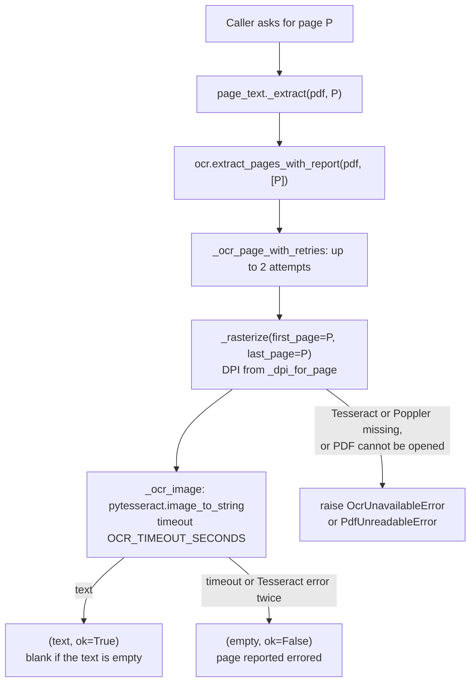

# OCR and page text

This page explains how the app turns PDF pages into text: Tesseract over Poppler, the DPI and
timeout rules, the `page_texts` store that extracts each page once, how an errored page differs from
a blank one and when a page is read again, the OpenMP thread limit, and the speed-ups that were
measured and rejected.

## Why it exists

Every stage needs the words on the pages: categorization reads a sub-document's first pages, the
duplicate check compares whole sub-documents, and summarization falls back to page text for
anything it is not given. The records are hundreds to thousands of pages, and reading one page
costs about 2 seconds of rasterising and Tesseract time. Before the store existed the same page was
read up to four times per document (segmentation's categorization, classify, dedup and summarize)
and thrown away on every re-run (`backend/app/services/page_text.py` and `backend/app/models.py`
`PageText` docstrings).

The comments put numbers on it: the OCR pass is roughly half the wall-clock time of a segment job.
One 297-page record segmented three times took 1,463 s, then 810 s and 715 s once its page text was
stored (`backend/app/config.py` comment on `page_text_workers`).

## How one page is read

Two system binaries do the work, both installed in the backend image (`backend/Dockerfile`:
`tesseract-ocr`, `poppler-utils`):

- Poppler, through `pdf2image`, renders the page to an image.
- Tesseract, through `pytesseract`, reads the image.

The rules, all in `backend/app/services/ocr.py`:

| Rule | Detail |
| --- | --- |
| Every page is rasterised and OCR'd | Even when the PDF carries a text layer. See [Rejected optimisations](#rejected-optimisations). |
| DPI | `OCR_BASE_DPI` (default 200). That value was pdf2image's own default before it was made explicit. |
| Optional DPI cap | `OCR_MAX_LONG_EDGE_PX` (default 0, which disables it) lowers the DPI of an oversized page so its long edge fits; it never raises the DPI. Page sizes are read once per file and cached. |
| `--dpi` flag | Passed to Tesseract only when a page was rendered below the base DPI. At the base DPI it is omitted. |
| Timeout | `OCR_TIMEOUT_SECONDS` (default 120) per image. pytesseract kills the Tesseract subprocess on timeout, so a hung page cannot hold a thread forever. |
| Retries | `extract_pages_with_report(..., retries=1)`: an errored page gets two attempts. A blank page is not an error and is not retried. |
| Fail fast on configuration | A missing Tesseract (`TesseractNotFoundError`) or missing Poppler (`PDFInfoNotInstalledError`) raises `OcrUnavailableError`. Every layer re-raises it rather than degrading to empty text. |
| Unreadable file | `PDFPageCountError` (corrupt, encrypted, truncated or missing file) raises `PdfUnreadableError`, a subclass of `OcrUnavailableError`, so it gets the same fail-fast treatment with a message about the file instead of the server. |
| Result | `(text, report)`, where `report` is `{"pages", "errored", "blank"}` and all three are lists of page numbers. |
| Windows hosts | `TESSERACT_CMD` points pytesseract at a Tesseract that is not on `PATH`. It is applied on first use and deliberately not passed through by `docker-compose.yml`, because a Windows path would break OCR in the Linux containers. |

The job error messages for the two fail-fast errors are listed in
[Errors and messages reference](../reference/errors-and-messages.md).

### Errored versus blank

An empty result has two causes that must stay apart:

- **Errored**: the read itself failed (timeout, Tesseract error). Often transient, so worth
  another attempt later.
- **Blank**: the read succeeded and found no words (a film, a photograph, a separator sheet). No
  number of retries will change it.

`page_text._extract` returns `(text, ok)` where `ok` is false only for an errored page. The
duplicate check reports the difference to the reviewer, and the summarizer names errored pages in a
notice. The code reads pages through the reporting extractor for this reason: the older
`extract_text_from_selected_pages` and `extract_text_from_all_pages` log and skip a failed page, so
it is indistinguishable from a blank one. Those two functions have no production caller; only tests
call them.

## The `page_texts` store

`backend/app/services/page_text.py` keeps one row per page in `page_texts` (`backend/app/models.py`
`PageText`):

| Column | Meaning |
| --- | --- |
| `document_id`, `page` | The key. Unique together (`uq_page_texts_document_page`). |
| `text` | The OCR text. Record content: never logged. |
| `extract_ok` | False when extraction errored; true for a successful read, including a blank page. |
| `ocr_engine` | `tesseract`. Recorded so a different engine can be compared page by page. |
| `char_count` | Length of `text`. |
| `created_at` | When the row was first written. |

The full column list is in [Data model reference](../reference/data-model.md). Rows are deleted only
when their document is deleted (ORM cascade on `Document.page_texts`).

Two design points from the module docstring:

- **Keyed by page, not by row.** A review row's identity changes whenever a reviewer merges or
  splits it, so text attached to a row cannot be reused across stages. Page numbers never change,
  so the store survives reviewer edits and re-segmentation.
- **A cache, not a source of truth.** Every entry can be reproduced from the PDF, and a miss is
  filled transparently, so no caller needs to know whether population has run.

### Filling the store: the OCR pass

Every segment job starts with `_populate_page_text` (`backend/app/worker/tasks.py`), which runs
`populate_document`:

1. Reports stage `reading` at `0 / page_count`.
2. Lists the pages with no row stored as `extract_ok = true`. Pages stored as errored count as
   missing, so they are attempted again.
3. Submits every missing page to a pool of `PAGE_TEXT_WORKERS` threads (default 6). The threads
   only OCR; each result is stored on the job's own session by the calling thread, because a session
   is not thread-safe.
4. Consumes results in completion order, stores each one, and calls
   `report("reading", stored, number_missing)`. That call is what moves the progress bar and what
   lets a Stop be heard during the pass.
5. On any exception, including a Stop, cancels every page still queued before leaving the pool.
   Without that, leaving the `with` block waits for the whole remaining pass (measured: 12.6 s
   against 0.5 s for a stop after 2 of 200 pages).
6. The drain is bounded by `Settings.pool_timeout(page_count)`, which fires just before RQ's own
   job timeout.

The pass is best-effort. Any failure is logged (`page text population failed for <document>`) and
the job carries on, because every reader can extract a missing page on demand. Two exceptions are
re-raised instead: `OcrUnavailableError` (and its subclass `PdfUnreadableError`), because no reader
can fall back when nothing can extract; and `JobCancelled`, because a Stop is not a failure.

A document created by the individual-records upload never gets this pass: it goes straight to a
classify job, and its pages are read on demand.

### Reading from the store

| Reader | Used by | Stored OK | Stored errored | Not stored |
| --- | --- | --- | --- | --- |
| `get_page_text(session, document_id, page, pdf_path)` | The segment job's categorization, which reads up to the first three pages of a low-confidence row through a reader that opens its own session per call because it runs on a thread pool; the classify job, which reads each row's first page | Returned | Re-read when `pdf_path` is given; a success replaces the stored failure | Read and stored when `pdf_path` is given |
| `get_row_text_with_report(session, document_id, pages, pdf_path)` | The dedup job, per included row | Returned | Re-read, as above | Read and stored; with no `pdf_path` the page is reported errored |
| `_seed_row_text` in `backend/app/worker/tasks.py` | The summarize job, for a row that has no `source_text` from the duplicate check (category 9 excluded) | Used only when every page of the row is stored OK | Makes the row fall back to a fresh read inside the summarizer | Makes the row fall back to a fresh read inside the summarizer |

`get_row_text_with_report` returns the same `(text, report)` shape as the direct extractor, so the
duplicate check can still tell errored pages from blank ones.

### When a page is read again

| Situation | What happens |
| --- | --- |
| No row for the page, and the caller passed the PDF path | OCR'd and stored. |
| Row stored with `extract_ok = false`, and the caller passed the PDF path | OCR'd again. A success overwrites the stored failure; a new failure leaves it as it was. |
| Row stored with `extract_ok = false`, during any later segment job | Included in the OCR pass again. |
| Row stored with `extract_ok = true` | Never OCR'd again through the store. Nothing in the app deletes `page_texts` rows except deleting the document, so a change to the OCR settings or engine applies only to pages not yet stored. |
| Two processes store the same page at once | The unique constraint rejects the second insert, which rolls back. If the second writer carried a success and the stored row is a failure, the success replaces it. A failure never overwrites anything. |

### Reads that bypass the store

Some reads OCR the PDF directly and do not write to `page_texts`:

| Reader | Pages | Code |
| --- | --- | --- |
| Header extraction at the end of a segment job | 1 to `min(15, page_count)` | `backend/app/services/extraction.py` `extract_header` |
| Boundary verification in the segment job | The two pages either side of a suspect boundary, rendered at 120 DPI; any OCR failure falls back to the image-only check | `backend/app/services/verify_pass.py` `_boundary_text` |
| Summarize, for a row with no seeded text | The row's pages; depositions (category 9) always, with `Page N:` markers | `backend/app/services/summarize_engine.py` (`extract_pages_with_report`) |
| Categorization escalation run outside the worker | Up to the first three pages of the row | `backend/app/services/segment_engine.py` `_escalation_text`, only when no page reader is supplied (the evaluation scripts) |

## The OpenMP thread limit

`docker-compose.yml` sets `OMP_THREAD_LIMIT: "1"` and `OMP_NUM_THREADS: "1"` for every backend
container (`x-backend-env`). Tesseract 5 is built with OpenMP, and concurrent Tesseract processes
deadlocked on the shared CPU without the limit: that was the reproduced "stuck on verifying" hang,
where the verify pass OCRs boundary pages on several threads at once. The comment records the proof:
a six-thread OCR hammer completed 0 of 60 reads without the limit and 60 of 60 with it. The
per-image timeout is the backstop if a Tesseract process hangs anyway.

`backend/scripts/dev/ocr_concurrency_hammer.py` is that proof, runnable inside a worker container;
see [Scripts reference](../reference/scripts.md). The limit is set only by compose, so a process run
directly on a host gets whatever that shell has.

### Why `PAGE_TEXT_WORKERS` is 6

The OCR pass got its own thread setting rather than sharing `CLASSIFY_WORKERS`, because it is pure
Tesseract CPU on a box that also runs the pacing work. The comment in `backend/app/config.py`
records the measurement behind 4 -> 6 (32 sampled pages of a 2,673-page record, in the api
container):

| Threads | 1 | 2 | 4 | 6 | 8 |
| --- | --- | --- | --- | --- | --- |
| Seconds | 60.2 | 30.7 | 17.0 | 12.7 | 10.9 |
| Speed-up | 1.00x | 1.96x | 3.54x | 4.75x | 5.51x |

Output was identical at every setting and no deadlock appeared even at 8. 6 was chosen over 8
because the 8-core box also runs six RQ workers, Postgres, Redis, the API and the frontend; no
contention effect was found in the history of up to four concurrent segment jobs. The value can be
reverted through the environment without a deploy.

## Rejected optimisations

These were measured and turned down. The measurements are recorded in the code so nobody has to
repeat them.

| Idea | Measured result | Where recorded |
| --- | --- | --- |
| Use the PDF's own text layer instead of OCR (about 0.04 s per page against about 2.0 s) | Over 35 records and about 1,050 sampled pages: only about 64% of pages with a layer matched OCR closely, and about 18% were missing more than 30% of the words OCR found. No character count separates good layers from bad. Checked in both directions: 25.8% of disagreeing pages were the layer missing content, 1.5% OCR noise. A per-document gate strict enough to be safe trusted 2 of 35 records. | `backend/app/services/ocr.py` module docstring |
| Cap the render size (`OCR_MAX_LONG_EDGE_PX`) | A 3500 px cap made OCR 4.2x faster and lost 6.0% of characters; 6500 px was 1.7x faster and still lost 3.8%. Measured by word recall with `backend/scripts/eval/ocr_cap_word_recall.py` on a 182-page record: pooled word recall 0.684 at 3500 px and 0.708 at 6500 px, with the slowest pages losing everything. Capping only the expensive pages cannot work, because those are the pages the cap destroys. | `backend/app/config.py` comment on `ocr_max_long_edge_px` |
| Always pass `--dpi 200` to Tesseract | Changed the text of a page whose resolution had not changed; it would have altered about 90% of stored OCR output for no gain. | `backend/app/services/ocr.py` `_ocr_image` |

The lesson both comments draw: measure word recall, in both directions, not character volume.
Character volume agreed within a few percent on records whose word recall was far worse.

## Page images are a separate path

Model calls that need page images (for backends that cannot take a PDF, and some vision reads) use
`backend/app/services/rasterise.py` `page_image_parts`, not OCR. It renders JPEG images at quality
70, with `SUMMARY_IMAGE_DPI` as a ceiling for every caller, and requires the caller to pass a page
cap. It renders one page at a time on purpose: batching was measured 2.2x faster but about 143 MB
more peak memory per concurrent row. See [Model providers](model-providers.md).

## Before you change it

- Keep the `except OcrUnavailableError` arms ahead of any general `except`. `PdfUnreadableError`
  is a subclass, so reordering would turn a configuration failure into a silently skipped page
  (`ocr.py` `_ocr_page_images`).
- Keep errored and blank apart. Read through `extract_pages_with_report` or the store, never
  through the extractors that skip failed pages.
- A stored failure must stay retryable: `populate_document` counts only `extract_ok = true` pages
  as done, and `_store` lets a success replace a failure, never the reverse.
- Do not touch the session from inside a thread pool; OCR in the threads, store on the caller.
- Changing `OCR_BASE_DPI`, the cap or the engine does not re-read stored pages. There is no code
  path that clears `page_texts` for a document other than deleting it, so plan how you will compare
  or refresh stored text before you change the engine, and record the engine in `ocr_engine`.
- `OCR_TIMEOUT_SECONDS`, `OCR_BASE_DPI` and `OCR_MAX_LONG_EDGE_PX` are not named in
  `docker-compose.yml`, so the containers use the code defaults until compose passes them. See
  [Configuration model](configuration-model.md).
- Measure any speed-up by word recall on real records before enabling it.

## Related pages

- [Pipeline and jobs](pipeline-and-jobs.md)
- [Duplicate detection](duplicate-detection.md)
- [Summarization](summarization.md)
- [Segmentation](segmentation.md)
- [Configuration reference](../reference/configuration.md)
- [Data model reference](../reference/data-model.md)
- [How to diagnose a stuck or failed job](../how-to/diagnose-a-stuck-or-failed-job.md)

<!-- reviewed: 2026-09-30 -->
