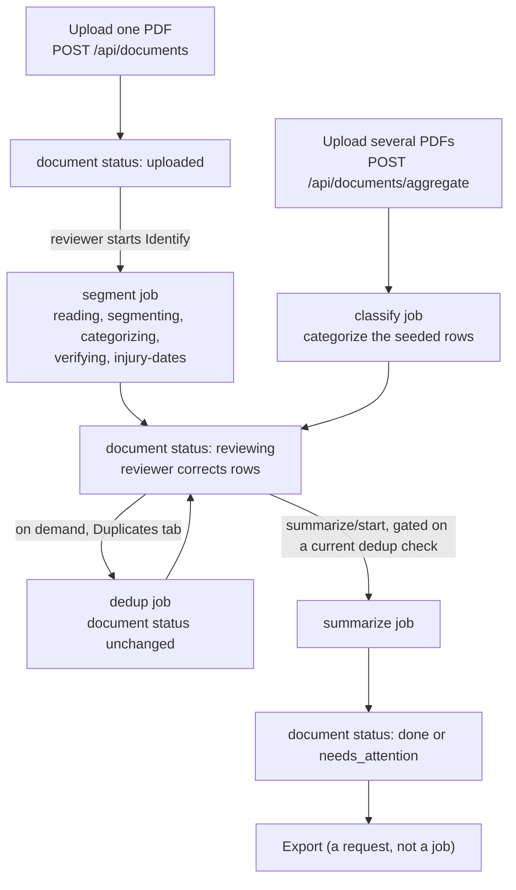
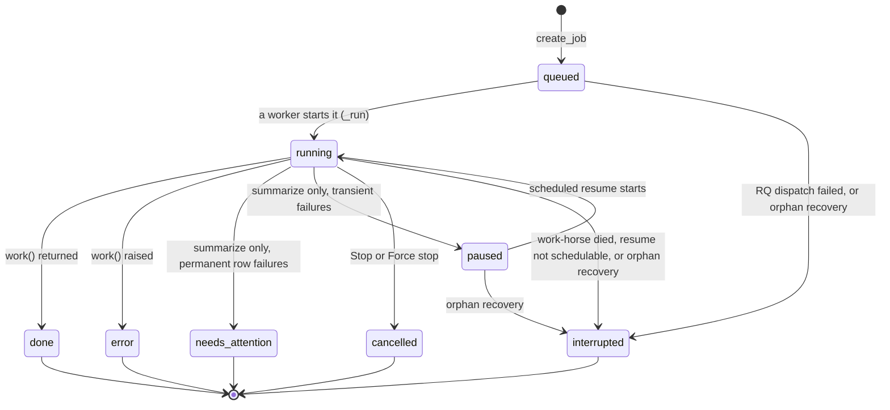
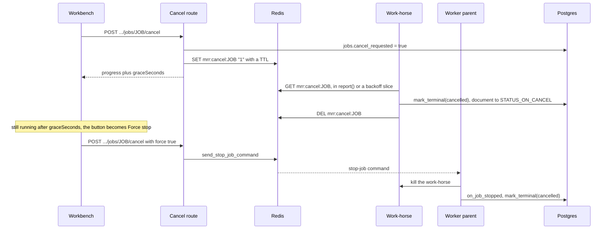
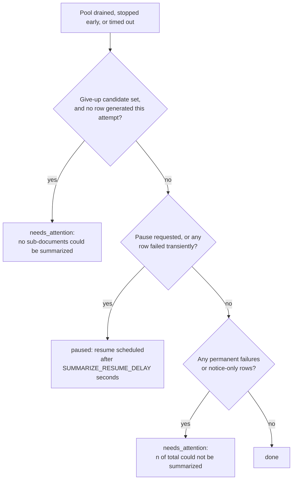

# Pipeline and jobs

This page explains how a record moves from upload to summaries, and how the long-running steps run
as background jobs on RQ workers: queues and per-user lanes, the shared job runner, the single
terminal writer, Stop and Force stop, the finalizer callbacks, orphan recovery at API start, and the
resumable summarize run.

For the exact vocabulary (every job kind, state, stage and document status, and who writes each),
see [Job and document states reference](../reference/job-and-document-states.md).

## Why the work runs in jobs

A record is a large scanned PDF. Identifying its sub-documents means OCR over every page plus many
model calls, and summarizing it means one model call chain per sub-document. That work takes minutes
to hours, far longer than an HTTP request can stay open, and it has to survive a reviewer closing the
browser.

So the API never does the work itself. It writes a `jobs` row, moves the document to an in-progress
status, and puts only the job id on a Redis queue. A separate worker process picks the id up, loads
the row, does the work, and writes progress and results to Postgres. The browser polls
`GET /api/documents/{id}/status` once a second to show progress.

The Redis payload is just the integer job id, so no record content ever sits in the queue
(`backend/app/services/jobs.py` module docstring).

## The stages, upload to summaries



| Step | Started by | Job kind | What happens | Document status afterwards |
| --- | --- | --- | --- | --- |
| Upload | `POST /api/documents` | none | The PDF is stored under the upload folder and a `documents` row is inserted. | `uploaded` |
| Individual-records upload | `POST /api/documents/aggregate` | `classify` (enqueued by the route) | `merge_pdfs` joins the files, one review row per source file is seeded at category `100`, then each row is categorized from its first page. | `segmenting` while running, then `reviewing` |
| Identify | `POST /api/documents/{id}/segment/start` | `segment` | OCR pass into the page-text store, segmentation, categorization, boundary verification, injury-date reads, then header extraction. | `segmenting` while running, then `reviewing` |
| Review | `PUT /api/documents/{id}/rows` | none | The reviewer's rows are validated and stored. Refused with 409 while any job is active. | unchanged, or `reviewing` if the edit strands stored summaries |
| Duplicate check | `POST /api/documents/{id}/dedup/start` | `dedup` | OCR text for each included row, clustering, one confirm call per candidate, then the grouping is rewritten in one transaction. | unchanged (advisory) |
| Summarize | `POST /api/documents/{id}/summarize/start`, or an admin's `POST /api/admin/reprocess/{document_id}` | `summarize` | One summary per included row, each committed as it finishes; resumable. | `summarizing` while running, then `done` or `needs_attention` |
| Export | the export routes | none | See [Exports and downloads](exports-and-downloads.md). | unchanged |

Notes on the table:

- The individual-records path has no segment job and therefore no full OCR pass. Classify reads
  each row's first page through the page-text store, which OCRs a page the first time it is asked
  for (`backend/app/worker/tasks.py` `classify_document`).
- Classify selects every row of the document, not only the included ones. The seeded rows are all
  category `100`, which is off by default, so a filter on `include` would select nothing; the loop
  re-derives `include` from the category it assigns (comment in `classify_document`).
- The duplicate check runs only when the reviewer asks for it. `summarize/start` then refuses with
  409 unless a completed check still covers the current rows, or the request sets
  `skip_duplicate_check`, which is audited as `summarize.skip_duplicate_check`
  (`backend/app/api/documents.py` `_enforce_or_audit_duplicate_check`). The admin reprocess route
  does not apply that gate.
- Segmentation, categorization, duplicate detection and summarization each have their own page:
  [Segmentation](segmentation.md), [Categorization](categorization.md),
  [Duplicate detection](duplicate-detection.md), [Summarization](summarization.md). OCR and the
  page-text store are explained in [OCR and page text](ocr-and-page-text.md).

## Queues, lanes and workers

### Two base queues, routed by kind

`backend/app/worker/queues.py` maps each job kind to a base queue and to the dotted path of its task
function:

| Kind | Base queue | Task | Why that queue |
| --- | --- | --- | --- |
| `segment` | `segment` | `app.worker.tasks.segment_document` | Runs the classifier, which needs torch. |
| `classify` | `segment` | `app.worker.tasks.classify_document` | Runs the classifier, which needs torch. |
| `summarize` | `summarize` | `app.worker.tasks.summarize_document` | No torch. |
| `dedup` | `summarize` | `app.worker.tasks.dedup_document` | OCR plus one model call per candidate, no torch. |

The split is by image: only the segment worker carries torch and the embedding model. `queues.py` is
deliberately import-light (redis, rq and config only) and names tasks by dotted path, so the API can
enqueue without importing torch.

### One lane per user

A single queue per task serialised every tester behind whoever queued first; the comment in
`queues.py` records a segment job that waited 427 seconds unstarted behind another user's job. So a
job is enqueued on its document owner's lane: `segment:<user_id>` or `summarize:<user_id>`
(`lane_name`, `queue_for`). The bare base name is still a real queue: it takes a job whose document
has no owner, and it kept jobs enqueued before lanes existed runnable across that deploy.

A worker started as `python -m app.worker segment` listens on the base queue plus one lane per user
that exists at start-up (`lanes_for`, `_user_ids` in `backend/app/worker/__main__.py`). Two details
are load-bearing:

- It uses RQ's `RoundRobinWorker`, not `Worker`. The default worker reads its queues in strict
  priority order, so the last user's lane would starve. Round-robin gives every lane a turn.
- Lanes are enumerated once, at start-up. A user created later has no lane on a running worker, so
  that user's jobs sit `queued` until the workers restart. **Restart both worker services after
  adding a user:**

```bash
docker compose restart segment-worker summarize-worker
```

A restart can cut off a job the container is running at that moment, and that job is then only
finalized later (see [Finalizer callbacks](#finalizer-callbacks)), so check for active jobs first;
see [How to manage users and admins](../how-to/manage-users-and-admins.md) for the full procedure. The
module docstring names the alternatives if the user set stops being small and fixed: fixed hashed
lanes, or re-reading the user set periodically.

If listing users fails at start-up, the worker logs a warning and serves the base queues only, on
the reasoning that a worker serving fewer lanes is better than one that refuses to boot.

### What a worker does before its first job

`backend/app/worker/__main__.py` `main()`:

1. Configures logging to stdout at INFO, so `docker compose logs` shows the pipeline's own lines.
2. Rejects an unknown queue name. With no arguments it serves both base queues (a development
   convenience).
3. Calls `assert_backends_ready()` from `backend/app/services/llm/preflight.py`, outside any
   `try`, so a worker never takes a job against a model backend that failed its check. See
   [Model providers](model-providers.md).
4. On segment workers, resets the classifier's per-process category cache, so a category edit made
   before the worker started cannot be served stale.
5. Starts `RoundRobinWorker(...).work(with_scheduler=True)`. The in-process scheduler is what fires
   the delayed resume of a paused summarize run; RQ coordinates several schedulers with a Redis
   lock.

### The worker containers

| Compose service | Image | Build extras | Command | Replicas |
| --- | --- | --- | --- | --- |
| `segment-worker` | `mrr-backend-classifier` | `--extra docs --extra classifier` | `python -m app.worker segment` | 3 |
| `summarize-worker` | `mrr-backend-web` (the same image as `api`) | `--extra docs` | `python -m app.worker summarize` | 3 |

Both images contain Tesseract and Poppler (`backend/Dockerfile`). A worker process runs one job at a
time: RQ forks a separate work-horse process per job, and the worker parent monitors it. The
replica comment in `docker-compose.yml` gives 4 as the ceiling on the measured box, because OCR is
CPU-bound. See [Compose services reference](../reference/compose-services.md) for the rest of the
service definitions and [How to deploy to the server](../how-to/deploy-to-the-server.md) for why all
three backend services must be rebuilt together.

Redis runs with persistence off (`docker-compose.yml` `redis` service). Queue contents, scheduled
resumes and RQ's registries do not survive a Redis restart; the `jobs` table in Postgres does.

### Dispatch

`backend/app/services/jobs.py`:

- `create_job` inserts the `queued` row, stamps provenance and moves the document to its
  in-progress status. Provenance is `model` as the caller passed it; for summarize jobs also the
  title model, audit model and backend, resolved once so a resumed job keeps them; the prompt
  fingerprint; `build_sha`; and the catalog revision. It also records `requested_by`, the user who
  started the job (an admin can start one on another reviewer's record; NULL for jobs the system
  queues itself), which the worker's audit rows name. A second active job for the same document
  violates the database's partial unique index, which surfaces as `JobConflict` and then HTTP 409.
- `enqueue` calls `create_job`, then puts `worker_fn(kind)` with the single argument `job.id` on the
  owner's lane, with the RQ job id set to the DB job id, a size-aware `job_timeout`
  (`Settings.effective_job_timeout(page_count)`: the larger of `JOB_TIMEOUT` and pages times
  `JOB_TIMEOUT_PER_PAGE`), and both finalizer callbacks. It records the RQ id in `jobs.rq_job_id`.
- If the dispatch raises (Redis unreachable), the job and the document are marked `interrupted` and
  the exception is re-raised.

## One job, start to finish: the `_run` runner

Every task function (`segment_document`, `classify_document`, `dedup_document`,
`summarize_document`) defines a `work(session, job, report)` and hands it to `_run` in
`backend/app/worker/tasks.py`. `_run` is the only entry point, and it:

1. Calls `get_engine().dispose(close=False)`. The work-horse is a fork of the worker parent, which
   already holds a pooled database connection. Without this the two processes share one socket, and
   a Force stop that kills the horse mid-transaction leaves that socket unusable for the parent,
   which is exactly where the stopped callback runs. `dispose(close=False)` is SQLAlchemy's fork
   initializer: it drops the inherited pool without closing the parent's sockets.
2. Loads the job. If the row is gone (the document was deleted), it logs and returns.
3. Sets `state = running` and `started_at`, commits, and publishes the job id as this process's
   current job (`backend/app/worker/cancel.py` `set_current_job`).
4. Calls `work(session, job, report)`, where `report(stage, current, total)` is the progress
   callback:
   - It checks for a pending Stop first, before any throttling, and raises `JobCancelled` if one is
     found.
   - A stage change always writes (the UI labels progress by stage).
   - Ticks within the same stage are limited to one write per second, except the tick that
     completes the stage (`current == total`), which always writes. The comment records why:
     without that exemption finished jobs kept a permanent record of having processed fewer items
     than they had.
5. Maps the outcome of `work()` to a finalizer, then clears the current-job id in a `finally`.



| Outcome of `work()` | Finalizer | Job state | Document status |
| --- | --- | --- | --- |
| Returned | `_finalize_done` | `done` | `STATUS_ON_DONE[kind]`, left alone when that is `None` |
| Raised `JobPaused` | `_finalize_paused` | `paused` (or `interrupted` if the resume cannot be scheduled) | unchanged (or `interrupted`) |
| Raised `JobCancelled` | `_finalize_cancelled` | `cancelled` | `STATUS_ON_CANCEL[kind]` |
| Raised `JobNeedsAttention` | `_finalize_needs_attention` | `needs_attention` | `needs_attention` |
| Raised anything else | `_finalize_failed` | `error`, with `user_facing_message(exc)` in `error` | `error`, only if it was `segmenting` or `summarizing` |

`JobPaused`, `JobCancelled` and `JobNeedsAttention` (`backend/app/worker/failures.py`) are
cooperative control-flow signals, not faults. The `return` after `_finalize_failed` stays inside
`_run`'s `try` on purpose: a helper cannot end that block, and falling through would mark a failed
job done.

`error` always holds a plain-language message, never the vendor's error text; the technical detail
goes to the worker log. The messages are listed in
[Errors and messages reference](../reference/errors-and-messages.md).

## The single terminal writer: `mark_terminal`

Several processes can legitimately race to finalize the same job: RQ runs the stopped callback and
then its own failure handling for one Force stop; abandoned-job cleanup can overlap orphan recovery
at API start; several worker parents finalize concurrently. `mark_terminal` in
`backend/app/services/jobs.py` is the single writer for every terminal outcome that is not the job's
own success, and it makes that race safe:

- It issues `UPDATE jobs ... WHERE id = :id AND state IN ('queued', 'running', 'paused')`. The
  database resolves the race: the first writer wins and every later writer gets zero rows, rolls
  back and returns `False`.
- `document_status_only_when` narrows the document write. Failure and interruption paths pass
  `INTERRUPTIBLE_DOCUMENT_STATUSES` (`segmenting`, `summarizing`), because a job may only move the
  document out of the stage it put it into.

Callers: `_finalize_cancelled`, `on_job_stopped`, `on_job_failed` and `recover_orphans`. The
in-horse finalizers for done, error, paused and needs_attention write the row directly, without the
conditional update. `backend/app/worker/recovery.py` records why the last
hand-written caller was moved onto `mark_terminal`: a Force stop landing during recovery used to be
overwritten as `interrupted`.

## Stop and Force stop



### Cooperative stop

`POST /api/documents/{id}/jobs/{job_id}/cancel` (`backend/app/api/documents.py` `cancel_job`):

- Returns 404 if the job is not this document's. A job that is already terminal gets a 200 no-op,
  because a job finishing between the click and the request is a normal race.
- For an active job it sets `jobs.cancel_requested`, commits, and calls `request_cancel`, which sets
  the Redis key `mrr:cancel:<job_id>` with a TTL of `max(60, JOB_CANCEL_GRACE_SECONDS * 60)`
  seconds. It audits `job.cancel` and returns the job's progress plus `graceSeconds`.

The worker notices the key in three places:

- `report()`, on every progress call, before the throttle.
- The one-second sleep slices of model-call retry backoff: `_cancellable_sleep` in
  `backend/app/services/genai_retry.py`, and the equivalent loops in
  `backend/app/services/llm/openai.py` and `backend/app/services/llm/vllm.py`. A retrying call can
  otherwise park a job for many minutes.
- The OCR pass, which calls `report` per stored page.

`_finalize_cancelled` then writes `cancelled` through `mark_terminal` with stage `cancelled` and the
progress carried by the signal, moves the document to `STATUS_ON_CANCEL[kind]`, cancels the RQ job
at `rq_job_id` if there is one (after a pause that is the scheduled resume), and deletes the Redis
key. It does not roll back: whatever the job committed (finished summaries, categorized rows) stays,
and `error` stays empty because a stop is not a fault.

Why a Redis key and not only the column: the check has to reach retry loops running on thread-pool
threads, with no session and no job argument. A GET on a short key needs no plumbing; the column is
the durable record of what was asked. Why a module-level "current job" is safe: RQ forks one
work-horse per job, so a process only ever runs one job; a `contextvar` would be wrong because
`ThreadPoolExecutor` threads do not inherit context (`backend/app/worker/cancel.py` docstring). A
Redis error while checking is treated as "not cancelled", so a Redis blip cannot abort every running
job.

### Force stop

The workbench offers Force stop only after the server's `graceSeconds` (`JOB_CANCEL_GRACE_SECONDS`,
default 10) has passed without the job settling. `force: true` additionally calls RQ's
`send_stop_job_command` for `rq_job_id`. RQ kills the work-horse and the worker parent runs
`on_job_stopped`, which writes the same `cancelled` state and `STATUS_ON_CANCEL` through the same
`mark_terminal`, so downstream nothing can tell which path ended the run.

A job with no running work-horse (still `queued`, or `paused` between attempts) cannot receive the
command; the route logs `force stop could not be delivered for job N` at INFO and returns normally.
The cooperative flag is already set, so that job is cancelled the first time it runs and calls
`report()`. A paused summarize resumes after `SUMMARIZE_RESUME_DELAY` seconds, well inside the
key's TTL at default settings.

### After a stop: Continue or Start over

A cancelled job is terminal, so it no longer blocks a new job. The start routes accept `fresh`:

| Kind | `fresh: false` (Continue) | `fresh: true` (Start over) |
| --- | --- | --- |
| `segment` | Recomputes everything. The OCR pass skips pages already stored successfully. | Same as Continue: segmentation keeps no checkpoints, so the flag has no effect (`segment_start` docstring). |
| `dedup` | Reuses each row's stored `source_text`. | Clears every row's `source_text` first. |
| `summarize` | Reuses every stored summary whose row still matches. | Deletes every summary of the document first. |

A cancelled segment run leaves the document `uploaded`, not `reviewing`, because a first run has no
rows and `reviewing` would open an empty editor. It does not delete the rows of an earlier run.

## Finalizer callbacks

When a work-horse dies without finishing (Force stop, out of memory, a crash), the code that would
have finalized its row dies with it. `backend/app/worker/finalizers.py` registers two RQ callbacks
that run in the worker parent, which outlives the horse:

| Callback | RQ fires it when | Writes |
| --- | --- | --- |
| `on_job_stopped` | A stop-job command killed the horse. Immediate. | `cancelled`, stage `cancelled`, document `STATUS_ON_CANCEL[kind]` |
| `on_job_failed` | An exception escaped the horse, or RQ's registry maintenance finds the job abandoned. The abandoned case is eventual, not immediate. | `interrupted`, document `interrupted` only if it was `segmenting` or `summarizing` |

Rules they follow:

- They find the DB job from the RQ job's first positional argument, not from the RQ job id,
  because a resumed summarize runs under a fresh RQ id.
- They never raise. An exception from a callback would take down the parent's job-monitoring loop;
  a callback that cannot reach the database logs and leaves the row for orphan recovery.
- RQ stores callbacks by dotted path, so they must stay importable module-level functions.
  Both dispatch sites pass them: `enqueue` in `backend/app/services/jobs.py` and `_finalize_paused`
  in `backend/app/worker/tasks.py`.

An ordinary exception inside `work()` is already finalized as `error` by `_run`; if RQ reports a
failure for that job afterwards, `mark_terminal` finds it no longer active and does nothing.

## Orphan recovery at API start

`recover_orphans` (`backend/app/worker/recovery.py`) runs once, in the API's start-up
(`backend/app/main.py` `_lifespan`), inside a `try` so a Redis outage cannot stop the API serving.
For every job in `queued`, `running` or `paused`:

1. It fetches the RQ job by `rq_job_id` (or the DB id when that is empty).
2. RQ status `queued`, `started`, `deferred` or `scheduled` means a worker has it or it is validly
   waiting: left alone.
3. No such RQ job, or any other status, means its worker is gone: `mark_terminal(interrupted)`,
   with the document moved to `interrupted` only from `segmenting` or `summarizing`.
4. A Redis error stops the loop; it returns only the count it actually committed.

The API logs `startup orphan recovery interrupted N stale job(s)` when it reaps anything.

This replaced the Flask app's sweep that marked every queued or running job interrupted at boot,
which would have killed healthy jobs on every API restart. The consequence to know: recovery runs
only when the API starts. A job whose RQ record vanished (for example after a Redis restart) stays
active in the database, and keeps blocking new jobs on its document, until the API is restarted. See
[How to diagnose a stuck or failed job](../how-to/diagnose-a-stuck-or-failed-job.md).

## Resumable summarize

`summarize_document` runs `_summarize_work` through `_run`. It is built so that an interrupted,
paused or re-clicked run pays only for the rows still missing.

### What one attempt does

1. Loads the included review rows, in order, as plain dicts.
2. Seeds each row from stored text: `unreadable_pages` from `page_texts` rows with
   `extract_ok = false`; and, for a row that has no `source_text` yet from the duplicate check,
   `source_text` from the page-text store when the store covers every page of the row cleanly
   (category 9 is skipped: depositions are re-read with page markers). Also attaches
   excluded records-review blocks to the evaluation row they sit inside
   (`_seed_row_text`, `_seed_embedded_review_pages`).
3. Reconciles existing summaries by row identity `(start, end, category)`: one summary per
   still-wanted row is kept, with the reviewer's edits, and repositioned to the current order;
   stale and duplicate summaries are deleted. A notice-only summary (nothing on its pages could be
   read, no model output, no reviewer edit) is deleted so it is retried rather than reused
   (`_reconcile_summaries`, `_is_retryable_notice`).
4. Reports `summarizing` at `done/total`. If nothing is pending, it returns and the job is done.
5. Resolves one prompt per category before starting threads, because a SQLAlchemy session is not
   thread-safe (`_prompts_for_rows`).
6. Submits every pending row to a thread pool of `PIPELINE_WORKERS` threads. The body, title and
   audit models come from the job row, resolved when the job was created, so a configuration change
   cannot split one document across models.
7. Drains the pool with `drain_pool` under `Settings.pool_timeout(page_count)` (the job timeout
   minus `FUTURE_TIMEOUT_MARGIN_SECONDS`, so the pool gives up just before RQ would kill the horse).
   Each success is committed at once and reported; each failure is classified.
8. Decides the outcome (`_SummarizeRun.finish`).

### Transient and permanent failures

`classify_failure` in `backend/app/worker/failures.py` mirrors the retry seam's own retryable set:

- Transient: a 429 that is not the daily quota, a 5xx that is not a deadline 504, a dropped
  connection. Worth waiting for.
- Permanent: everything else, including a `PipelineError` (no readable text), an auth or bad-request
  rejection, the daily quota, a deadline 504 (it already had its longer retry inside the seam), and
  any unrecognized exception.

### How the attempt ends



During the drain:

- **Give-up.** When no row has been generated in this attempt and transient failures reach
  `SUMMARIZE_GIVEUP_AFTER_FAILURES` (default 3), the first such failure becomes the give-up
  candidate, rows not yet started are cancelled, and draining continues so rows already running can
  still answer. After the loop the candidate is promoted only if nothing was generated. A model that
  admits nothing then ends the job instead of pausing into the same refusal.
- **Pause.** When consecutive transient failures reach `SUMMARIZE_PAUSE_AFTER` (default 3), rows
  not yet started are cancelled and the pause is flagged; draining stops unless a give-up candidate
  is pending. A success resets the consecutive count.
- **Pool timeout.** `PoolTimeout` sets both `should_pause` and `transient_left`; the unfinished rows
  retry on the resume.
- **Notice-only rows.** A row whose pages could not be read is delivered with a notice in place of
  a summary, counted as done, and also listed as an attention row, so the job ends
  `needs_attention` and names it.

`_finalize_paused` writes `state = paused`, `stage = paused`, the progress, and `attempts + 1`, then
schedules the same DB job again with `enqueue_in(SUMMARIZE_RESUME_DELAY)` on the same owner lane,
with the same finalizer callbacks, and stores the new RQ id in `rq_job_id`. The document stays
`summarizing`. If scheduling fails, the job and the document become `interrupted`.

There is no limit on the number of pause cycles; `attempts` is a counter for observability only.

`needs_attention` stores the message in `error` and `{"rows": [{"idx", "pages", "reason"}], "message"}`
in `attention`. Rows carry positions, page ranges and a friendly reason only.
`GET /api/documents/{id}/status` returns the newest job of any kind but takes `attention` from the
newest summarize job, so a later dedup run does not hide the list.

## Design decisions recorded in the code

| Decision | Reason given in the code | Where |
| --- | --- | --- |
| One active job per document is a database partial unique index, not an application lock. | It holds across worker processes; the old in-process lock could not. | `backend/app/models.py` `Job.__table_args__`, `backend/app/services/jobs.py` `create_job` |
| `dedup` has `None` in every status map. | The duplicate check is advisory. Writing `reviewing` rewrote finished records to "Ready for review" and hid a needs_attention list. | `jobs.py` comment above `STATUS_ON_ENQUEUE` |
| A cancelled segment job leaves the document `uploaded`. | A first run has no rows, and `reviewing` would open an empty editor. | `jobs.py` `STATUS_ON_CANCEL` |
| Failure and interruption move the document only out of `segmenting` or `summarizing`. | A job owns only the stage it put the document into; a failing dedup must leave a summarized record summarized. | `jobs.py` `INTERRUPTIBLE_DOCUMENT_STATUSES`, `tasks.py` `_finalize_failed` |
| Cooperative stop first, Force stop only after a grace period. | A hard kill can land mid-transaction. | `backend/app/schemas/documents.py` `CancelPayload`, `backend/app/config.py` `job_cancel_grace_seconds` |
| The completing progress tick always writes. | Measured over completed jobs: 30 of 57 dedup jobs and 7 of 68 segment jobs had recorded fewer items than they processed. | `tasks.py` `_run` |
| The OCR pass cancels its queued pages on the way out of a stop. | Measured: a stop after 2 of 200 pages returned in 12.6 s without it, 0.5 s with it. | `backend/app/services/page_text.py` `populate_document` |
| The give-up path keeps draining running rows. | Stopping on the spot made ending versus pausing depend on completion order; the same test passed 3 of 6 runs. | `tasks.py` `_SummarizeRun.record_transient` |
| Give-up is checked before pause. | Both dials ship at 3; checking pause first let a fully refused job grind for 96 minutes. | `tasks.py` `_SummarizeRun.finish` |
| Queue lanes per user plus a round-robin worker. | Measured head-of-line wait of 427 s behind another user's job. | `queues.py`, `__main__.py` |
| Models and backend are resolved once at job creation. | A resumed job must not switch models or vendors mid-document. | `jobs.py` `create_job` |

Bounding the number of model calls a refusing document costs was considered and left out: every row
is submitted up front, so cancelling only skips rows that have not started; bounding the spend would
need submission in waves (comment in `record_transient`).

## Before you change it

- Every task must go through `_run`. A new entry point that skips it loses the engine-pool dispose
  (reintroducing the Force stop callback failure), the progress callback, the cancel check and the
  finalizers.
- Keep the `return` after `_finalize_failed` inside `_run`.
- `report()` is the only cooperative cancel point in worker code, apart from the retry backoff
  slices. A new long loop with no `report()` calls can only be ended by Force stop. End each stage
  with `report(stage, total, total)`.
- Every job kind needs an entry in `STATUS_ON_ENQUEUE`, `STATUS_ON_DONE` and `STATUS_ON_CANCEL`;
  the runner indexes them directly. See
  [How to add a job kind or stage](../how-to/add-a-job-kind-or-stage.md).
- A new active state has to be added everywhere `('queued', 'running', 'paused')` appears, plus a
  migration for the index; the list is in the
  [states reference](../reference/job-and-document-states.md).
- Correlate an RQ job with its DB job by `rq_job_id` or by the job's first argument, never by
  assuming the RQ id equals the DB id.
- Do not rename or move `on_job_stopped` or `on_job_failed` without updating both enqueue sites;
  queued RQ jobs hold their dotted paths.
- Do not read the database or the catalog from inside a thread pool; resolve values before
  submitting, or open a fresh session per call as the segment job's page reader does.
- A setting the worker reads reaches the containers only if `docker-compose.yml` names it in
  `x-backend-env`; `SUMMARIZE_PAUSE_AFTER`, `SUMMARIZE_RESUME_DELAY` and
  `FUTURE_TIMEOUT_MARGIN_SECONDS` are not named there, so containers use the code defaults. See
  [Configuration model](configuration-model.md).
- After adding a user, restart both worker services.

## Related pages

- [Job and document states reference](../reference/job-and-document-states.md)
- [How to diagnose a stuck or failed job](../how-to/diagnose-a-stuck-or-failed-job.md)
- [How to add a job kind or stage](../how-to/add-a-job-kind-or-stage.md)
- [OCR and page text](ocr-and-page-text.md)
- [Architecture](architecture.md)
- [HTTP API reference](../reference/http-api.md)
- [Configuration reference](../reference/configuration.md)
