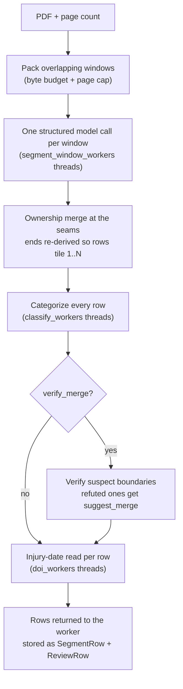

# Segmentation

Segmentation turns one uploaded medical-record PDF into an ordered list of sub-documents ("rows"),
each with a page range, a title, a visit date, a review flag, a category and an injury date. Every
later stage (review, the duplicate check, summarization, export) works on those rows.

## Why it exists

A workers' compensation file arrives as one large scan, often several hundred pages, containing
dozens of separate documents run together: progress notes, imaging reports, therapy visits, claim
forms, depositions, medico-legal evaluations. There are no separator pages and no index.

Before anything can be summarized, the file has to be cut into those documents. Everything
downstream depends on the cut. If two documents are merged into one row, the second one is never
shown to the reviewer as a document of its own and never gets its own summary.

The cut is harder than it looks:

- Printed page numbers restart and repeat, because the bundle was assembled from many sources.
- Scanners insert blank pages and separator sheets.
- Fax cover sheets, transmittal letters and routing slips travel with the document they belong to.
- A long report can embed pages that look like a different document: lab tables, a copied letter,
  a work-status form.

## Where it runs

Segmentation is the `segment` job kind. It runs on the `segment` queue, which is served by the
`segment-worker` containers. Those run the classifier image (`mrr-backend-classifier`, the one with
torch), because the same job also categorizes every row. See
[Pipeline and jobs](pipeline-and-jobs.md) for how jobs are queued, cancelled and recovered.

The worker entry point is `backend/app/worker/tasks.py` `segment_document()`. It first fills the
per-page text store (see [OCR and page text](ocr-and-page-text.md)), then calls
`backend/app/services/segment_engine.py` `run_segmentation()`, then stores the rows. The engine
module is deliberately database-free: page text reaches it through an optional `page_text_fn`
callback rather than an import, so the eval harnesses can run it outside the worker.

## The flow at a glance



The engine reports progress under the stage names `segmenting`, `categorizing`, `verifying` and
`injury-dates`, in that order (the worker reports `reading` before them while it fills the page
text store).

## What the model is told

The prompt lives in `backend/app/services/gemini.py` as `SEGMENTATION_SYSTEM` and
`SEGMENTATION_PROMPT`. Read the constants for the exact wording; it is summarized here, not copied.

The system text gives the model a role: an expert medical-records clerk who splits scanned
workers' compensation files into their component documents and reports exact page ranges and
metadata.

The prompt then gives six sets of instructions:

1. **What counts as one document.** One document by one author or facility for one encounter,
   report or form: the unit a records reviewer would summarize as a single item. Most documents are
   short (one to three pages), because the most common mistake is lumping several short documents
   together. The window is described as a continuous excerpt that may start and end mid-document.
2. **How to count pages.** "Page N" is the N-th page of the file it was given, counted from 1.
   Printed page numbers are to be ignored, because they restart throughout a bundle.
3. **Coverage.** Every page belongs to exactly one document; records are in order, do not overlap
   and leave no gaps. A partial document at either edge is still reported. Blank pages never form
   their own record: a blank page attaches to the document before it, and blank pages before the
   first document attach to the first document.
4. **Where a document starts.** At its first physical page, including any cover sheet, transmittal
   letter or routing slip that travels with it. Strong start signals are a new letterhead or form
   header together with a new title, the first page of a form, or a new visit date or author within
   a run of same-type documents (consecutive progress notes are separate records). Not starts:
   "page N of M" continuation pages, attached lab tables, signature pages, a letterhead change
   inside one report, and the stamp, branding, disclaimer and distribution-list pages that often
   open or close a document. A long QME/PQME/AME evaluation that quotes many other records stays one
   record; a distinct supplemental report is its own record. Documents are not merged merely
   because they share a type and a date.
5. **What to record for each document**, as three fields:
   - `t`, the title: the document's own title or header wording (it may sit next to a label such
     as "Notes"), otherwise the document type. Commas are replaced with a dash. A title of the form
     "X vs Y" is reported as "Deposition".
   - `d`, the visit or encounter date of this document as MM/DD/YYYY (it may be near the signature
     at the end), ignoring fax, print and re-send dates, and never the date of injury.
   - `m`, the manual-check flag: `x` for substantial handwriting, checkbox forms, work-status
     reports and QME/PQME/AME reports, otherwise `-`.
6. **The answer format**, with a short example and "Return ONLY the JSON array". The format is
   also enforced by a response schema (below), so the prompt's example is a format reference, not
   the enforcement.

The prompt ends with a tiebreak: when the model genuinely cannot tell whether a page starts a new
document or continues the previous one, it must start a new record. See
[Why recall matters most](#why-recall-matters-most).

Two things are deliberately not asked for:

- **No injury date.** It used to be a field of this call. A window covers many documents, so a
  date read from a window spread onto neighbouring documents that state none. It is now read once
  per row, in isolation, at the end (see [Injury dates, read last](#injury-dates-read-last)).
- **No confidence rating.** A per-row confidence field was trialled and removed: on the two most
  error-dense test cases the model answered "high" on 231 of 232 rows, including every known
  near-miss (comment under `SEGMENT_RESPONSE_SCHEMA`). Suspicion is computed from the rows instead,
  by the verify pass.

## Windows: packing a large record into calls

One call cannot carry a whole record, so the record is split into overlapping windows by
`backend/app/services/windows.py` `byte_budgeted_windows()`. Two independent bounds apply, because
they limit different things:

| Bound | Limits | Why a single bound is not enough |
| --- | --- | --- |
| Byte budget (`window_budget_mb`, default 12.5) | Request size | Vertex caps an inline request near 20 MB after base64. Page density varies roughly 60-260 KB per page, so a page count cannot bound size: a dense 100-page chunk reached 24 MB. |
| Page cap (`window_max_pages`, default 100) | Request duration | A byte-light record packs a huge page count into one budget-sized call. One 241-page record fit a single 12.5 MB window, needed 179 s against a 120 s deadline, and failed every attempt. |

The page-cap value comes from a duration curve measured on the server (80 pages 20.2 s, 120 pages
39.9 s, 160 pages 54.5 s, 200 pages 106.3 s, 241 pages 179.0 s, per the comment on
`window_max_pages` in `backend/app/config.py`). Production windows of 180-188 pages had started
erroring, so 100 sits clearly below the failure onset. `max_pages` has no default in
`byte_budgeted_windows()` on purpose: a caller that skips the cap is the failure it exists to
prevent.

How packing works:

1. Each page's size is measured by writing it as its own single-page PDF
   (`page_raw_sizes()`). A multi-page window is slightly smaller than the sum, so packing against
   the budget stays conservative.
2. Starting at page `s`, the window extends one page at a time while the next page still fits the
   byte budget and the window is under the page cap.
3. A page that is larger than the byte budget on its own simply gets a window of its own. Only a
   page larger than the backend's hard per-page limit fails the job, with a message naming the page
   and its size. This used to fail on the budget instead, and a 141-page record with one 12.7 MB
   page was refused outright.
4. The next window starts `overlap` pages before the previous window's end, so the model always has
   context on both sides of a seam. The effective overlap is capped at a third of the window
   (minimum 1) by `next_window_start()`, and the start always advances by at least one page. With
   a fixed overlap, dense regions packed 30-45 page windows and the step collapsed to a 2-4 page
   crawl, so the same pages were judged by many windows and false splits accumulated (measured on
   a test case, per the docstring).

The bounds depend on the backend answering the `segment` stage (`_window_byte_bounds()` and
`_window_page_cap()` in `segment_engine.py`):

| Backend | Byte budget | Hard per-page limit | Page cap |
| --- | --- | --- | --- |
| Gemini | `window_budget_mb` | 14 MiB raw (`_GEMINI_INLINE_PAGE_LIMIT`) | `window_max_pages` |
| vLLM | none in practice (1 TiB) | none | `min(window_max_pages, vllm_segment_max_pages)` |

On vLLM the raw PDF bytes are never sent (every page is rasterised to an image), so a budget in raw
bytes bounds nothing there. What does bound that request is the image count the pod accepts, which
`vllm_segment_max_pages` (default 30) mirrors.

Every setting named here is listed with its environment variable in the
[configuration reference](../reference/configuration.md).

## One call per window

`_window_rows()` makes one structured call per window through the provider seam, with both the
transport and the model resolved for the `segment` stage (`provider_for_stage("segment")` and
`Settings.model_for_stage("segment")`). See [Model providers](model-providers.md) for the seam and
[Model calls by stage](../reference/model-calls-by-stage.md) for every call's parameters.

**Payload.** The window goes first and the prompt last. The payload's shape depends on the backend
(`_window_parts()`):

- **Gemini** receives the window as one inline PDF. The Files API is not used: it existed only on
  the non-BAA Developer endpoint and was removed with the Vertex port.
- **vLLM** cannot take a PDF, so each page becomes a JPEG, preceded by a `Page N` text label
  (1-based within the window) and one preamble that says a label is a position only.
  `backend/app/services/rasterise.py` `page_image_parts()` builds these parts. Loose images carry no
  position, so without labels the model had to count them, and a count that slips by one puts a
  boundary on the wrong page. The docstring of `_window_parts()` records the measurement: against
  reviewer-kept boundaries on three corrected records, exact agreement rose from 68.2% to 80.1%
  and misplaced boundaries fell from 45 to 7. The prompt text itself was left untouched, so its
  fingerprint and the quality baseline stay comparable.

**Call parameters.**

- `generate_structured` with `SEGMENTATION_SYSTEM`, the prompt, and `SEGMENT_RESPONSE_SCHEMA`.
- `temperature=0.0`, `top_p=0.95`, `top_k=40`. Segmentation is the only stage that sets `top_p`
  and `top_k`.
- `stage="segment"`, which on Gemini selects `segment_thinking_budget` (default -1, dynamic
  thinking). Thinking stays on because an A/B showed thinking-off regresses document F1 by
  over-segmenting (docstring of `Settings.thinking_for()`).
- No output-token cap is passed.

**Schema.** An array of objects with `s` (first page), `e` (last page), `t`, `d` and `m`, all
required; `m` is constrained to `x` or `-`. An `id` property is also declared and never read: it is
kept so the Gemini request stays byte-identical to the one the seam replaced (comment on
`SEGMENT_RESPONSE_SCHEMA`).

**Parsing.** Markdown code fences are stripped and the reply is parsed as JSON. Each element goes
through `parse_segment_item()`, which accepts `title` as an alias for `t`, defaults a missing `d` or
`m` to `-`, and coerces page numbers to integers. An element that raises `KeyError`, `TypeError` or
`ValueError` is skipped so one bad element does not abort the window. Window-relative pages become
absolute pages (`s + window_start - 1`). Each row gets `injury_date = "-"` as a placeholder and its
`flag` from `m`.

**Concurrency and failure.** Windows are independent, so they run on a pool of
`segment_window_workers` threads (default 3); the provider's pacer caps the aggregate request rate.
Results are placed by window index so the merge sees them in order. Any window that raises fails
the whole job: a lost window is lost coverage, and a silently shorter document is worse than a
visible failure. If the window pool exceeds its time budget, the job fails with a timeout error
(see [Timeouts](#timeouts) and [Errors and messages](../reference/errors-and-messages.md)).

## Seams: which window decides a boundary

Windows overlap, so pages near a seam are judged twice. `merge_window_rows()` keeps exactly one
answer per page using an ownership rule: window `k` owns row starts in `(start_k, start_(k+1)]`,
and the last window owns everything through the last page. The first window also keeps its row at
page 1.

The effect is that a document start on page `p` is always decided by a window that saw page `p - 1`
as well as page `p`. A boundary is a judgement about two adjacent pages, so the window that can see
both is the one that decides it; no document is cut at a window edge.

A worked example with two windows, pages 1-90 and 61-150:

| Row start on page | Decided by | Reason |
| --- | --- | --- |
| 1 to 61 | window 1 | window 1 owns `(0, 61]`; page 61 is window 2's first page, and only window 1 also saw page 60 |
| 62 to 150 | window 2 | window 2 owns `(61, 150]`; it saw each such page and the page before it |

After ownership filtering:

1. Rows are sorted by start page. If two rows share a start page, only the first is kept.
2. If no row starts on page 1, a row for page 1 is inserted with title `-`, date `-` and flag `x`,
   so the front pages are never uncovered.
3. **Every row's end is re-derived** as the next row's start minus one, and the last row ends on
   the last page. The ends the model reported are discarded.

So the output always tiles pages 1..N exactly, with no gaps and no overlaps, whatever the model
returned. Only the start pages carry the model's judgement.

## Categorizing each row

Each row is then categorized by `_categorize()`: the category cascade runs on the title first and,
only when that is inconclusive, again on the text of the row's first pages (up to three pages,
12,000 characters). A low-confidence answer, or an `x` from the model's manual-check field, leaves
the row flagged `x`. Rows are independent, so they run on `classify_workers` threads (default 4).

If that pool runs out of time, the unfinished rows are not lost: each gets category `100`, flag
`x` and method `timeout`, and the job continues.

The cascade, the escalation and the `method` values are explained in
[Categorization](categorization.md).

## The verify pass: suggestions, never merges

The tiebreak deliberately over-splits, so some boundaries are false splits. The verify pass
(`backend/app/services/verify_pass.py` `verify_and_merge()`) looks for likely false splits and
marks them for the reviewer. It runs only when `verify_merge` is true (the default) and after
categorization, because it uses the categories to choose what to check.

**Choosing suspects (`suspect_indices()`).** Suspicion is computed from the rows, never asked of
the model. A boundary is *triggered* when the row has the same category and the same known date as
the row before it, or when the row is at most two pages long (`SHORT_ROW_PAGES`). Two nets exist:

| Net | Setting | Boundaries checked |
| --- | --- | --- |
| Wide (default) | `verify_triggered_only=false` | Every boundary, triggered ones first |
| Narrow | `verify_triggered_only=true` | Triggered boundaries only |

Either list is truncated to `verify_suspect_cap` (default 200). The docstring notes the cap does
not bind in practice (roughly 88 boundaries per record), which is why the narrow net exists as a
separate switch.

**Checking one boundary (`_same_document()`).** For each suspect row B and the row A before it:

1. Render A's last page and up to two of B's pages (`FRAGMENT_PAGE_CAP`) as PNG at 120 dpi.
2. Send the images first and the prompt last. The prompt refers to the images by position ("The
   first image is the LAST page of document A"), so the model should see them before reading those
   references.
3. The prompt carries each row's pages, category, date and title, and the rule: answer YES only for
   clear continuation evidence (continued pagination, a sentence or table flowing across the
   boundary, the same author and visit continuing, an attachment the report references); sharing a
   type, date or letterhead is not enough; unclear means NO.
4. When `verify_use_text` is true (the default), OCR text is appended: the last 1,200 characters of
   A's last page and the first 1,200 of B's first page. OCR failure falls back to images only.
5. The answer is constrained to `YES` or `NO` (`generate_choice`, stage `verify`, model
   `verify_model`, which defaults to `genai_model`).

Only an exact `YES` counts as "same document". Any error keeps the boundary, and a boundary the pool
did not reach before its deadline is simply left unverified and kept. Merging on missing evidence
would hide a document.

**Applying verdicts (`_apply_verdicts()`).** Production calls the pass with `auto=False`: every
refuted boundary sets `suggest_merge = true` on row B, and no row is removed. The review editor then
shows a "Likely same doc - merge?" button on each such row and an "Apply N suggested merges" button
for all of them (see [The frontend workbench](frontend-workbench.md)). An `auto=True` mode exists
that absorbs refuted rows into the previous one (collapsing a run of refutations into one row and
carrying an `x` flag over); production does not use it.

The engine logs `verify pass: {'suspects': n, 'suggested': k}` for every run.

> **Note:** The oracle's measured figures (wide net 57.4% precision at 49.0% recall, narrow net
> 60.2% at 45.6% on 31% fewer calls, over 28 reviewer-corrected records) were taken before the
> images-first reordering and have not been re-measured. The code comments say only the shape of
> the trade survives: the narrow net buys precision with recall. Do not quote the levels as current.

## Injury dates, read last

After verification, each row's injury date is read once, in isolation, by
`backend/app/services/summary_doi.py` `extract_injury_date()` on a pool of `doi_workers` threads
(default 4). The call sends only that row's first pages (at most ten), so the model has no
neighbouring documents to copy a date from.

It runs last because the read is defined by a page range, and it must run after every step that
could change a range. It replaced two earlier reads that never reconciled: one inside the window
call (which spread one document's date onto its neighbours) and one at summarize time (whose value
won, so a reviewer's correction was discarded). The row is now the single source of the injury
date. A failed read, or a pool timeout, leaves `-`, which means "states none".
[Summarization](summarization.md) explains how the date is used downstream.

## Timeouts

Every pool drain in the engine is bounded by one size-aware budget,
`Settings.pool_timeout(total_pages)`:

```text
pool_timeout = max(1, max(job_timeout, pages * job_timeout_per_page) - future_timeout_margin_seconds)
```

With the defaults (3,600 s, 20 s per page, 120 s margin) a 100-page record gets 3,480 s and a
1,000-page record 19,880 s. Each pool gets that budget from the moment it starts draining
(`backend/app/services/pools.py` `drain_pool()`). What an unfinished item means differs by pool:

| Pool | On timeout |
| --- | --- |
| Windows | The job fails: lost coverage is not recoverable. |
| Categorization | Unfinished rows become `100`, flag `x`, method `timeout`; the job continues. |
| Verify | Unfinished boundaries stay unverified and keep their split. |
| Injury dates | Unfinished rows keep `-`. |

## What gets stored

The engine returns row dicts with `start`, `end`, `title`, `date`, `injury_date`, `flag`,
`category`, `method` and, when the verify pass ran, `suggest_merge`. The worker then
(`_store_segment_rows()`):

1. Copies every existing `ReviewRow` of the document to `replaced_review_rows`, tagged with this
   job, then deletes them.
2. Writes each row twice from one shared dict: an immutable `SegmentRow` tied to this job, and an
   editable `ReviewRow` that the reviewer changes. Writing both from one dict keeps the two copies
   from drifting.
3. Sets each `ReviewRow.include` from the category's `summarize_default` in the live catalog.

Re-running segmentation therefore replaces the document's rows and every reviewer correction on
them in the editor. The replaced rows are kept in `replaced_review_rows`, one generation per
re-segment, so the corrections remain available as ground truth and training data. The worker counts the corrections it is about to destroy and, if there were any, writes a
`segment.rows_replaced` audit row after the new rows exist. The `fresh` flag on
`POST /api/documents/{id}/segment/start` is accepted and currently does nothing: segmentation keeps
no checkpoints, so every run recomputes every window.

After the rows are stored the job also extracts the report header, best-effort; see
[Pipeline and jobs](pipeline-and-jobs.md). The tables are described in the
[data model reference](../reference/data-model.md).

## Why recall matters most

The two segmentation errors do not cost the same:

- **An over-split** (one document cut into two rows) is visible. The reviewer sees both rows and
  merges them with one click, and the verify pass has probably already suggested it.
- **An under-split** (two documents in one row) is invisible. The second document is never listed,
  never summarized, and nothing downstream surfaces it.

So the design is biased toward the visible, fixable error at every step: the prompt's tiebreak
says "start a new record", the verify pass only ever suggests merges, a failed or unfinished
verification keeps the split, and a lost window fails the job rather than returning a shorter
document.

The measurement that matters is boundary recall against hand-labelled ground truth. In the
2026-07-08 bake-off on a 227-page case with 51 hand-labelled documents (run on `gemini-2.5-flash`,
`experiments/a1-segmentation/CASE3-BAKEOFF-RESULTS.md`), the windowed method found every boundary
(recall 1.00) at precision 0.69. The prompt has changed since then, so treat those numbers as the
historical baseline, not the current level. Any change to the prompt or the schema needs a new
measurement, not an opinion.

## Design decisions and their reasons

- **Temperature 0, a schema-enforced JSON reply and a tolerant parser.** The first Gemini
  segmentation ran at temperature 1.5 with a self-contradictory in-prompt JSON example and a parser
  that aborted the whole batch on one malformed element. Fixing those three defects, rather than
  abandoning the model, is what made model segmentation usable (historical record:
  `legacy/docs/decisions/0004-segmentation-b1-fixes.md`).
- **Overlapping windows with ownership, instead of fixed chunks.** Fixed page chunks give the model
  no context across a chunk edge (the chunk-boundary problem the 0004 decision record deferred).
  Overlap gives every seam context, and ownership decides each boundary exactly once.
- **Alternatives measured and rejected.** The bake-off above compared the windowed method with a
  pairwise check of every adjacent page (226 calls, lower F1), an "accumulate pages until the
  document ends" method (recall 0.86) and a binary-search range probe (recall 0.65). The windowed
  method matched the best recall at two calls.
- **No self-reported confidence.** It was measured to carry no signal (231 of 232 "high").
- **Dynamic thinking kept on for segmentation**, because thinking-off over-segments.
- **Page labels on the vLLM path**, because image position has to be stated when there is no PDF
  container; measured, and the prompt left unchanged to keep the baseline comparable.
- **A heavy page gets its own window** rather than failing the record.
- **vLLM packs by page count only**, because a raw-byte budget describes a transport that path does
  not use.
- **Verify suggests, never auto-merges**, because a wrong auto-merge hides a document, the worst
  error class.
- **The prompt version is computed, not hand-bumped.** `PROMPT_VERSION` in `gemini.py` stays at `3`
  as a historical stamp. A hand-bumped constant went unbumped through about a dozen prompt changes,
  so jobs now carry a fingerprint computed from `SEGMENTATION_SYSTEM` and `SEGMENTATION_PROMPT`
  (`backend/app/services/provenance.py` `job_prompt_fingerprint()`).

## Before you change it

- **Measure first.** A prompt, schema or window change needs a before/after measurement against
  reviewer-corrected or hand-labelled boundaries. The harnesses are in `backend/scripts/eval/`
  (`segmentation_boundary_ab.py`, `segmentation_cap_ab.py`, `window_duration_curve.py`); see the
  [scripts reference](../reference/scripts.md).
- **Keep `stage="segment"` on the call, and resolve transport and model through the same stage.**
  Another stage string silently selects a different thinking budget, and a bare `get_provider()`
  resolves the transport for `summarize` while the model resolves for `segment`.
- **Rebuild the classifier image.** `segment_engine.py`, `windows.py`, `verify_pass.py` and
  `classification.py` run on `segment-worker`, which uses `mrr-backend-classifier`. Building only
  `api` leaves the worker on the old code. See [Deploy to the server](../how-to/deploy-to-the-server.md).
- **Window settings are environment-tunable without a rebuild.** `WINDOW_BUDGET_MB`,
  `WINDOW_MAX_PAGES`, `WINDOW_OVERLAP` and `SEGMENT_WINDOW_WORKERS` are passed through
  `docker-compose.yml`; a setting reaches a container only when compose names it (see
  [The configuration model](configuration-model.md)).
- **Re-segmenting destroys reviewer corrections** for that document (audited, not prevented).
- **Tests:** `backend/tests/test_windows.py`, `test_segment_engine.py`,
  `test_segment_engine_request.py`, `test_segment_thinking.py` and `test_verify_pass.py`. See
  [Run the tests](../how-to/run-the-tests.md).

## Related pages

- [Categorization](categorization.md) - the cascade that runs on every row.
- [Duplicate detection](duplicate-detection.md) - the reviewer-started check that follows review.
- [OCR and page text](ocr-and-page-text.md) - where escalation and verify text come from.
- [Pipeline and jobs](pipeline-and-jobs.md) - the job around this engine.
- [Model calls by stage](../reference/model-calls-by-stage.md) and
  [Model providers](model-providers.md).
- [Job and document states](../reference/job-and-document-states.md).
- [Configuration reference](../reference/configuration.md).

<!-- reviewed: 2026-09-30 -->
