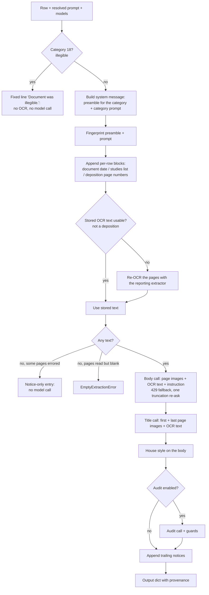
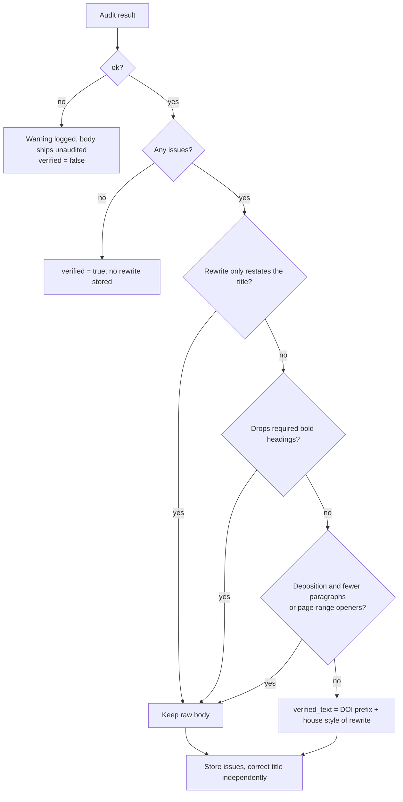

# Summarization

Summarization turns each reviewed sub-document of a record (a "row": a page range with a category,
a date, a date of injury and a review flag) into one delivered entry: an ALL CAPS header line, a
body, and the provenance and review flags a reviewer needs before the entry ships. It exists because
the deliverable is a medical-legal document: every entry has to say only what its own pages say, in
the house style the reviewers' own reports use, and has to be traceable to the model and prompt
that wrote it.

This page explains how one row is summarized and how the summarize job drives many rows. Job states
and the pause and resume machinery in general live in [Pipeline and jobs](pipeline-and-jobs.md); the
letter the entries end up in lives in [Deliverable layout](deliverable-layout.md).

## Where it runs

The engine is `backend/app/services/summarize_engine.py` `summarize_row()`. It is deliberately
database-free: callers hand it the row, the resolved prompt and the models, and it returns a plain
dictionary. Three callers use it, and they do not call it the same way.

| Caller | Code | Models | Audit | Record-level context |
| --- | --- | --- | --- | --- |
| Summarize job (worker) | `backend/app/worker/tasks.py` `_summarize_work()` | Body, title and audit models pinned on the Job | `SUMMARY_VERIFY` (on by default) | Stored OCR from the row or the page-text store, unreadable pages, embedded-review pages, standalone studies list |
| Single-row re-draft | `backend/app/api/documents.py` `resummarize()` | Body from the request or config; title and audit from live config | `SUMMARY_VERIFY` | The row's stored OCR, standalone studies list; no embedded-review pages, no unreadable-page seed |
| Bundle summarize | `backend/app/services/bundles.py` `bundle_summary_entries()` | Body from the request or config; title and audit from live config | Always off | The row's stored OCR only |

The rest of this page describes the worker path unless it says otherwise.

## How one row is summarized

0. **Illegible.** A row a reviewer put in category 18 returns at once from `_illegible_output()`:
   the body is `ILLEGIBLE_SUMMARY` ("Document was illegible."), the header is the row's own title
   and date, and nothing is read, rendered or sent to a model. `noticeOnly` is false, because it is
   the reviewer's decision rather than a failure, so the job does not end needs_attention.
1. **Models.** The worker passes the three models stored on the Job (`job.model`,
   `job.title_model or job.model`, `job.audit_model or job.model`). A caller that omits one gets it
   from `Settings.model_for()` (`summarize_engine.py` `_resolved_models()`).
2. **Prompt.** The caller passes the category prompt it resolved from the database first. Without
   one, the engine falls back to `backend/app/services/prompts.py` (key `category_NN`, or
   `category_100` when the key is missing).
3. **System message.** `_build_system_message()` joins the shared preamble for this category and the
   category prompt, fingerprints that text, then appends the per-row blocks (see below).
4. **Source text.** `_row_source_text()` reuses stored OCR text or re-reads the pages (see
   [Source text](#source-text-stored-ocr-and-unreadable-pages)).
5. **Empty text.** If nothing was read and some pages errored, the row becomes a notice-only entry
   and no model is called. If the pages read cleanly and hold no words, the engine raises
   `EmptyExtractionError`.
6. **Body, title, house style, audit.** The three model calls and the deterministic passes described
   below.
7. **Trailing notices** are appended after the audit, to both the raw and the audited body.
8. **Output.** `summarize_row` returns the dictionary the worker persists as one `summaries` row via
   `backend/app/worker/tasks.py` `_build_summary()`.

## The system message

### The preamble is assembled per category

The shared rules are separate blocks in `summarize_engine.py`, assembled by `build_preamble()`. They
were split because a single shared block reached 4,927 characters, 81% of the system message for a
one-line laboratory summary, which was being instructed about depositions, range of motion and pain
scales that cannot apply to it (comment above `_FACTUALITY`).

Every category receives the factuality rules (`_FACTUALITY`), the point-scope rule
(`_C_POINT_SCOPE`), the no-billing-codes rule (`_C_CODES`), the bold-labels-only rule (`_F_BOLD`) and
the sentence-case rule (`_F_SENTENCE_CASE`). The rest depend on the category sets defined just above
`build_preamble()`:

| Category | Normal findings (`_C_NORMAL_FINDINGS`) | Verdict (`_C_VERDICT`) | Embedded review (`_C_EMBEDDED_REVIEW`) | Height/weight, pain, range of motion | Format |
| --- | --- | --- | --- | --- | --- |
| 1, 2, 5, 6 | yes | no | no | yes | one paragraph |
| 12, 13 | yes | no | yes | yes | one paragraph |
| 3, 14 | no | yes | no | no | one paragraph |
| 9 | no | no | no | no | groups of ten pages |
| 4, 7, 8, 10, 11, 15, 16, 17 | no | no | no | no | one paragraph |
| 100 | yes | yes | yes | no | one paragraph |
| Any id not in `_KNOWN_CATEGORIES` | yes | yes | yes | yes | one paragraph |

- **Default is include.** An id the code does not know (an admin can create one at any time) gets
  every block except the deposition format, so a new category is never silently under-instructed.
- **Category 100 is a known id with unknown content.** It takes the content blocks but not the three
  measurement blocks; whether it should get them is an open question the code records against
  issue #216.
- **15, 16 and 17 get the minimal preamble on purpose.** A discharge summary (16) would be told by
  `_C_NORMAL_FINDINGS` to omit what is normal, which is most of its content; a job description (17)
  describes a job, not a patient. Their requirements are stated in their own prompts instead.

### The category prompt

The worker resolves one prompt per category before the thread pool starts, because the database
session is not thread-safe (`tasks.py` `_prompts_for_rows()`). Resolution is
`backend/app/services/catalog.py` `get_prompt()`:

1. The category's own row in the `prompts` table (an admin edit, which always wins).
2. The category's own code prompt in `prompts.py`.
3. The general (category 100) row in `prompts` - reached only by a category with no code prompt.
   Category 11 is the one such category, deliberately.
4. The general code prompt.

An admin-saved prompt row therefore shadows the code prompt for that category until it is reverted.
[How to change a summary prompt or rule](../how-to/change-a-summary-prompt-or-rule.md) covers this.

### Per-row blocks

After the fingerprint is taken, `_build_system_message()` appends up to three blocks that carry row
or record data:

| Block | Categories | What it tells the model |
| --- | --- | --- |
| `_document_date_block()` | 1, 2 (`_CURRENT_VISIT_CATEGORIES`) | The document's own date: summarize that encounter, not a recap of earlier visits. Omitted when the date is `-`. |
| `_standalone_studies_block()` | 12, 13 (`_EMBEDDED_REVIEW_CATEGORIES`) | The category-3 studies that are their own included rows elsewhere in the record, so an embedded records review does not restate them. Built from the full included row set, so a resumed run gives the same list. |
| `_deposition_pages_block()` | 9 | Whether the `Page N:` markers are the transcript's own printed numbers, or record positions that must not be cited. |

They go into the system message, not the user content, so the user payload order stays page images,
then OCR text, then the instruction (`_MULTIMODAL_INSTRUCTION`), which is sent last per Google's
context-first guidance.

## Source text: stored OCR and unreadable pages

- **Seeding.** Before the pool starts, `tasks.py` `_seed_row_text()` gives every row its
  `unreadable_pages` (pages whose `page_texts.extract_ok` is false) and, when the page-text store
  holds every page of the row and read each one cleanly, its `source_text`. A row with even one
  errored page is left to re-extract. The duplicate check may already have stored `source_text` on
  the row itself; that is reused too. See [OCR and page text](ocr-and-page-text.md).
- **Depositions never reuse stored text.** Category 9 is re-read with page markers, because page
  boundaries cannot be recovered from concatenated text.
- **Re-extraction wins.** When the engine re-reads pages it uses
  `backend/app/services/ocr.py` `extract_pages_with_report()`, and that run's errored pages replace
  the seeded list. A page that timed out earlier and reads now is not announced.
- **Only an errored page is announced.** A page that read cleanly and holds no words (a film, a
  photograph, a separator sheet) is silent.

### Notices are built in code

A model asked to describe a page it cannot read is the shape that invents content, so every notice
is a fixed sentence from `summarize_engine.py`:

| Case | Function | Result |
| --- | --- | --- |
| Nothing on the row could be read | `unreadable_notice()` via `_unreadable_output()` | The body IS the notice; every model field is NULL; `noticeOnly` is true; no DOI prefix |
| A reviewer marked the row illegible (category 18) | `_illegible_output()` | The body is `ILLEGIBLE_SUMMARY`; every model field is NULL; `noticeOnly` is false; no DOI prefix |
| Some pages could not be read | `partial_unreadable_notice()` | Sentence appended to the summary of the readable pages |
| An excluded records-review block belongs to this evaluation | `embedded_review_notice()` | Sentence appended naming the review's pages |

Trailing notices are appended by `_trailing_notices()` after the audit (the audit checks the body
against the source, and these sentences are not in the source) and after capitalisation (so the
transform never rewrites them). For a deposition the notice cites pages in transcript numbering,
falling back to record pages if any shifted number would be zero or less (`notice_pages()`).

The embedded-review tag exists because an evaluation's embedded records review is split off as its
own row and excluded, which left its pages unmentioned. `tasks.py` `_seed_embedded_review_pages()`
walks back from each excluded row whose title matches a records-review pattern to the nearest
included row, and tags it only if that host is category 12 or 13.

## The three model calls

All three go through `backend/app/services/llm/__init__.py` `get_provider()`, which resolves the
backend for the `summarize` stage. See [Model providers](model-providers.md) and
[Model calls by stage](../reference/model-calls-by-stage.md).

| Call | Prompt | Input | Temperature | Output cap | On failure |
| --- | --- | --- | --- | --- | --- |
| Body | Preamble + category prompt + per-row blocks | Page images (when `SUMMARY_MULTIMODAL`), OCR text, instruction | `SUMMARY_TEMPERATURE` (0.0) | `SUMMARY_MAX_OUTPUT_TOKENS` (8192) | 429 fallback, one truncation re-ask |
| Title | `TITLE_PROMPT` | First and last page images + OCR text (multimodal on) | 0.0 | `SUMMARY_MAX_OUTPUT_TOKENS` | Rejected answer falls back to the segmentation title |
| Audit | `VERIFY_PROMPT` (`summary_verify.py`) | Source, document date (categories 1 and 2 only), title, body | 0.0 | Argument, else `AUDIT_MAX_OUTPUT_TOKENS`, else the body cap | Fail-safe: body ships unaudited |

The three models are resolved once, when the Job is created (`backend/app/services/jobs.py`
`create_job()`), and stored on it, so a job resumed after a configuration change keeps the models it
started with. Defaults per backend are in [Configuration](../reference/configuration.md).

### Body

`_generate_body()` makes the call, then:

- **429 fallback.** If the call raises a rate-limit error (`errors.is_rate_limited()`, status 429)
  after the retry seam has spent its budget, and `SUMMARY_BODY_FALLBACK_MODEL` is set and differs
  from the body model, the body is asked once of the fallback model. It is a fallback, not a race:
  asking both at once would double load on a pool that is already refusing. The row records the
  model that answered in `model` and the one asked for in `bodyFallbackFrom`. With the shipped
  Gemini defaults the fallback equals the body model, so it only takes effect when the body model is
  changed.
- **Truncation re-ask.** If the reply hit the token cap, `_retry_if_truncated()` re-asks once at
  `SUMMARY_MAX_OUTPUT_TOKENS x SUMMARY_TRUNCATION_RETRY_MULTIPLIER` (a multiplier of 1 or less turns
  it off). A finished reply beats a truncated one; between two truncated replies the longer wins; an
  empty reply never wins; a retry that raises is swallowed because a partial body beats losing the
  row. It runs against whichever model answered.
- **Deposition coverage check.** For category 9, `_log_incomplete_deposition()` logs a warning when
  the body cites less than half of the transcript pages it was given. It changes nothing. It exists
  to separate a model that stopped early (reported as finished) from token truncation.

A body that is still truncated after the re-ask is stored, and the row is flagged
`manual_check`.

### Title

`TITLE_PROMPT` asks for one ALL CAPS line: `AUTHOR, CREDENTIALS. FACILITY. DOCUMENT TYPE.` The order
was measured against 812 of 813 human-written entries. Diagnostic studies are named by modality,
side, body part and contrast rather than by document class; a deposition is titled
`DEPOSITION OF <NAME>` with no author or facility; absent elements are left out with their
separator; no dates, page numbers or patient name.

The author is the name PRINTED on the page - the typed name under or beside the signature, a
physician field on a form, or the letterhead - never a transcription of a handwritten signature;
when no printed name can be read in full the author and credentials are left out. The call is sent
the row's first and last page images (letterhead and signature block) with the OCR text
(`_title_contents()`), because OCR cannot read a signature drawn over a typed name: reviewer
feedback on 2026-10-02 showed titles opening with OCR's fragment of such a name, and with the
letters OCR made of a cursive signature.

The facility is read the same way, from the image as well as the OCR, because a logo or stylised
letterhead is where OCR garbles most; a facility that cannot be read in full as real words is left
out rather than written as a fragment. Reviewer feedback on 2026-10-06 showed a title carrying
letters from an institute's logo beside an entry that named the institute correctly, and a
read-only measurement the next day put 38 of the 45 such one-off facility spellings on this call
(`_TITLE_IMAGE_INSTRUCTION` now names the facility as well as the author).

The 150-character limit in the prompt is a hint only: the call has no response schema and Gemini
does not enforce `maxLength`. `_usable_title()` is the enforcement:

- A generated title that is empty or longer than `MAX_GENERATED_TITLE` (200) is **rejected** and the
  row's segmentation title is used instead. Rejected rather than truncated: a 620-character answer
  (seen once, deterministically, on one document) is the wrong kind of answer, and storing it
  overflowed the 512-character column and killed a 124-row job.
- The segmentation title fallback is **truncated** to `MAX_STORED_TITLE` (512 minus the length of the
  three decorations), because a long segmentation title is a real header that is merely long.
- An accepted title passes through `tidy_title()`. Its `without_address()` step drops pieces of the
  title that are unmistakably an address (street, suite, city before a state or ZIP, `CA` after a
  city, a phone number) and keeps everything else byte for byte. Its `tidy_author_and_facility()` step
  turns a `SURNAME, GIVEN NAMES, CREDENTIAL` author into `GIVEN NAMES SURNAME, CREDENTIAL`, and cuts a
  listed health system (`_HEALTH_SYSTEMS`, today Kaiser Permanente) down to its name, dropping the
  branch or department after it. Both are deliberately narrow: an author without a credential, a
  second credential or degree in the middle slot, and text after the system's name that names a
  document are all left as they are.
- A category-7 title (workers' compensation legal forms) then loses the state agency header
  (`without_wc_agency()`), keeping the Appeals Board when the header names it. Applied to the
  generated and the audited title of category 7 only; other categories keep the agency.

The stored title is decorated: `[ManualCheck] ` in front when the row flag is `x`,
` [Diagnostic Study]` after it for category 3, and ` (Pages S-E)` at the end. Exports strip all
three (`presentable_title()`).

### Audit

`backend/app/services/summary_verify.py` `verify_summary()` makes one structured call that checks the
title and body for faithfulness to the source and for six house rules (`_HOUSE_RULES`):

| Rule | Issue type | May delete content? |
| --- | --- | --- |
| 1 Height and weight removed (other vitals and a BMI diagnosis kept) | `vitals` | yes |
| 2 Pain: frequency, rating, location only | `pain_descriptor` | yes |
| 3 Capitalisation: re-case only; bold headings are required structure | `capitalization` | no (correction only) |
| 4 Range of motion carries a direction; reference ranges permitted | `range_of_motion` | no (correction only) |
| 5 Duplicate sentence removed, except Findings plus Impression | `duplicate_finding` | yes |
| 6 Previous visits removed (only when a document date is given) | `prior_visit` | yes |

Faithfulness issues are `unsupported`, `contradiction`, `date` and `laterality`. The reply schema is
`{fixed_text, fixed_title, issues: [{type, detail}]}`.

On our model (`summarize` on vLLM) the same reply is asked for as `{issues, corrected_title,
corrected_summary}` (`_reply_shape()`, switch `VLLM_AUDIT_ISSUES_FIRST`, on by default) and mapped
back to `fixed_text` and `fixed_title` before anything reads it. vLLM's grammar writes an object's
fields in the order the schema lists them, so the shared schema made the model open with
`fixed_text`, a name the prompt never explains, before it had listed an issue or had a field for
the title. It wrote the title there on 176 of about 300 audits on 2026-10-01, and each was
rejected by the title guard below (#348). Gemini orders its fields alphabetically, which is the
shared order, and gets the shared schema whatever the switch says.

The audit is text-only, while the title call reads the first and last page images, so a name in a
logo can be right in the title and broken letters in the source. `VERIFY_PROMPT` forbids writing
such letters into the title: a name it writes must read as a name or as real words, and where the
source gives the name only as garbled letters the title's name stays. The rule is deliberately no
wider than that. Where the audit re-spelled a title's facility or author and a reviewer later
retyped the title, they kept the audit's spelling about as often as the original's (comment above
`VERIFY_PROMPT`).

The audit is fail-safe. `ok` is true only when the reply parsed; an empty body, a truncated reply
(checked before parsing) or any exception returns the originals with no issues and `ok` false. A
reviewer's Stop (`JobCancelled`) is re-raised, not swallowed.

The document date is passed only for categories 1 and 2, the same gate generation uses. Rule 6
switches itself on whenever a date is present, so passing it for every category armed the rule on
documents whose substance is earlier events (an evaluation's injury history, a deposition's
testimony), and its rewrites were accepted (comment in `_verified_outputs()`).

#### Guards on the audit's rewrite

A rewrite is a whole new body from one model call, so `_verified_outputs()` checks it before
accepting it:

- `_restates_the_title()` rejects a rewrite whose content words are all already in the title. A
  subset test needs no threshold and cannot reject a real correction.
- `_drops_required_headings()` compares counts of bold spans, never their text, because renaming a
  heading is allowed. If every issue is correction-only (`capitalization`, `range_of_motion`), any
  lost heading rejects the rewrite. Otherwise a body with at least three headings that loses more
  than half is rejected, unless `unsupported` is among the issues: a fabrication fix is never
  blocked, because shipping invented content is the worse failure.
- `_drops_deposition_structure()` rejects fewer paragraphs or fewer `On pages N to M` openers.

When a guard fires the raw body ships and the issues are still stored, so the reviewer sees what
was flagged. The title correction is applied independently, through `_usable_title()` again, and is
stored in `verified_title` only when it differs.

What is displayed and exported is `edited` over `verified` over raw, for body and title separately
(`backend/app/models.py` `Summary.effective_text()`, `Summary.effective_title()`). The listing
derives three review flags from the stored columns: `verifyChanged` (a rewrite was applied),
`verifyKeptRaw` (issues found, rewrite rejected) and `verifyFailed` (an audit was requested and did
not complete).

## House style on the body

`_house_body()` runs two deterministic passes from `backend/app/services/house_style.py`, on the raw
body before the audit (so the audit reads what a reader will see) and on any accepted rewrite:

- `sentence_case_caps_runs()`: runs of two or more capitalised words become sentence case, or title
  case when the run contains an organisation word (`_PROPER_NOUN_MARKERS`); a lone capitalised word
  of four or more letters becomes title case; allowlisted acronyms (`_ACRONYMS`) are untouched. It is
  never applied to a title, which is ALL CAPS by design.
- `one_paragraph()`: joins lines into one paragraph, drops list markers, and removes a label that
  introduces nothing: one followed only by another label or the end, carrying no digit, and not
  in front of a result heading (Findings, Impression, Conclusion, Interpretation, Results). So
  `**Objective Findings**:` straight into `**Range of Motion**:` goes, while a study heading such as
  `**MRI of the lumbar spine (05/15/2025):**` in a multi-study summary stays (#407). Skipped for
  depositions.

Both exist because the prompt rule alone missed: 22% of stored summaries still carried a run of
capitals after the prompt and the audit had both had a go, and 83 delivered summaries in 30 days
carried line breaks. The export applies `one_paragraph()` again to unedited machine text so older
stored summaries need no re-run.

## Date of injury prefix

- **Read once, at the end of segmentation.** `backend/app/services/summary_doi.py`
  `extract_injury_date()` reads each sub-document in isolation (its first 10 pages, from the page
  image rather than OCR) so a date cannot be copied from a neighbouring document, and the value is
  stored on the row. See [Segmentation](segmentation.md).
- **The row is the source of truth.** `summarize_row` never re-reads it; it uses
  `row["injury_date"]`, so a reviewer's correction on the review page reaches the summary.
- **Prefix.** `_doi_lead()` writes `**DOI**: <value>. ` with exactly one trailing space, or nothing
  for `-`. It is applied to both the raw and the audited body and never to a notice-only entry.
- **Value grammar** (`summary_doi.py` `_clean()`): `MM/DD/YY`; a cumulative-trauma period
  `CT MM/DD/YY-MM/DD/YY`; several items joined with ` & `; `-` for none.
- **Export restores it.** The Summaries tab moves the prefix into a chip, so a reviewer-edited body
  usually has none; the export re-prepends `doi_prefix(summary.text)` when the edited body carries no
  `**DOI**` (`backend/app/api/documents.py` `_export_title_and_text()`). `doi_prefix()` also reads the
  pre-2026-07-29 form `**DOI**:<dates>,`.

## Depositions

Category 9 differs at every step:

- **Format.** Groups of ten consecutive transcript pages, one paragraph per group, each opening
  with its page range (`_F_DEPOSITION`, and the category 9 prompt in `prompts.py`). The measured
  human convention is one page per paragraph. Groups of three were the owner's instruction
  (2026-08-06), made with that measurement in hand; groups of ten are the senior reviewer's
  instruction (2026-09-25) after reading delivered depositions. The comment above `_F_DEPOSITION`
  records both, so nobody "fixes" the size back to either convention.
- **Page numbers.** `backend/app/services/deposition_pages.py` `transcript_page_offset()` makes one
  `deposition`-stage model call over the first six pages to find the transcript's own printed page
  numbers (at least two pages must agree on one offset). The OCR markers are then labelled in
  transcript numbering and the model is told to cite them. A page that comes before the transcript's
  page 1 (a cover or caption page) has no printed number, so `ocr.page_marker()` marks it as front
  matter instead of labelling it `Page 0:` (#259). If no offset can be established the model
  is told to cite no page numbers. A truncated reply raises `TranscriptPagesUnreadableError`, which
  the worker treats as a permanent failure for that row.
- **No stored text, no one-paragraph pass, no export flattening.**
- **Audit guard** on paragraph and page-range counts, and the coverage warning described above.

## Record-level passes at export

Some rules need the whole record, so they run over the delivered entries when the Word letter and
the linked PDF are built (`documents.py` `_record_pass()`), not on the stored rows:

- **One spelling per provider.** `consistent_authors()` joins only spellings that can only be one
  person: same surname, suffix and credential; identical first names; an initial only when exactly
  one first name fits; different middle initials kept apart. A reviewer-edited title is never
  rewritten and its spelling wins its group.
- **One spelling per facility for each provider.** `consistent_facilities()` runs after the author
  pass and groups by author. It joins a facility spelling to the one more of that author's entries
  carry (or to a reviewer's) only when both have the same number of words and every differing word
  is a near spelling of the other: at least four letters, a difflib ratio of at least 0.80, and the
  same compass words. A garble that changes the word count is not joined, because by spelling alone
  it is as close to the right name as a second site of the same practice. The same reviewer lock
  applies.
- **Same-visit folding.** `fold_same_visit()` makes one entry of the category-1 entries with the same
  author, credential and date string. The entry is headed by a PR-2 when the visit has one (a title
  matching `PR-2` or `PROGRESS REPORT` that is not a work status slip), otherwise by the longest body.
  Its body is the longest body plus every section of the others whose text it does not already hold.
  The rows and summaries are untouched, so the review page still shows every document and a reviewer
  can still separate them.

Bundle summarize applies `consistent_authors()` and `consistent_facilities()` but not folding.

## The resumable run

The summarize job (`tasks.py` `summarize_document()`) is resumable by design:

- **Rows** are the included review rows in order. Summaries are matched to rows by identity
  `(start, end, category)` (`_reconcile_summaries()`): a match is reused with its reviewer edits
  intact and only re-positioned; stale and duplicate summaries are deleted. A re-spanned or
  re-categorised row therefore gets a fresh summary.
- **Notice-only entries are retried.** A notice entry with no model and no reviewer edit is deleted
  and re-attempted on the next run (`_is_retryable_notice()`), so a transient OCR failure does not
  become permanent by having been delivered.
- **Each success is committed at once**, so a paused, cancelled or failed run keeps every finished
  row.
- **Rows run concurrently** on `PIPELINE_WORKERS` threads (5 by default).
- **Ending.** `_SummarizeRun.finish()` decides, in this order: give up (no row succeeded in this
  attempt and at least `SUMMARIZE_GIVEUP_AFTER_FAILURES` transient failures occurred) -> needs
  attention; any transient failure left or `SUMMARIZE_PAUSE_AFTER` consecutive transient failures ->
  pause and resume the same job after `SUMMARIZE_RESUME_DELAY` seconds, with no attempt ceiling;
  permanent failures or notice-only rows -> needs attention naming the rows; otherwise done. The
  give-up check must come before the pause check, or a model that refuses everything would pause and
  resume into the same refusal. Notice-only rows do not count as successes for the give-up rule.
- **"Re-summarize all from scratch"** sends `fresh`, and the route deletes every summary before
  enqueuing, discarding reviewer edits.

Job and document states are listed in [Job and document states](../reference/job-and-document-states.md).

## Provenance on each row

| Column | Meaning |
| --- | --- |
| `model` | The body model that answered (NULL on a notice-only row) |
| `title_model`, `audit_model` | The title and audit models; `audit_model` is set whenever the audit was requested |
| `backend` | The provider that served the calls, read from the provider object |
| `prompt_fingerprint` | First 12 hex characters of SHA-256 over the preamble and the category prompt, taken before per-row blocks (`backend/app/services/provenance.py` `summary_prompt_fingerprint()`) |
| `audit_fingerprint` | The same over `VERIFY_PROMPT` alone |
| `verified` | The audit ran and parsed, not merely that it was requested |
| `verify_issues` | The issue list, or NULL on a clean audit (never `[]`) |
| `manual_check` | The row flag was `x`, the body was still truncated, or the body came from the fallback model |
| `unreadable` | At least one page could not be read (with `model` NULL: nothing was summarized) |
| `embedded_review` | The body carries the embedded-review sentence |

The Job also carries a fingerprint of the whole prompt set and the build commit. Full column list:
[Data model](../reference/data-model.md).

## Decisions recorded in the code

| Decision | Reason recorded | Rejected alternative |
| --- | --- | --- |
| Temperature 0 for the body | Repeat runs identical; less fabrication (config comment on `summary_temperature`) | 0.8, which varied |
| Retry a truncated body once at a wider cap | A bigger cap moves every row and a thinking model spends extra budget on reasoning | Raising `SUMMARY_MAX_OUTPUT_TOKENS`; retrying a truncated audit was measured at 1.7x the time for a 29% yield |
| Title rejected, fallback truncated | A 620-character answer is not a title; a long segmentation title is | Truncating the model's answer |
| Notices built in code | A model describing unreadable pages invents content | A model-written notice |
| Guards compare counts | Renaming a heading is legitimate; losing one is not | Comparing heading text |
| Title-restatement test is a word subset | Needs no threshold and cannot reject a real correction | A length ratio |
| Deterministic capitalisation after generation | 22% of rows still had capital runs after prompt and audit | Louder prompt wording |
| No ICD/CPT stripper | The prompt rule already cut codes from 36% of rows to 1 in 124 | A regex that rewrites sentences |
| Height and weight only; BMI kept | BMI appears only as a numbered diagnosis in the human corpus | All vitals |
| Range-of-motion reference ranges allowed | Textbook values, not a claim about the patient | A strict no-inference rule |
| Embedded review gets a tag, not a summary | The senior reviewer asked for a tag | Including the review |
| Ten-page deposition groups | The senior reviewer's instruction (three pages before 2026-09-25, the owner's) | The measured one-page convention |

## Before you change it

- Edit a generation rule and its audit rule together, including the document-date gate
  (`summary_verify.py` comment above `_HOUSE_RULES`).
- A new category id must be added to the right set in `summarize_engine.py`, or it silently takes the
  every-block default; `test_every_catalog_category_is_registered_in_the_preamble_sets` enforces it.
  `_EMBEDDED_REVIEW_CATEGORIES` and `tasks.py` `_EMBEDDED_REVIEW_HOSTS` must agree
  (`test_the_two_embedded_review_category_sets_agree`).
- Keep the fingerprint before the per-row blocks, or identical prompts stop hashing alike.
- Keep notices and the DOI prefix out of the audit's view.
- `verified` means "ran". Keep `verify_issues` NULL on a clean audit.
- A notice-only row must have `model` NULL; the re-draft route rewrites `model` for that reason.
- Never apply `sentence_case_caps_runs()` to a title.
- `get_provider()` is correct only for the summarize stage; any other stage uses
  `provider_for_stage()`.
- `summarize_engine.py` sits at the linter's seven-parameter ceiling and its regular expressions are
  bounded to stay linear; keep both properties.

## Related pages

- [How to change a summary prompt or rule](../how-to/change-a-summary-prompt-or-rule.md)
- [How to troubleshoot a summary](../how-to/troubleshoot-a-summary.md)
- [Pipeline and jobs](pipeline-and-jobs.md)
- [Categorization](categorization.md)
- [Duplicate detection](duplicate-detection.md)
- [Exports and downloads](exports-and-downloads.md)
- [Deliverable layout](deliverable-layout.md)
- [Model calls by stage](../reference/model-calls-by-stage.md)
- [Configuration](../reference/configuration.md)

<!-- reviewed: 2026-09-30 -->
