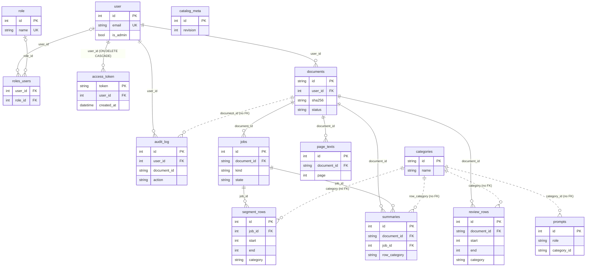

# Data model reference

Every table the application stores in Postgres, with every column, its type, what NULL means, its
defaults, and the indexes, constraints and relationships around it.

Source of truth: `backend/app/models.py` (the ORM classes), `backend/alembic/versions/` (the
schema the database actually has; see [Migrations reference](migrations.md)) and
`backend/app/db.py` (`Base`, engines, sessions).

## Conventions used on this page

| Term | Meaning |
| --- | --- |
| Type | The SQLAlchemy type the column is declared with. `String(n)` is `VARCHAR(n)`. `DateTime` is `TIMESTAMP WITHOUT TIME ZONE` everywhere except `access_token.created_at`. `JSON` is Postgres `json`, not `jsonb`. |
| Null | `no` = `NOT NULL`. `yes` = nullable; the Meaning column says what NULL stands for. |
| ORM default | A Python-side default (`default=` / `onupdate=` in `models.py`). SQLAlchemy applies it on an ORM or Core insert that omits the column. Raw SQL does NOT get it and must supply the value. |
| Server default | A default stored in the database schema itself (set by a migration). Applies to every insert, raw SQL included. |
| `_utcnow` | `backend/app/models.py` `_utcnow()`: the current time in UTC. Values are stored as UTC wall-clock time with no offset; `_utc_iso()` adds the `+00:00` offset when a timestamp is serialized to the browser. |
| Added by | The Alembic revision that created the column. `73abdcd5ef01` is the baseline. |
| Provenance NULL | On columns that record which model, backend, prompt or build produced a row, NULL means "not recorded" (the row predates the column, or the call did not run). It never means a default value such as "Gemini". None of these columns has a server default or a backfill. |

Integer `id` primary keys are auto-incrementing (Postgres serial sequences).

## Entity-relationship diagram

Key columns only; every column is listed in the per-table sections below. Solid lines are database
foreign keys. Dotted lines are logical references: a value that names a row in another table with
no foreign key behind it.

## Foreign keys, cascades and logical references

Every database foreign key except `access_token.user_id` was created without an `ondelete` rule,
so Postgres applies the default, `NO ACTION`: a parent row cannot be deleted while a child row
still references it. Every cascade on deleting a document is done by the ORM, which loads and
deletes the children first.

| Child column | References | Database rule | ORM relationship and cascade | Index on the child column |
| --- | --- | --- | --- | --- |
| `documents.user_id` | `user.id` | NO ACTION | none | `ix_documents_user_id` |
| `audit_log.user_id` | `user.id` | NO ACTION | none | `ix_audit_log_user_id` |
| `access_token.user_id` | `user.id` | ON DELETE CASCADE | none | none |
| `roles_users.user_id` | `user.id` | NO ACTION | `User.roles` (many-to-many through `roles_users`) | none |
| `roles_users.role_id` | `role.id` | NO ACTION | `User.roles` | none |
| `jobs.document_id` | `documents.id` | NO ACTION | `Document.jobs`, `all, delete-orphan`, ordered by `Job.id`; backref `Job.document` | `ix_jobs_document_id`; partial unique `uq_one_active_job_per_document` |
| `review_rows.document_id` | `documents.id` | NO ACTION | `Document.review_rows`, `all, delete-orphan`, ordered by `ReviewRow.idx`; backref `ReviewRow.document` | `ix_review_rows_document_id` |
| `summaries.document_id` | `documents.id` | NO ACTION | `Document.summaries`, `all, delete-orphan`, ordered by `Summary.idx`; backref `Summary.document` | `ix_summaries_document_id` |
| `page_texts.document_id` | `documents.id` | NO ACTION | `Document.page_texts`, `all, delete-orphan`; backref `PageText.document` | `ix_page_texts_document_id`; unique `uq_page_texts_document_page` |
| `segment_rows.job_id` | `jobs.id` | NO ACTION | `Job.segment_rows`, `all, delete-orphan`, ordered by `SegmentRow.idx`; backref `SegmentRow.job` | `ix_segment_rows_job_id` |
| `summaries.job_id` | `jobs.id` | NO ACTION | none | none |

Logical references (no foreign key, no ORM relationship):

| Column | Names a row in | Notes |
| --- | --- | --- |
| `segment_rows.category`, `review_rows.category` | `categories.id` | `String(8)`. Validated against the active catalog when a reviewer saves rows (`backend/app/services/rows.py` `validate_rows()`), not by the database. |
| `summaries.row_category` | `categories.id` | Snapshot of the row's category when the summary was written. |
| `prompts.category_id` | `categories.id` | A prompt row can exist for an id the catalog serves from constants (no `categories` row). |
| `audit_log.document_id` | `documents.id` | Kept after the document is deleted; the trail outlives the record. |

> **Note:** `backend/tests/test_models_methods.py` `test_every_table_that_references_a_document_is_cascaded_by_it()` fails if a mapped table gains a foreign key to `documents.id` without either an ORM `delete-orphan` cascade from `Document` or `ON DELETE CASCADE`.

## Indexes and constraints

| Table | Name | Kind | Columns / predicate | Created by |
| --- | --- | --- | --- | --- |
| `user` | (Postgres-generated) | UNIQUE | `email` | `73abdcd5ef01` |
| `user` | (Postgres-generated) | UNIQUE | `username` | `73abdcd5ef01` |
| `user` | (Postgres-generated) | UNIQUE | `fs_uniquifier` | `73abdcd5ef01` |
| `role` | (Postgres-generated) | UNIQUE | `name` | `73abdcd5ef01` |
| `access_token` | `ix_access_token_created_at` | index | `created_at` | `a0725d467a48` |
| `documents` | `ix_documents_user_id` | index | `user_id` | `73abdcd5ef01` |
| `documents` | `ix_documents_sha256` | index, NOT unique | `sha256` | `73abdcd5ef01` |
| `jobs` | `ix_jobs_document_id` | index | `document_id` | `73abdcd5ef01` |
| `jobs` | `uq_one_active_job_per_document` | partial UNIQUE index | `document_id` WHERE `state IN ('queued', 'running', 'paused')` | `009991f2eda1`, rebuilt by `c2d5e8f1a3b7` |
| `segment_rows` | `ix_segment_rows_job_id` | index | `job_id` | `73abdcd5ef01` |
| `review_rows` | `ix_review_rows_document_id` | index | `document_id` | `73abdcd5ef01` |
| `review_rows` | `ix_review_rows_dupe_group` | index | `dupe_group` | `f1b8d3c60a29` |
| `summaries` | `ix_summaries_document_id` | index | `document_id` | `73abdcd5ef01` |
| `page_texts` | `ix_page_texts_document_id` | index | `document_id` | `f0f4d21dbb53` |
| `page_texts` | `uq_page_texts_document_page` | UNIQUE constraint | `(document_id, page)` | `f0f4d21dbb53` |
| `prompts` | `uq_prompt_role_category` | UNIQUE constraint | `(role, category_id)` | `73abdcd5ef01` |
| `audit_log` | `ix_audit_log_user_id` | index | `user_id` | `73abdcd5ef01` |

### The one-active-job index

| Property | Value |
| --- | --- |
| Name | `uq_one_active_job_per_document` on `jobs (document_id)` |
| Predicate | `state IN ('queued', 'running', 'paused')` |
| Enforces | At most one active job per document, across every API and worker process. |
| Violation | `IntegrityError` on insert; `backend/app/services/jobs.py` `create_job()` rolls back and raises `JobConflict`, which the API returns as HTTP 409. |
| Declared in the model | `backend/app/models.py` `Job.__table_args__` (`postgresql_where` and `sqlite_where`, so SQLite test schemas get the same index). |
| Same set of states also in | `backend/app/services/jobs.py` `ACTIVE_STATES`; `backend/app/models.py` `Document.active_job`; `backend/scripts/copy_records.py` `ACTIVE_STATES`. |
| History | `009991f2eda1` created it for `queued`, `running`; `c2d5e8f1a3b7` dropped and recreated it adding `paused`. |

The meaning of each state is in [Job and document states](job-and-document-states.md).

## Tables

### `user`

Accounts. The first 21 columns mirror the Flask-Security schema of the retired Flask app so its
data migrated one to one (module docstring of `backend/app/models.py`). FastAPI-Users reads three
of them under its own names through writable ORM synonyms: `hashed_password` -> `password`,
`is_active` -> `active`, `is_superuser` -> `is_admin`.

| Column | Type | Null | Default | Meaning | Added by |
| --- | --- | --- | --- | --- | --- |
| `id` | Integer | no | serial | Primary key. | `73abdcd5ef01` |
| `email` | String(255) | no | - | UNIQUE. The login identifier. | `73abdcd5ef01` |
| `username` | String(255) | yes | - | UNIQUE. Flask-Security carry-over. | `73abdcd5ef01` |
| `password` | String(255) | yes | - | Password hash (ORM synonym `hashed_password`). See [Auth and access](../explanation/auth-and-access.md). | `73abdcd5ef01` |
| `active` | Boolean | no | ORM `True` | Account enabled (ORM synonym `is_active`). | `73abdcd5ef01` |
| `fs_uniquifier` | String(64) | no | ORM `_uniquifier()` (uuid4 hex) | UNIQUE. Kept NOT NULL and unique from the Flask schema; not the session identity. | `73abdcd5ef01` |
| `fs_webauthn_user_handle` | String(64) | yes | - | Flask-Security carry-over. | `73abdcd5ef01` |
| `confirmed_at` | DateTime | yes | - | Flask-Security carry-over. | `73abdcd5ef01` |
| `last_login_at` | DateTime | yes | - | Flask-Security carry-over. | `73abdcd5ef01` |
| `current_login_at` | DateTime | yes | - | Flask-Security carry-over. | `73abdcd5ef01` |
| `last_login_ip` | String(64) | yes | - | Flask-Security carry-over. | `73abdcd5ef01` |
| `current_login_ip` | String(64) | yes | - | Flask-Security carry-over. | `73abdcd5ef01` |
| `login_count` | Integer | yes | - | Flask-Security carry-over. | `73abdcd5ef01` |
| `tf_primary_method` | String(64) | yes | - | Flask-Security carry-over. | `73abdcd5ef01` |
| `tf_totp_secret` | String(255) | yes | - | Flask-Security carry-over. | `73abdcd5ef01` |
| `tf_phone_number` | String(128) | yes | - | Flask-Security carry-over. | `73abdcd5ef01` |
| `mf_recovery_codes` | Text | yes | - | Flask-Security carry-over. | `73abdcd5ef01` |
| `us_totp_secrets` | Text | yes | - | Flask-Security carry-over. | `73abdcd5ef01` |
| `us_phone_number` | String(128) | yes | - | Flask-Security carry-over. | `73abdcd5ef01` |
| `create_datetime` | DateTime | no | ORM `_utcnow` | Row creation time. | `73abdcd5ef01` |
| `update_datetime` | DateTime | no | ORM `_utcnow`, ORM `onupdate` `_utcnow` | Last ORM update. | `73abdcd5ef01` |
| `name` | String(255) | yes | - | Display name. Required at registration (`backend/app/auth/schemas.py` `UserCreate`); used as the reviewer name in exports. | `73abdcd5ef01` |
| `is_admin` | Boolean | no | ORM `False` | Admin flag (ORM synonym `is_superuser`). See [How to manage users and admins](../how-to/manage-users-and-admins.md). | `73abdcd5ef01` |
| `is_verified` | Boolean | no | ORM `False` | Required by FastAPI-Users; never gated on. The migration used a temporary server default `false` to fill existing rows, then dropped it. | `a0725d467a48` |

The "Flask-Security carry-over" columns and `username` are not read or written by any code in
`backend/app`.

### `role`

Flask-Security role table. No code in `backend/app` outside `models.py` reads it; admin rights are
the `user.is_admin` flag.

| Column | Type | Null | Default | Meaning | Added by |
| --- | --- | --- | --- | --- | --- |
| `id` | Integer | no | serial | Primary key. | `73abdcd5ef01` |
| `name` | String(80) | no | - | UNIQUE. | `73abdcd5ef01` |
| `description` | String(255) | yes | - | - | `73abdcd5ef01` |
| `permissions` | Text | yes | - | - | `73abdcd5ef01` |
| `update_datetime` | DateTime | no | ORM `_utcnow`, ORM `onupdate` `_utcnow` | Last ORM update. | `73abdcd5ef01` |

### `roles_users`

Flask-Security association table between `user` and `role`. Declared as a `Table`, not a class. No
primary key and no unique constraint.

| Column | Type | Null | Default | Meaning | Added by |
| --- | --- | --- | --- | --- | --- |
| `user_id` | Integer | yes | - | FK `user.id`. | `73abdcd5ef01` |
| `role_id` | Integer | yes | - | FK `role.id`. | `73abdcd5ef01` |

### `access_token`

Server-side session tokens for the FastAPI-Users `DatabaseStrategy` (`backend/app/auth/backend.py`).
The class inherits `token` and `created_at` from
`fastapi_users_db_sqlalchemy.access_token.SQLAlchemyBaseAccessTokenTable`. Carries no PHI. How
sessions use it is in [Auth and access](../explanation/auth-and-access.md).

| Column | Type | Null | Default | Meaning | Added by |
| --- | --- | --- | --- | --- | --- |
| `token` | String(43) | no | set by FastAPI-Users | Primary key. The opaque session token held in the cookie. | `a0725d467a48` |
| `created_at` | `TIMESTAMPAware` (TIMESTAMP WITH TIME ZONE) | no | set by FastAPI-Users | Indexed. The only timezone-aware column in the schema. | `a0725d467a48` |
| `user_id` | Integer | no | - | FK `user.id` ON DELETE CASCADE. | `a0725d467a48` |

No code in the repository deletes rows from this table by age.

### `documents`

One uploaded PDF and its report-header fields. The PDF itself is stored on disk at
`<UPLOAD_FOLDER>/<user_id>/<id>.pdf` (`backend/app/api/documents.py` `create_document()`).

| Column | Type | Null | Default | Meaning | Added by |
| --- | --- | --- | --- | --- | --- |
| `id` | String(36) | no | ORM `_uuid()` (uuid4 string) | Primary key. | `73abdcd5ef01` |
| `user_id` | Integer | no | - | FK `user.id`, indexed. The owner. | `73abdcd5ef01` |
| `original_filename` | String(512) | no | - | The uploaded file name. PHI: never logged. | `73abdcd5ef01` |
| `stored_path` | String(1024) | no | - | Path of the stored PDF. | `73abdcd5ef01` |
| `sha256` | String(64) | no | - | Hash of the stored PDF. Indexed, NOT unique: the same PDF can be uploaded more than once, within and across accounts. | `73abdcd5ef01` |
| `page_count` | Integer | no | - | Pages in the stored PDF. | `73abdcd5ef01` |
| `status` | String(16) | no | ORM `'uploaded'` | Pipeline stage shown in the UI. Values: [Job and document states](job-and-document-states.md). | `73abdcd5ef01` |
| `created_at` | DateTime | no | ORM `_utcnow` | Upload time. | `73abdcd5ef01` |
| `updated_at` | DateTime | no | ORM `_utcnow`, ORM `onupdate` `_utcnow` | Last ORM update of this row. | `73abdcd5ef01` |
| `patient_first_name` | String(255) | yes | - | Report header, PHI. NULL = never set. | `b1f4a7c9d2e3` |
| `patient_last_name` | String(255) | yes | - | Report header, PHI. NULL = never set. | `b1f4a7c9d2e3` |
| `patient_dob` | String(32) | yes | - | Report header, PHI. Free text, not a date type. | `b1f4a7c9d2e3` |
| `law_firm` | String(512) | yes | - | Report header: the firm the records came from. | `b1f4a7c9d2e3` |
| `attorney_name` | String(255) | yes | - | Report header: the person the records came from (`law_firm` is the company). | `c2f1a7d94e63` |
| `doctor` | String(255) | yes | - | Report header: the evaluator the report is for. Selects the Word font through `backend/app/services/reporting.py` `DOCTOR_FONTS`. | `c2f1a7d94e63` |
| `letter_type` | String(32) | yes | - | The covering letter: one of `reporting.LETTER_TYPES` (`advocacy`, `interrogatory`, `none`). An unrecognised value is saved as `''`. NULL = never set. | `c2f1a7d94e63` |
| `letter_date` | String(32) | yes | - | Free text. | `c2f1a7d94e63` |
| `pages_received` | Integer | yes | - | Pages actually received, which is not `page_count`. NULL = nobody has said; every consumer then uses `page_count`. | `c2f1a7d94e63` |

ORM helpers on `Document`: `active_job` (the job in `queued`, `running` or `paused`, else `None`)
and `listing()` (the wire shape; see [HTTP API reference](http-api.md)).

### `jobs`

One pipeline run. The row is also the provenance stamp for the run. Values of `kind`, `state` and
`stage` are listed in [Job and document states](job-and-document-states.md).

| Column | Type | Null | Default | Meaning | Added by |
| --- | --- | --- | --- | --- | --- |
| `id` | Integer | no | serial | Primary key. | `73abdcd5ef01` |
| `document_id` | String(36) | no | - | FK `documents.id`, indexed, and the key of `uq_one_active_job_per_document`. | `73abdcd5ef01` |
| `kind` | String(16) | no | - | `segment`, `classify`, `summarize` or `dedup`. | `73abdcd5ef01` |
| `state` | String(16) | no | ORM `'queued'` | Lifecycle state. | `73abdcd5ef01` |
| `stage` | String(32) | no | ORM `'starting'` | Progress label written by the worker. | `73abdcd5ef01` |
| `current` | Integer | no | ORM `0` | Progress counter. | `73abdcd5ef01` |
| `total` | Integer | no | ORM `0` | Progress denominator. | `73abdcd5ef01` |
| `error` | Text | yes | - | The message shown to the reviewer when the job failed. NULL = no failure recorded (a cancelled job keeps NULL). See [Errors and messages](errors-and-messages.md). | `73abdcd5ef01` |
| `model` | String(64) | no | - | The body model for a `summarize` job; the only model for every other kind. | `73abdcd5ef01` |
| `title_model` | String(64) | yes | - | Summarize title model, resolved once at job creation. Provenance NULL: jobs before 2026-08-06 and non-summarize kinds; read as `title_model or model`. | `b6d19f4c30a7` |
| `audit_model` | String(64) | yes | - | Summarize audit (verify) model, resolved once at job creation. Provenance NULL as for `title_model`. | `b6d19f4c30a7` |
| `backend` | String(16) | yes | - | The model backend name (`gemini`, `openai`, `vllm`) the summarize stage resolved at job creation. Stamped for `summarize` jobs only. Provenance NULL: other kinds and jobs before the column existed. | `b3e9f0c47a15` |
| `prompt_version` | String(16) | no | - | A hand-maintained version constant passed by the caller. Kept for historical rows; prefer `prompt_fingerprint`. | `73abdcd5ef01` |
| `prompt_fingerprint` | String(16) | yes | - | 12-hex-character hash of the prompt set as resolved (DB-first) at job creation (`backend/app/services/provenance.py` `job_prompt_fingerprint()`). Provenance NULL: jobs before the column, or the hash could not be computed. | `b6d19f4c30a7` |
| `build_sha` | String(40) | yes | - | The commit the image was built from (`Settings.build_sha`, from the `GIT_SHA` build argument); `'unknown'` when built without it. Provenance NULL: jobs created before 2026-08-11. | `c5d81f6a3b70` |
| `catalog_revision` | Integer | yes | - | `catalog_meta.revision` when the job was created (`0` when there is no meta row). | `73abdcd5ef01` |
| `requested_by` | Integer | yes | - | The user who started the job, where the route knew it: an admin can start one on another reviewer's record. The worker's `segment.rows_replaced` audit row names this user. Provenance NULL: jobs before the column, and jobs the system queues itself (read it as the owner). A plain integer, not a foreign key. | `f5c8d2a19e47` |
| `rq_job_id` | String(64) | yes | - | The CURRENT RQ job id. Changes when a paused summarize run is resumed; orphan recovery correlates by it. | `c2d5e8f1a3b7` |
| `attempts` | Integer | no | ORM `0`, server `'0'` | Pause and resume count. Observability only. | `c2d5e8f1a3b7` |
| `attention` | JSON | yes | - | Set when a run ends `needs_attention`: `{"rows": [...], "message": str}`, the sub-documents that could not be summarized (index, page range, reason; no PHI). NULL = no such rows. | `c2d5e8f1a3b7` |
| `cancel_requested` | Boolean | no | ORM `False`, server `false` | The reviewer pressed Stop. The durable record of the request (the worker also reads a Redis key). | `e7b4c1a92d58` |
| `created_at` | DateTime | no | ORM `_utcnow` | Creation time. | `73abdcd5ef01` |
| `started_at` | DateTime | yes | - | NULL = never started. | `73abdcd5ef01` |
| `finished_at` | DateTime | yes | - | NULL = not finished. | `73abdcd5ef01` |

### `segment_rows`

The model's segmentation output for one `segment` job: one row per sub-document. Never edited
after the job writes it; it hangs off `jobs`, not `documents`.

| Column | Type | Null | Default | Meaning | Added by |
| --- | --- | --- | --- | --- | --- |
| `id` | Integer | no | serial | Primary key. | `73abdcd5ef01` |
| `job_id` | Integer | no | - | FK `jobs.id`, indexed. | `73abdcd5ef01` |
| `idx` | Integer | no | - | Order within the job. | `73abdcd5ef01` |
| `start` | Integer | no | - | First page, 1-based (the numbering `page_texts.page` also uses). | `73abdcd5ef01` |
| `end` | Integer | no | - | Last page, inclusive. | `73abdcd5ef01` |
| `category` | String(8) | no | - | Category id (logical reference to `categories.id`). | `73abdcd5ef01` |
| `title` | String(512) | no | ORM `'-'` | Generated title. | `73abdcd5ef01` |
| `date` | String(16) | no | ORM `'-'` | Document date, `MM/DD/YYYY`; `'-'` = the document states none. | `73abdcd5ef01` |
| `injury_date` | Text | no | ORM `'-'` | Date(s) of injury; several are joined as `"MM/DD/YYYY, MM/DD/YYYY"`; `'-'` = none stated. | `73abdcd5ef01` |
| `flag` | String(4) | no | ORM `'-'` | `x` (compared case-insensitively) = flagged for a manual check; `'-'` = not flagged. | `73abdcd5ef01` |
| `suggest_merge` | Boolean | no | ORM `False` | The boundary verify pass suggests merging this row into the previous one. | `73abdcd5ef01` |
| `method` | String(32) | yes | - | Which classification path decided `category`: `rules`, `empty`, `no-signal`, `embedding-only`, `llm-only`, `llm+embedding`, `llm-disagree`, or `timeout`. NULL = unknown (row predates the column), which is not the same as `no-signal`. | `b9d3e5f81c47` |

ORM helper: `as_row()` returns the `ROW_FIELDS` (`start`, `end`, `category`, `title`, `date`,
`injury_date`, `flag`) plus `suggest_merge`.

### `review_rows`

The reviewer's editable row set for a document. `backend/app/api/documents.py` `_store_rows()`
deletes and recreates the whole set on every save, so these rows carry no timestamp; dedup fields,
`source_text` and `method` are carried across a save only for rows whose `(start, end)` is
unchanged.

| Column | Type | Null | Default | Meaning | Added by |
| --- | --- | --- | --- | --- | --- |
| `id` | Integer | no | serial | Primary key. | `73abdcd5ef01` |
| `document_id` | String(36) | no | - | FK `documents.id`, indexed. | `73abdcd5ef01` |
| `idx` | Integer | no | - | Order within the document. | `73abdcd5ef01` |
| `start` | Integer | no | - | First page, 1-based. Rows in a saved set do not overlap and are in page order (`validate_rows()`). | `73abdcd5ef01` |
| `end` | Integer | no | - | Last page, inclusive. | `73abdcd5ef01` |
| `category` | String(8) | no | - | Category id (logical reference to `categories.id`); must be an active category when saved. | `73abdcd5ef01` |
| `title` | String(512) | no | ORM `'-'` | Title. | `73abdcd5ef01` |
| `date` | String(16) | no | ORM `'-'` | Document date; `'-'` = none. | `73abdcd5ef01` |
| `injury_date` | Text | no | ORM `'-'` | As `segment_rows.injury_date`. | `73abdcd5ef01` |
| `flag` | String(4) | no | ORM `'-'` | As `segment_rows.flag`. | `73abdcd5ef01` |
| `suggest_merge` | Boolean | no | ORM `False` | As `segment_rows.suggest_merge`. | `73abdcd5ef01` |
| `include` | Boolean | no | ORM `True` | Selected for summarization. | `73abdcd5ef01` |
| `method` | String(32) | yes | - | As `segment_rows.method`. NULL also for a row the editor created or re-spanned; the client cannot set it. | `b9d3e5f81c47` |
| `source_text` | Text | yes | - | OCR text of exactly these pages, stored by the duplicate check and reused by summarize. PHI. NULL = not stored. | `f1b8d3c60a29` |
| `dupe_group` | Integer | yes | - | Duplicate cluster number within the document. Indexed. NULL = not in a cluster. | `f1b8d3c60a29` |
| `dupe_primary` | Boolean | no | ORM `False`, server `false` | The reviewer's chosen copy within its cluster. | `f1b8d3c60a29` |
| `dupe_dismissed` | Boolean | no | ORM `False`, server `false` | The reviewer dismissed the cluster as not duplicates. | `f1b8d3c60a29` |
| `dupe_similarity` | Float | yes | - | The cluster's lowest pairwise character similarity (0-1), stored on every member. NULL = singleton, or grouped before the column existed. | `b7c25e40a913` |

ORM helper: `as_row()` returns `ROW_FIELDS` plus `suggest_merge`, `include`, `dupe_group`,
`dupe_primary`, `dupe_dismissed` and `source_text` (not `method` or `dupe_similarity`).

### `summaries`

One delivered summary per summarized row. The raw `title` and `text` are never overwritten; what
the reviewer sees is chosen by `effective_title()`, `effective_date()` and `effective_text()`.

| Column | Type | Null | Default | Meaning | Added by |
| --- | --- | --- | --- | --- | --- |
| `id` | Integer | no | serial | Primary key. | `73abdcd5ef01` |
| `document_id` | String(36) | no | - | FK `documents.id`, indexed. | `73abdcd5ef01` |
| `job_id` | Integer | no | - | FK `jobs.id` (the summarize job that wrote it). Not indexed. | `73abdcd5ef01` |
| `idx` | Integer | no | - | Order of the summary within the document. Not the same number as `review_rows.idx`. | `73abdcd5ef01` |
| `title` | String(512) | no | - | Raw model title. Immutable. | `73abdcd5ef01` |
| `date` | String(16) | no | ORM `'-'` | Raw date. | `73abdcd5ef01` |
| `text` | Text | no | - | Raw model body. Immutable. | `73abdcd5ef01` |
| `source_text` | Text | yes | - | The OCR text the body was written from. PHI. | `73abdcd5ef01` |
| `edited_title` | String(512) | yes | - | Reviewer edit. NULL = not edited. | `73abdcd5ef01` |
| `edited_date` | String(16) | yes | - | Reviewer edit. NULL = not edited. | `73abdcd5ef01` |
| `edited_text` | Text | yes | - | Reviewer edit. NULL = not edited. | `73abdcd5ef01` |
| `verified` | Boolean | no | ORM `False`, server `false` | The faithfulness audit ran to completion. | `e3a9c7b21d84` |
| `verified_text` | Text | yes | - | The audit's corrected body. NULL = the audit changed nothing, did not run, or its rewrite was discarded. | `e3a9c7b21d84` |
| `verify_issues` | JSON | yes | - | List of `{type, detail}` the audit reported. | `e3a9c7b21d84` |
| `verified_title` | String(512) | yes | - | The audit's corrected title. NULL as for `verified_text`. | `a4f2c9e81b53` |
| `excluded` | Boolean | no | ORM `False` | Left out of the deliverable. | `73abdcd5ef01` |
| `manual_check` | Boolean | no | ORM `False` | A human must look before it ships: the row was flagged, the body was cut off, or the body came from the fallback model (`backend/app/worker/tasks.py` `_build_summary()`). | `73abdcd5ef01` |
| `row_start` | Integer | no | - | Snapshot of the row's first page when written. Goes stale after a boundary edit. | `73abdcd5ef01` |
| `row_end` | Integer | no | - | Snapshot of the row's last page when written. | `73abdcd5ef01` |
| `row_category` | String(8) | no | - | Snapshot of the row's category when written. | `73abdcd5ef01` |
| `model` | String(64) | yes | - | Model that wrote the body. Provenance NULL: rows before 2026-08-06, or a notice-only row where nothing could be summarized (see `unreadable`). | `b6d19f4c30a7` |
| `title_model` | String(64) | yes | - | Model that wrote the title. Provenance NULL. | `b6d19f4c30a7` |
| `audit_model` | String(64) | yes | - | Model the audit was requested on. NULL also when no audit was requested; compare with `verified`. | `b6d19f4c30a7` |
| `backend` | String(16) | yes | - | Backend name that answered this row. Provenance NULL: rows before the column; never means "Gemini". | `b3e9f0c47a15` |
| `prompt_fingerprint` | String(16) | yes | - | Hash of this row's preamble plus category prompt (`backend/app/services/provenance.py` `summary_prompt_fingerprint()`). Provenance NULL. | `b6d19f4c30a7` |
| `audit_fingerprint` | String(16) | yes | - | Hash of the audit prompt (`VERIFY_PROMPT`). Set together with `audit_model`, so NULL also when no audit was requested. | `b6d19f4c30a7` |
| `unreadable` | Boolean | no | ORM `False`, server `false` | At least one page of the row failed extraction and the body carries a notice naming it. With `model IS NULL`: the body is only the notice. | `c4a7e2b91f60` |
| `embedded_review` | Boolean | no | ORM `False`, server `false` | The body carries the embedded-records-review sentence. Only set on a row that was really summarized. | `d5b8c31a740e` |
| `updated_at` | DateTime | yes | ORM `_utcnow`, ORM `onupdate` `_utcnow` | When the row was last written (by a reviewer edit or the verify pass). Provenance NULL: rows not written since 2026-08-26. | `a1e6f4d20c93` |

Display precedence (ORM helpers):

| Helper | Returns the first that is not NULL |
| --- | --- |
| `effective_title()` | `edited_title`, `verified_title`, `title` |
| `effective_date()` | `edited_date`, `date` |
| `effective_text()` | `edited_text`, `verified_text`, `text` |

### `page_texts`

OCR text for one page of one document, written once and reused by every stage. Keyed by page, not
row, so it survives reviewer merges and splits. Writer: `backend/app/services/page_text.py`
`_store()`. How it is used: [OCR and page text](../explanation/ocr-and-page-text.md).

| Column | Type | Null | Default | Meaning | Added by |
| --- | --- | --- | --- | --- | --- |
| `id` | Integer | no | serial | Primary key. | `f0f4d21dbb53` |
| `document_id` | String(36) | no | - | FK `documents.id`, indexed. | `f0f4d21dbb53` |
| `page` | Integer | no | - | Page number in the stored PDF. UNIQUE with `document_id`. | `f0f4d21dbb53` |
| `text` | Text | no | ORM `''` | Extracted text. PHI. | `f0f4d21dbb53` |
| `ocr_engine` | String(32) | no | ORM `'tesseract'` | The engine that produced `text`. | `f0f4d21dbb53` |
| `extract_ok` | Boolean | no | ORM `True` | Extraction succeeded. `False` with empty text = the page errored; `True` with empty text = a genuinely blank page. A later successful read replaces a `False` row. | `f0f4d21dbb53` |
| `char_count` | Integer | no | ORM `0` | Length of `text`. | `f0f4d21dbb53` |
| `created_at` | DateTime | no | ORM `_utcnow` | Creation time. | `f0f4d21dbb53` |

### `categories`

The editable category catalog. While this table is EMPTY the catalog is served from the constants
in `backend/app/services/taxonomy.py` (plus category 6 from `backend/app/services/seed_catalog.py`);
once it holds any row, only the rows count (`backend/app/services/catalog.py` `get_categories()`).
See [Categorization](../explanation/categorization.md).

| Column | Type | Null | Default | Meaning | Added by |
| --- | --- | --- | --- | --- | --- |
| `id` | String(8) | no | - | Primary key. A numeric string, e.g. `'1'`, `'100'`. | `73abdcd5ef01` |
| `name` | String(255) | no | - | Display name. | `73abdcd5ef01` |
| `description` | Text | no | ORM `''` | Read by the classifier's embedding and model stages. | `73abdcd5ef01` |
| `examples` | JSON | no | ORM `[]` | List of example titles. | `73abdcd5ef01` |
| `active` | Boolean | no | ORM `True` | Selectable in the editor and accepted by `validate_rows()`. | `73abdcd5ef01` |
| `auto_assign` | Boolean | no | ORM `True` | The classifier may assign it. | `73abdcd5ef01` |
| `summarize_default` | Boolean | no | ORM `True`, server `true` | Rows in this category are selected for summarization by default. | `a7c3f2e9b1d4` |
| `updated_at` | DateTime | no | ORM `_utcnow`, ORM `onupdate` `_utcnow` | Last ORM update. | `73abdcd5ef01` |

### `prompts`

Admin overrides of the built-in summary prompts. A row exists only where an admin saved a custom
prompt; with no row, a category resolves to its prompt in `backend/app/services/prompts.py`
(`backend/app/services/catalog.py` `get_prompt()`). See [Summarization](../explanation/summarization.md).

| Column | Type | Null | Default | Meaning | Added by |
| --- | --- | --- | --- | --- | --- |
| `id` | Integer | no | serial | Primary key. | `73abdcd5ef01` |
| `role` | String(32) | no | - | Only `'summary'` is written or read by `backend/app`. UNIQUE with `category_id`. | `73abdcd5ef01` |
| `category_id` | String(8) | yes | - | Category id (logical reference). | `73abdcd5ef01` |
| `text` | Text | no | - | The prompt text. | `73abdcd5ef01` |
| `revision` | Integer | no | ORM `1` | Incremented on each admin save of this row. | `73abdcd5ef01` |
| `updated_at` | DateTime | no | ORM `_utcnow`, ORM `onupdate` `_utcnow` | Last ORM update. No server default: raw SQL inserts must supply it. | `73abdcd5ef01` |

### `catalog_meta`

A single row (`id = 1`) holding the catalog revision. The revision is the cache key the classifier
uses to reload the catalog and is stamped on every job as `jobs.catalog_revision`. The app bumps
it on every category or prompt edit (`backend/app/services/catalog.py` `bump_revision()`, which
creates the row when it is missing); catalog migrations bump it by UPSERT.

| Column | Type | Null | Default | Meaning | Added by |
| --- | --- | --- | --- | --- | --- |
| `id` | Integer | no | - | Primary key; always `1`. | `73abdcd5ef01` |
| `revision` | Integer | no | ORM `1` | Monotonic catalog revision. No row = revision `0` (`catalog.catalog_version()`). | `73abdcd5ef01` |

### `audit_log`

A write-only trail of who did what to which document. Written by `backend/app/services/audit.py`
`audit()` (which commits its own row) and by `backend/scripts/copy_records.py`. Nothing in the app
reads it.

| Column | Type | Null | Default | Meaning | Added by |
| --- | --- | --- | --- | --- | --- |
| `id` | Integer | no | serial | Primary key. | `73abdcd5ef01` |
| `user_id` | Integer | no | - | FK `user.id`, indexed. The acting user. | `73abdcd5ef01` |
| `action` | String(32) | no | - | One of the values below. | `73abdcd5ef01` |
| `document_id` | String(36) | yes | - | The document acted on (no FK). NULL for catalog and prompt actions. | `73abdcd5ef01` |
| `detail` | Text | yes | - | Free text: what changed when the action alone does not say. Ids and enum values only, never PHI. | `d8c2f5b71e43` |
| `at` | DateTime | no | ORM `_utcnow` | When. | `73abdcd5ef01` |

Every `action` value written by the repository:

| Action | Written by |
| --- | --- |
| `upload` | `backend/app/api/documents.py` (upload) |
| `aggregate_upload` | `backend/app/api/documents.py` (aggregate upload) |
| `delete` | `backend/app/api/documents.py` `delete_document()` |
| `view_pdf` | `backend/app/api/documents.py` (PDF view) |
| `rows.edit` | `backend/app/api/documents.py` (row save; `detail` carries the boundary counts) |
| `job.cancel` | `backend/app/api/documents.py` (cancel) |
| `summarize.skip_duplicate_check` | `backend/app/api/documents.py` (summarize start without a current duplicate check) |
| `summary.edit` | `backend/app/api/documents.py` (summary edit) |
| `summary.category` | `backend/app/api/documents.py` (summary category change) |
| `resummarize` | `backend/app/api/documents.py` (re-summarize one row) |
| `export`, `export_pdf`, `export_memo`, `export_zip` | `backend/app/api/documents.py` (exports) |
| `bundle_pdf`, `bundle_summarize` | `backend/app/api/documents.py` (bundles) |
| `download` | `backend/app/api/downloads.py` |
| `reprocess` | `backend/app/api/admin.py` |
| `category.create`, `category.update` | `backend/app/api/admin.py` |
| `prompt.update`, `prompt.revert` | `backend/app/api/admin.py` |
| `segment.rows_replaced` | `backend/app/worker/tasks.py` |
| `copy` | `backend/scripts/copy_records.py` (`detail` = `source=<uuid> source_user=<id> pages=<n>`) |

### `alembic_version`

Alembic's own bookkeeping table, not declared in `models.py`. It holds one row, `version_num`, the
revision the database is stamped at. The current head is listed in the
[Migrations reference](migrations.md).

## Engines and sessions

| Symbol (`backend/app/db.py`) | Used by | Behaviour |
| --- | --- | --- |
| `Base` | every model | SQLAlchemy 2.0 `DeclarativeBase`. |
| `get_engine()` | sync code | Cached per process. `create_engine(Settings.database_url, pool_pre_ping=True)`. |
| `get_sessionmaker()` | workers, scripts, `get_db()` | Cached per process. `autoflush=False`, `expire_on_commit=False`; both are required by the segmentation thread pools and pinned by `backend/tests/test_db.py`. |
| `get_db()` | API routes (FastAPI dependency) | One session per request: commit on success, rollback and re-raise on error, always close. |
| `get_async_engine()`, `get_async_sessionmaker()`, `get_async_db()` | FastAPI-Users adapters only | Same `postgresql+psycopg://` URL; psycopg 3 serves sync and async. `expire_on_commit=False`. |

## Related pages

- [Migrations reference](migrations.md)
- [How to create a database migration](../how-to/create-a-database-migration.md)
- [Job and document states](job-and-document-states.md)
- [Configuration reference](configuration.md) (`DATABASE_URL`)
